# fastcharts

[](https://app.codspeed.io/Alek99/charts-exp?utm_source=badge)

**fastcharts** is an experimental Python charting engine for very large,
interactive line and scatter plots. Its core idea is simple: chart cost should
scale with the pixels on screen, not with every point in the dataset.

It combines a native Rust compute core, binary columnar transport, WebGL2
rendering, and level-of-detail tiers so notebooks and standalone HTML exports
can stay interactive well past the point where JSON/SVG-heavy chart stacks run
out of room.

**Status:** early alpha, with the core 2D surface now in place: line, scatter,
area, histogram, bar/column, grouped/stacked bars, heatmap, direct rendering,
M4 line/area decimation, Tier-2 scatter density, adaptive scatter drilldown,
hover, box select/zoom, standalone HTML export, and a Reflex example app all
exist. See the full design dossier in
[`docs/design-dossier.md`](docs/design-dossier.md).

## How fastcharts Works (the 30-second tour)

Most chart libraries write every data point out as text (`{"x": 3.14159, "y":
2.71828}`) and draw one shape per point. At ten million points the browser
drowns in parsing and shapes — even though your screen only has a couple million
pixels, so most of that work is invisible anyway. fastcharts is built around one
idea: **cost should scale with the pixels on screen, not with how much data you
have.** Here is the whole pipeline, in plain terms.

```
Figure() / fc.chart()      you hand over raw numbers          (Python)
        ↓
ColumnStore                the "pantry": keeps your exact data, once, in
  columns.py               full f64 precision — the source of truth for hover
        ↓
kernels                    the heavy math (e.g. bin 10M points into a
  _native.py (Rust)        screen-sized grid), run by the compiled Rust core
                           bundled in every wheel — no pure-Python path.
        ↓
Payload builder            pack for delivery: a tiny JSON *spec* (title, axes,
  figure.py                colors) plus the data as raw f32 *binary buffers* —
  export.py / widget.py    never text. Ship the rice, not a recipe for it.
        ↓
JS client (WebGL2)         the browser hands those buffers straight to the GPU
  js/src/*.js              and draws them in one pass — no per-point DOM nodes.
        ↕  pan / zoom / hover
LOD loop                   zoom into a small region and the browser asks Python
  lod.py ⇄ 45_lod.js       for the *exact* points there; zoom out and it's back
                           to the grid. Like a map loading streets as you zoom.
```

The three ideas that make this fast:

1. **Keep the truth in Python.** Your full-precision data never leaves the
   `ColumnStore`, so hover and selection always return exact original values.
2. **Ship bytes, not text.** Data travels as raw f32 buffers, so a number costs
   4 bytes instead of a dozen characters, and the browser skips parsing
   entirely. (Only lightweight settings ride along as JSON.)
3. **Draw the screen, not the dataset.** Zoomed out, a huge scatter becomes a
   fixed-size density grid; zoom in and the *level-of-detail* (LOD) loop swaps
   in the real points for just the region you're looking at.

Net effect: a ten-million-point chart costs roughly what a few-thousand-point
chart costs, because the amount of work is bounded by your screen. The
[Architecture](#architecture) section below has the full diagram, and
[`docs/design-dossier.md`](docs/design-dossier.md) is the authoritative deep
dive.

## Stable Vs Experimental

Stable enough to build on today:

- Python 3.11+ package import, fluent `Figure` construction, and standalone
  HTML export.
- Core declarative composition with `fc.chart(...)`, layered marks, axes,
  annotations, legends, tooltips, event props, CSS/Tailwind-friendly DOM hooks,
  and the same notebook/static export methods as `Figure`.
- Implemented 2D chart families: line, scatter, area, histogram, bar/column,
  grouped/stacked/horizontal bars, and heatmap.
- Binary column payloads, committed JavaScript bundles, and native Rust kernels
  bundled in every published platform wheel.

Still experimental and expected to change before 1.0:

- Reflex integration adapters, callback/event payload details, and chart
  breadth beyond the implemented 2D core.
- Large-data adaptive drilldown internals and performance thresholds.
- Compatibility shims for Plotly/Recharts-style APIs.

| Surface | Current status | Notes |
|---|---|---|
| Fluent `Figure` API | Stable alpha | Preferred public API for implemented 2D chart families and standalone export. |
| Standalone HTML export | Stable alpha | Self-contained output with bundled JS, escaped metadata, and binary payloads. |
| Native Rust backend | Stable alpha; required compute core | Used for fast ingest, binning, and decimation. Bundled in every published wheel; on a platform with no wheel and no local Rust build, the compute layer raises a clear error rather than degrading. |
| Composition API | Stabilizing alpha | Declarative `fc.chart(...children)`, layered marks, axes, annotations, custom legend/tooltip chrome, callbacks, CSS/Tailwind hooks, and notebook/static export parity. |
| Reflex integration | Experimental | Example app exists; core `fastcharts` has no Reflex dependency; any future adapter should use no hard Reflex dependency, or only a supported Reflex core/component package unless full Reflex is proven necessary. |
| Adaptive drilldown internals | Experimental | Thresholds and request protocol may move as the LOD engine evolves. |

## Why fastcharts

| Problem in large charts | fastcharts approach |
|---|---|
| JSON payloads grow with every point | Binary f32 buffers ship as widget buffers |
| SVG creates one DOM node per mark | WebGL2 draws instanced marks and line segments |
| Precision gets shaky with timestamps | f64 canonical data stays kernel-side; GPU gets recentered f32 offsets |
| Rendering 10M points is visually wasteful | Large scatters aggregate into a fixed-size density grid |
| Benchmark claims get fuzzy | Each mode reports timing, memory, payload, and backend |

## Installation

### From a published wheel (recommended — no toolchain)

```bash
pip install fastcharts
```

That's it. The Rust core ships **as a prebuilt binary inside the wheel** — you
never compile it. Each platform wheel bundles the compiled C-ABI core, the
Python package, **and** the JavaScript client, so there's **no Rust, no Node, no
npm, no CDN** at install time. Wheels are published per platform by the release
workflow — Linux glibc **and** musl/Alpine (x86-64, aarch64, armv7), macOS
(x86-64, Apple Silicon), and Windows (x86, x64, arm64), plus a best-effort
Pyodide/Emscripten WASM wheel; because the core is a plain C ABI with no CPython
ABI, one wheel per platform serves every supported Python version.

### From source

Python 3.11+, `uv` (or plain `pip`), and a **Rust toolchain** are the
requirements for a source build:

```bash
git clone https://github.com/Alek99/charts-exp.git
cd charts-exp
uv venv
uv pip install -e ".[dev]"
```

- **Rust is required from source.** fastcharts computes through a compiled Rust
  core and there is no pure-Python fallback, so a source install compiles that
  core — install [Rust via rustup](https://rustup.rs) first. On a supported
  platform you can skip the toolchain entirely: `pip install fastcharts` pulls a
  prebuilt wheel with the core already inside. If the native core cannot be
  loaded, importing the compute layer raises a clear, actionable error that
  names the supported platforms — never a silent degrade.
- **Node is optional** — the JS client ships as a committed artifact, so you only
  need Node (18+) if you're *editing* the client source under `js/src/` and want
  to regenerate the bundle with `node js/build.mjs`. Use `node js/build.mjs
  --check` to verify the committed bundles are fresh.

CI (`install_without_rust` job) builds a no-toolchain wheel and asserts it fails
loudly on import, keeping the no-wheel behavior a defined, actionable error.

### Install/backend quick matrix

| Path | Command | Toolchain needed | Result |
|---|---|---|---|
| Published wheel | `pip install fastcharts` | none | `native` on supported platform wheels |
| Source with Rust | `uv pip install -e ".[dev]"` | Rust (Node only for JS edits) | `native` |
| Platform/build with no native core | — | — | clear `ImportError` on first compute, naming supported platforms |

Published wheels cover Linux glibc and musl/Alpine (x86-64, aarch64, armv7),
macOS (x86-64, Apple Silicon), and Windows (x86, x64, arm64), plus a best-effort
Pyodide/Emscripten WASM wheel; the C-ABI core means one wheel per platform serves
every supported Python version.

### Check the active backend

`import fastcharts` is intentionally lightweight: it does not import NumPy or
load the native core. Import `fastcharts.kernels` when you want to initialize and
inspect the compute backend:

```bash
python -c "import fastcharts.kernels as k; print(k.BACKEND)"
```

`BACKEND` is always `native`. On a platform where the native core cannot load,
that import raises `ImportError` with remediation rather than returning a
degraded backend.

Accessing chart-building APIs such as `Figure` or `scatter_chart` is the point
where NumPy and the compute backend may initialize. Notebook widget dependencies
stay deferred until `.widget()`/display; standalone `Figure.to_html()` reads the
bundled static client directly.

## Getting Started

Create a small business chart:

```python
from fastcharts import Figure

months = [1, 2, 3, 4, 5, 6]
revenue = [42, 45, 48, 51, 55, 59]
pipeline = [35, 38, 42, 40, 46, 50]

fig = Figure(title="Revenue vs pipeline", x_label="month", y_label="USD thousands")
fig.line(months, revenue, name="revenue", color="#2563eb", width=2.0)
fig.line(months, pipeline, name="pipeline", color="#16a34a", width=2.0)
fig
```

Create a line chart:

```python
import numpy as np
from fastcharts import Figure

n = 100_000
x = np.arange(n, dtype=np.float64)
y = np.cumsum(np.random.default_rng(0).normal(size=n))

fig = Figure(title="Random walk", x_label="sample", y_label="value")
fig.line(x, y, name="walk")
fig
```

Create a colored, sized scatter plot:

```python
import numpy as np
from fastcharts import Figure

rng = np.random.default_rng(1)
x = rng.normal(size=50_000)
y = x * 0.5 + rng.normal(scale=0.6, size=len(x))

Figure(title="Correlated cloud").scatter(
    x,
    y,
    color=y,
    size=np.abs(y),
    colormap="viridis",
    size_range=(2, 14),
)
```

Export a standalone HTML file:

```python
import numpy as np
from fastcharts import Figure

rng = np.random.default_rng(2)
x = rng.normal(size=2_000)
y = 0.35 * x + rng.normal(scale=0.4, size=len(x))

fig = Figure(title="Standalone").scatter(x, y)
fig.to_html("chart.html")
```

### Standalone HTML Safety And CSP

`Figure.to_html()` writes one self-contained document with the JavaScript client,
JSON chart spec, and binary data blob inlined. That makes exports easy to share
from notebooks, docs, and reports with no CDN or Python kernel required.

Because standalone exports intentionally use inline scripts, strict
Content-Security-Policy deployments still need an application wrapper that
serves the JavaScript bundle separately and applies the host's nonce or hash
policy. The single-file export includes a defensive `Content-Security-Policy`
meta tag that blocks network fetches and external images while allowing the
inline scripts/styles required for a portable chart. User strings in titles,
axis labels, trace names, legends, series names, and categories are escaped
before entering inline JSON or `<title>`, and non-finite JSON metadata is
rejected instead of emitted as browser-dependent JavaScript.

`Figure.to_png()` screenshots the same standalone HTML in local Chromium with
the browser sandbox enabled by default. Use `sandbox=False` only for trusted
HTML in CI/container environments where sandboxed Chromium cannot launch.

## Example Apps

- [`examples/reflex/`](examples/reflex/) is a standalone Reflex
  dashboard that embeds generated fastcharts line, scatter, density, histogram,
  area, bar, and heatmap charts, including large-data drilldown examples. Its
  Reflex dependency is app-local; installing `fastcharts` itself must not pull
  in Reflex.
- [`docs/api-examples.md`](docs/api-examples.md) has copyable examples for the
  currently implemented 2D chart families.

## API Styles

Use the fluent API when you want quick imperative chart construction:

```python
import numpy as np
from fastcharts import Figure

timestamps = np.arange("2026-01-01", "2026-01-08", dtype="datetime64[h]")
values = np.sin(np.linspace(0, 12, len(timestamps)))

Figure(title="Telemetry").line(timestamps, values, name="sensor A")
```

Use the composition API when you prefer declarative chart children and event
props:

```python
import fastcharts as fc

data = {
    "gdp": [38_000, 46_000, 58_000, 71_000],
    "life": [76.1, 79.4, 81.2, 83.1],
    "continent": ["Europe", "Americas", "Asia", "Europe"],
    "pop": [12, 33, 21, 8],
}

fc.scatter_chart(
    fc.scatter(x="gdp", y="life", color="continent", size="pop", data=data),
    fc.x_axis(label="GDP per capita"),
    fc.y_axis(label="life expectancy"),
    fc.legend(),
    title="Gapminder",
    on_hover=lambda row: print(row),
    on_select=lambda sel: print(len(sel), "points"),
)
```

The neutral `fc.chart(...)` container overlays mixed marks and annotations on
one panel:

```python
import fastcharts as fc

data = {
    "month": ["Jan", "Feb", "Mar", "Apr"],
    "actual": [12, 18, 16, 22],
    "target": [14, 15, 17, 20],
}

chart = fc.chart(
    fc.bar(x="month", y="actual", data=data, name="actual", color="#f59e0b"),
    fc.line(x="month", y="target", data=data, name="target", color="#dc2626"),
    fc.vline("Mar", text="release", color="#7c3aed"),
    fc.callout("Apr", 22, "best month", dx=-70, dy=-26),
    fc.tooltip(fields=["month", "actual", "target"], title="{month}"),
    fc.x_axis(label="month"),
    fc.y_axis(label="pipeline"),
    fc.legend(),
    title="Layered pipeline",
)
chart
```

Both APIs render in Jupyter, VS Code, Colab, Marimo, and standalone HTML through
the same engine.

The composition contract we are locking is intentionally narrow and durable:
children are lightweight Python specs; `fc.chart(...)` can layer marks,
annotations, axes, legends, tooltips, themes, and interaction config in one
panel; `Chart` keeps `widget()`, `show()`, `to_html(...)`, `html(...)`,
`_repr_html_()`, `to_png(...)`, and `memory_report()` parity with `Figure`;
`class_name`, `class_names`, and `style` reach stable DOM slots for CSS/Tailwind
styling; and opaque framework objects passed to `fc.legend(...)` /
`fc.tooltip(...)` are returned by `chrome_components()` /
`reflex_components()` without being serialized into standalone HTML. Python
`on_*` callbacks stay widget-side: standalone HTML receives only the safe
interaction flags needed for browser hover, click, brush, selection, and
view-change behavior.

`chrome_components()` returns a keyed slot map, for example
`{"legend": my_legend, "tooltip": my_tooltip}`. Adapters should mount those
objects by slot name next to the FastCharts HTML/widget container; it is not an
iterable child list.

## Benchmark Snapshot

Benchmarks live in [`benchmarks/`](benchmarks/). The cross-library harness now
compares fastcharts with matplotlib, seaborn, Plotly, Bokeh, Altair,
Datashader, and hvPlot/HoloViews.

The benchmark program tracks separate performance categories rather than one
blurry "fastest" number: small-data startup, medium exact scatter, huge scatter
overview, adaptive scatter drilldown, huge line/time-series, many-chart
dashboards, interaction smoothness, payload/export size, and core 2D chart
breadth. See
[`docs/benchmark.md`](docs/benchmark.md) for the category goals and fairness
notes. The stable category IDs are emitted in `benchmark.json` and attached to
the fastcharts-only benchmark rows as `benchmark_categories`. JSON benchmark
artifacts also include a schema version and `environment` block with Python,
platform, package, executable, and git metadata so performance claims keep their
run context. The benchmark verifier rejects non-finite, negative, or
non-positive work-size metrics so dashboards cannot publish impossible numbers.

Run the expanded comparison:

```bash
uv pip install matplotlib seaborn plotly kaleido bokeh altair datashader hvplot psutil
uv run python benchmarks/bench_vs.py --sizes 1e3,1e4,1e5,1e6 --budget 45 --json benchmark.json
make check-benchmark-report BENCHMARK_JSON=benchmark.json BENCHMARK_KIND=scatter-vs
```

Run `make check-benchmark-harness` after editing benchmark harness code,
environment metadata, report validation, or regression comparison scripts.

Run `make check-claims` after editing README/docs/package metadata or copying
benchmark numbers into public-facing text.

Run the fastcharts kernel/payload benchmarks:

```bash
uv run python benchmarks/bench.py --sizes 1e5,1e6,1e7
uv run python benchmarks/bench_native.py --sizes 1e5,1e6,1e7
python benchmarks/bench_scatter_native.py --sizes 1e5,1e6,1e7 --render
PYTHONPATH=python uv run python benchmarks/bench_2d_charts.py --profile smoke --ttfr
PYTHONPATH=python uv run python benchmarks/bench_interaction.py --sizes 1e4,2.5e5 --json interaction.json
```

The interaction benchmark sweeps the requested scatter sizes. Use at least one
direct size and one density-tier size; the CI/browser smoke defaults do this
with `1e4,2.5e5`. It also always adds fixed line, histogram, bar, and heatmap
rows so pan/zoom/hover/brush budgets are not scatter-only. The report verifier
fails if any of those required interaction rows disappear.

### 10M-point native benchmark

Measured by the `benchmark-refresh` CI workflow on 2026-07-08 (Ubuntu, native
Rust backend) — every library in one consistent run of `benchmarks/bench_vs.py`.
`Total` is build + static render, timed with no memory tracer active; `Peak`
is the tracemalloc peak from a separate untimed pass over the same pipeline
(transient working buffers included); `Resident Δ` is the lasting RSS growth
across the timed pass. See [`docs/benchmark.md`](docs/benchmark.md) for the
full tables and fairness notes.

| Library | Target | Total | Peak mem | Resident Δ | Payload / output |
|---|---|---:|---:|---:|---:|
| fastcharts | GPU binary payload | **203 ms** | **126 MB** | **+10 MB** | **832 KB** |
| matplotlib | Agg PNG | 3,239 ms | 553 MB | +223 MB | 42 KB |
| Seaborn | matplotlib/Agg PNG | 7,918 ms | 1,088 MB | +695 MB | 32 KB |
| Plotly `Scattergl` | Kaleido PNG | 54,064 ms | 1,584 MB | +382 MB | 49 KB |
| Plotly `Scatter` | SVG/Kaleido | over budget above 1M | 184 MB at 1M | — | 109 KB at 1M |

At 10M points fastcharts is 16x faster than matplotlib, 39x than Seaborn, and
266x than Plotly `Scattergl`, at 4-13x lower peak memory. Ingest is zero-copy
for well-formed f64 arrays (the canonical store holds a reference, not a
duplicate), so the 126 MB peak is transient working buffers — visible-row
indices, sample gathers, encode staging — released after the payload is built.
What lasts is screen-bounded: a fixed 832 KB density payload and ~10 MB of
resident growth, versus +223–695 MB for the raster libraries, which keep every
rendered point's cost resident. (The payload-only native benchmark in
[`docs/benchmark.md`](docs/benchmark.md) reports the payload-build allocation
in isolation, where it stays near 2 MB regardless of N.)

### Core 2D benchmark

Measured by the `benchmark-refresh` CI workflow on 2026-07-08 (Ubuntu, native
Rust backend, headless-Chrome TTFR). `Speedup` is total payload-prep time
(Plotly's `total` ÷ fastcharts' `total`); the harness warms each library once
before timing so no row is charged a one-time cold-start. Rows are interactive
sizes where a browser TTFR was measured.

| Chart | Workload | Speedup vs Plotly | Payload reduction vs Plotly | TTFR speedup vs Plotly |
|---|---|---:|---:|---:|
| Histogram | 10k values / 200 bins | 17.3x faster | 33.4x smaller | 5.0x faster |
| Area | 10k samples | 17.2x faster | 1.9x smaller | 4.0x faster |
| Bar | 100 categories | 11.3x faster | 2.5x smaller | 3.8x faster |
| Grouped bar | 100 categories x 4 | 4.5x faster | 2.1x smaller | 4.1x faster |
| Stacked bar | 100 categories x 4 | 4.5x faster | 1.7x smaller | 5.1x faster |
| Heatmap | 50 x 50 cells | 32.2x faster | 3.4x smaller | 4.6x faster |

Payload reduction grows sharply with data size, because fastcharts bins
Python-side and ships fixed-size rectangles while Plotly ships raw values: the
histogram payload advantage goes from 33x smaller at 10k values to **321x at
100k and 3192x at 1M**.

The same harness also measures Seaborn/Agg as a static chart-to-pixels baseline
(total-time speedup where a Seaborn-native primitive exists):

| Chart | vs Seaborn/Agg |
|---|---|
| Histogram | 61x–150x faster |
| Area | unavailable; no direct Seaborn-native area primitive |
| Bar | 328x–1329x faster |
| Grouped bar | 202x–1243x faster |
| Stacked bar | unavailable; no direct Seaborn-native stacked bar primitive |
| Heatmap | 31x–62x faster |

## What Exists

| Piece | Where |
|---|---|
| Rust core: zone maps, offset-f32 encode, M4 decimation, 2-D binning | [`src/`](src/) |
| ctypes native binding to the Rust core | [`python/fastcharts/_native.py`](python/fastcharts/_native.py) |
| Column store, autorange, memory accounting | [`python/fastcharts/columns.py`](python/fastcharts/columns.py) |
| Figure API, payload builder, line/scatter/area/histogram/bar/heatmap traces | [`python/fastcharts/figure.py`](python/fastcharts/figure.py) |
| Composition API | [`python/fastcharts/components.py`](python/fastcharts/components.py) |
| anywidget and standalone WebGL2 client | [`js/src/`](js/src/) (parts concatenated by `js/build.mjs`) |
| Benchmarks | [`benchmarks/`](benchmarks/) |
| Tests | [`tests/`](tests/) |

## Architecture

```mermaid
flowchart LR
    subgraph PY["Python kernel / app process"]
        API["User APIs<br/>Figure fluent API<br/>Composition API"]
        VALIDATE["Builder validation<br/>shape, dtype, ranges"]
        STORE["ColumnStore<br/>canonical f64 data<br/>strings/categories<br/>rollback checkpoints"]
        KERNELS["Compute core<br/>native Rust C ABI<br/>(required; no fallback)"]
        PAYLOAD["Payload builder<br/>trace specs<br/>offset-f32 columns<br/>tier/mode metadata"]
        EXPORTS["Export surfaces<br/>anywidget buffers<br/>standalone HTML<br/>PNG via Chromium"]

        API --> VALIDATE --> STORE
        STORE --> KERNELS
        KERNELS --> PAYLOAD
        STORE --> PAYLOAD
        PAYLOAD --> EXPORTS
    end

    subgraph BROWSER["Browser / notebook frontend"]
        CLIENT["fastcharts client<br/>anywidget ESM or standalone IIFE"]
        RENDER["WebGL2 renderer<br/>instanced marks<br/>line/area strips<br/>density textures"]
        DOM["DOM chrome<br/>titles, axes, legend<br/>tooltips, modebar"]
        PICK["Interaction layer<br/>GPU picking<br/>selection masks<br/>box zoom/select"]

        CLIENT --> RENDER
        CLIENT --> DOM
        RENDER --> PICK
        DOM --> PICK
    end

    subgraph LOD["Adaptive large-data loop"]
        VIEW["View change<br/>pan, zoom, box zoom"]
        DECIDE["LOD decision<br/>direct, decimated,<br/>density, adaptive"]
        REFINE["Refine visible window<br/>M4 line decimation<br/>scatter density or exact points"]

        VIEW --> DECIDE --> REFINE
    end

    EXPORTS -- "spec JSON + raw f32 buffers<br/>no JSON number arrays" --> CLIENT
    PICK -- "hover/select rows" --> CLIENT
    PICK -- "debounced view state" --> VIEW
    REFINE -- "new screen-bounded payload" --> PAYLOAD
```



Important properties:

- Wire format is memory format: raw f32 buffers, not JSON arrays.
- Canonical data stays f64 in Python so hover/select can return exact rows.
- Builder validation uses rollback checkpoints so failed public calls do not
  partially mutate the `Figure` or column store.
- Long lines ship M4-decimated points for first paint and re-decimate on zoom.
- Large scatters switch to a fixed-size density surface above the threshold,
  then drill back to exact visible points when the view is small enough.
- The same trace specs feed notebooks, standalone HTML, static PNG screenshots,
  and the Reflex example app.
- Standalone HTML embeds the same spec and buffers with no Python kernel needed.

## Development

```bash
uv venv
uv pip install -e ".[dev]"
make check
```

The JavaScript client is dependency-free. `js/build.mjs` copies the ESM client
for anywidget and wraps a standalone IIFE for `Figure.to_html`.

Use `make check-full` before production-facing changes; it adds fallback tests,
JS bundle checks, Rust tests/lints/build, and the native ABI smoke. That full
gate expects Node 18+ plus `cargo`, `rustc`, and clippy
(`rustup component add clippy`). Use
`make check-sdist` and `make check-wheel` before touching packaging/docs release
surfaces; add `WHEEL_EXPECT=--expect-native` when verifying a native release
wheel. Use `make check-artifacts SDIST=/path/to/fastcharts.tar.gz
WHEEL=/path/to/fastcharts.whl` when CI or a release job has already produced the
artifacts and you want to verify those exact files. Use `make check-ci` after
editing workflow gates, release publishing, or benchmark artifact wiring. Use
`make check-docs` after editing README/API prose or public benchmark wording. Use
`make check-examples` after editing README snippets, `docs/api-examples.md`, or
the Reflex dashboard chart registry. Use `make check-security` after touching
standalone HTML export, tooltips, legends, labels, or browser client text
insertion. Use `make check-errors` after changing validation, public errors,
builder rollback behavior, LOD/drill mutation boundaries, or chart/widget
caching. Use `make check-api` after
changing public exports, lazy import mappings, component factories, or public
annotations. Use `make check-import` after changing `fastcharts.__init__`,
lazy import boundaries, dependency boundaries, widget/export boundaries, or
backend import setup. Use
`make check-browser CHROMIUM=/path/to/chrome` for the split browser hardening
gates: lifecycle, visual regression, and interaction stress. The lifecycle
smoke verifies each FastCharts demo asset across fresh loads, explicit hash
navigation, resize, scroll-bottom, fast-scroll, visibility, restore, and an
all-iframe remount/reload shell so disappearing dashboard panels fail loudly.
The visual smoke screenshots generated core families plus every FastCharts
gallery asset except the Plotly comparison page, and the interaction smoke
budgets zoom, pan, hover, crosshair, box zoom, and brush select. CI runs these
as `Browser lifecycle smoke (Chromium)`, `Browser visual regression smoke
(Chromium)`, and `Browser interaction stress smoke (Chromium)` with Playwright
Chromium; the underlying `scripts/verify_local.py --list/--dry-run` commands
show exactly what will run.

See [`docs/contributing.md`](docs/contributing.md) for the PR checklist and
chart-type contribution guide.

## Roadmap

For chart-type ordering, see the single 2D-first
[`docs/chart-roadmap.md`](docs/chart-roadmap.md). Short version: keep hardening
the common core charts already in place, then add box/violin, pie/donut,
contour, error bars, annotations, and the rest of the Plotly-class 2D breadth
backlog from common charts through obscure compatibility surfaces. Long term,
the goal is Plotly-class chart breadth across BI, data science, finance,
science/engineering, product analytics, and dashboards.

- **Phase 1:** worker-side compute, SharedArrayBuffer where available, gap
  semantics, accessibility layer, filter Tier A.
- **Phase 2:** density pyramid, progressive refinement, fill-rate-aware tier
  heuristic, filter Tier B.
- **Phase 3:** CPU reference rasterizer, perceptual-diff CI, native export.
- **Phase 4:** out-of-core tiling, shared-context dashboards, filter Tier C.
- **Phase 5:** Plotly compatibility shim and generated conformance suite.

For release gates and the current alpha stability contract, see
[`docs/production-readiness.md`](docs/production-readiness.md).
