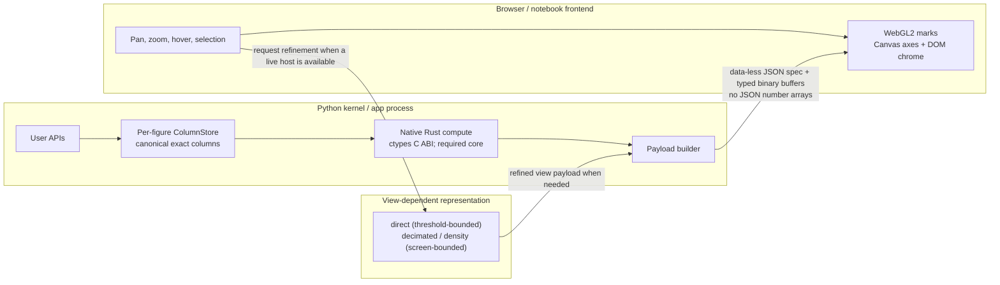

<p align="center">
  
</p>

<p align="center">
  <a href="https://github.com/reflex-dev/xy/actions/workflows/ci.yml"></a>
  <a href="https://app.codspeed.io/reflex-dev/xy?utm_source=badge"></a>
  <a href="pyproject.toml"></a>
  <a href="https://reflex.dev/docs/xy/" target="_blank" rel="noopener noreferrer"></a>
</p>

xy is a Python charting library for large, interactive datasets. Its Rust core
and WebGL2 renderer keep work bounded by what the screen can show.

> [!NOTE]
> xy is early alpha and actively evolving. Find guides, API reference, and
> examples in the [xy documentation](https://reflex.dev/docs/xy/).

## Highlights

- **Built for large data.** Long lines are decimated and dense scatters become
  fixed-size density surfaces, then refine as you zoom.
- **Python-friendly.** Compose charts from marks, axes, annotations, legends,
  tooltips, and callbacks—or use the familiar `xy.pyplot` interface.
- **Interactive by default.** Pan, zoom, hover, select, and inspect exact source
  rows without shipping the entire dataset as JSON.
- **One chart, many outputs.** Display in Jupyter, VS Code, Colab, and Marimo,
  or export self-contained HTML plus browser-free PNG, JPEG, WebP, SVG, and
  PDF through one `to_image`/`write_image` API.
- **Designed for applications.** Layer marks and style both chart chrome and
  marks with CSS/Tailwind-friendly hooks, gradients, strokes, and curves.

## Is xy for me?

xy is a great fit for teams that want to explore large 2D datasets in Python,
share interactive notebook results, or ship self-contained charts on the web.
Build charts once, then display them in notebooks and apps or export them as
HTML, images, and vector graphics.

## Installation

```bash
pip install xy

# or, with uv
uv add xy
```

Published wheels contain the Python package, JavaScript client, and native Rust
core. End users do not need Rust, Node, npm, or a CDN.

## Getting started

Create a small business chart:

```python
import xy

months = [1, 2, 3, 4, 5, 6]
revenue = [42, 45, 48, 51, 55, 59]
pipeline = [35, 38, 42, 40, 46, 50]

chart = xy.line_chart(
    xy.line(months, revenue, name="revenue", color="#2563eb"),
    xy.line(months, pipeline, name="pipeline", color="#16a34a"),
    xy.x_axis(label="month"),
    xy.y_axis(label="USD thousands"),
    xy.legend(),
    title="Revenue vs pipeline",
)
# chart.to_html("chart.html")
# chart.to_png("chart.png")
# chart.to_svg("chart.svg")
chart
```

The same chart can be exported without changing how it is built.

xy currently includes line, scatter, area, histogram, bar and column, heatmap,
error bar and band, box, violin, ECDF, hexbin, contour, step, stairs, stem,
triangle mesh, and faceted charts. See the
[copyable examples](spec/api/api-examples.md) for the complete surface.

### Coming from matplotlib

For common pyplot workflows, change the import and keep the plotting code:

```python
import numpy as np
import xy.pyplot as plt

x = np.linspace(0, 10, 200)
fig, ax = plt.subplots()
ax.plot(x, np.sin(x), "r--", label="signal")
ax.legend()
plt.show()
```

The shim intentionally covers common plotting workflows rather than every
matplotlib feature. See the [compatibility guide](spec/matplotlib/compat.md).

## Benchmarks

<p align="center">
  
</p>

On the committed [xy 0.1.0 launch baseline](benchmarks/launch_baselines/xy-0.1.0/macos-arm64-m5-pro/report.md),
xy rendered a 10M-point scatter in 0.0232 seconds as a native PNG and reached
its interactive GPU view in 0.1797 seconds. The run uses identical seeded data,
a 900×420 output, and three isolated cold runs on an Apple M5 Pro with 64 GB RAM.

| 900×420 output contract | xy | Matplotlib | Plotly |
|---|---:|---:|---:|
| Static CPU PNG | 0.0232 s | 2.7842 s | 9.5834 s |
| Interactive first render, default GPU | 0.1797 s | 3.0029 s | 3.6434 s |
| Interactive first render, CPU fallback | 0.9920 s | 3.6735 s | 8.2152 s |

xy automatically uses screen-bounded representations for dense views and
returns to exact points as users zoom in. See the [benchmark runbook](benchmarks/README.md),
[environment](benchmarks/launch_baselines/xy-0.1.0/macos-arm64-m5-pro/environment.json),
and [raw results](benchmarks/launch_baselines/xy-0.1.0/macos-arm64-m5-pro/default-results.json)
to inspect or reproduce the measurements.

## How it works

Most chart stacks serialize every value as JSON and ask the browser to draw
every mark. xy instead keeps exact values in a `ColumnStore`, computes an
appropriate level of detail in Rust, and transfers typed binary buffers.
Decimated and density views are bounded by the visible result.



This is why zooming matters: a dense overview can use aggregation, while a
narrow view can return to exact points. Canonical f64 data stays in Python so
hover and selection can still return original rows.

For benchmark methodology and measured results, see the
[benchmark runbook](benchmarks/README.md) and the committed
[launch report](benchmarks/launch_baselines/xy-0.1.0/macos-arm64-m5-pro/report.md).
For the full design, see the [design dossier](spec/design-dossier.md).

## What you can build today

- Declarative 2D charts with marks, axes, annotations, legends, tooltips, and
  CSS/Tailwind-friendly styling hooks.
- Interactive notebook and application views with pan, zoom, hover, and
  selection.
- Self-contained HTML and browser-free PNG, JPEG, WebP, SVG, and PDF exports
  from the same chart object.
- Large-data views that adapt from direct rendering to decimated and density
  representations as the visible range changes.

## Documentation

Start with the [xy documentation](https://reflex.dev/docs/xy/) for installation,
the chart gallery, guides, and API reference. The repository also includes
[copyable API examples](spec/api/api-examples.md),
[benchmark details](benchmarks/README.md), and the [changelog](CHANGELOG.md).
