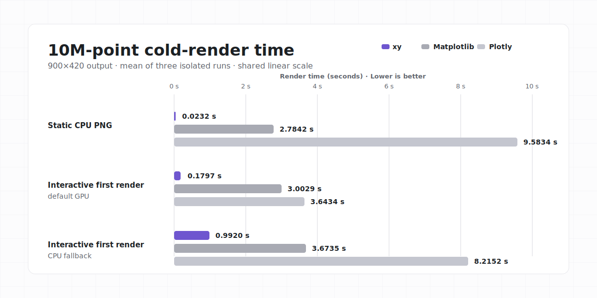
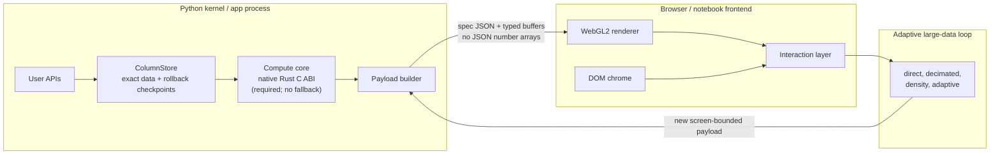

<h1 align="center">xy</h1>

<p align="center">
  <a href="https://github.com/reflex-dev/xy/actions/workflows/ci.yml"></a>
  <a href="https://app.codspeed.io/reflex-dev/xy?utm_source=badge"></a>
  <a href="pyproject.toml"></a>
</p>

<p align="center">
  
</p>

xy is an experimental Python charting library for large, interactive datasets.
Its Rust core and WebGL2 renderer keep work bounded by what the screen can show.

> [!IMPORTANT]
> xy is early alpha; APIs may change before 1.0.

## Highlights

- **Built for large data.** Long lines are decimated and dense scatters become
  fixed-size density surfaces, then refine as you zoom.
- **Python-friendly.** Compose charts from marks, axes, annotations, legends,
  tooltips, and callbacks—or use the familiar `xy.pyplot` interface.
- **Interactive by default.** Pan, zoom, hover, select, and inspect exact source
  rows without shipping the entire dataset as JSON.
- **One chart, many outputs.** Display in Jupyter, VS Code, Colab, and Marimo,
  or export self-contained HTML, browser-free PNG, and SVG.
- **Designed for applications.** Layer marks and style both chart chrome and
  marks with CSS/Tailwind-friendly hooks, gradients, strokes, and curves.

## Installation

```bash
uv add xy
```

Published wheels contain the Python package, JavaScript client, and native Rust
core. End users do not need Rust, Node, npm, or a CDN.

## Getting started

Create a small business chart:

```python
import xy

months = [1, 2, 3, 4, 5, 6]
revenue = [42, 45, 48, 51, 55, 59]
pipeline = [35, 38, 42, 40, 46, 50]

chart = xy.line_chart(
    xy.line(months, revenue, name="revenue", color="#2563eb"),
    xy.line(months, pipeline, name="pipeline", color="#16a34a"),
    xy.x_axis(label="month"),
    xy.y_axis(label="USD thousands"),
    xy.legend(),
    title="Revenue vs pipeline",
)
# chart.to_html("chart.html")
# chart.to_png("chart.png")
# chart.to_svg("chart.svg")
chart
```

The same chart can be exported without changing how it is built.

xy currently includes line, scatter, area, histogram, bar and column, heatmap,
error bar and band, box, violin, ECDF, hexbin, contour, step, stairs, stem,
triangle mesh, and faceted charts. See the
[copyable examples](docs/api-examples.md) for the complete surface.

### Coming from matplotlib

For common pyplot workflows, change the import and keep the plotting code:

```python
import numpy as np
import xy.pyplot as plt

x = np.linspace(0, 10, 200)
fig, ax = plt.subplots()
ax.plot(x, np.sin(x), "r--", label="signal")
ax.legend()
plt.show()
```

The shim intentionally covers common plotting workflows rather than every
matplotlib feature. See the [compatibility guide](docs/matplotlib-compat.md).

## Benchmarks

These results come from the committed
[xy 0.1.0 launch baseline](benchmarks/launch_baselines/xy-0.1.0/macos-arm64-m5-pro/report.md):
identical seeded scatter data, a 900×420 output, and three isolated cold runs on
an Apple M5 Pro with 64 GB RAM. Times are mean ± sample standard deviation.

| Points | Native static PNG | Interactive, default GPU | Interactive, CPU fallback | xy representation |
|---:|---:|---:|---:|---|
| 10k | 0.0085 ± 0.0002 s | 0.1533 ± 0.0079 s | 0.9580 ± 0.0103 s | direct |
| 100k | 0.0108 ± 0.0004 s | 0.1742 ± 0.0029 s | 0.9752 ± 0.0048 s | direct |
| 1M | 0.0114 ± 0.0013 s | 0.1688 ± 0.0081 s | 0.9678 ± 0.0039 s | density; density + sample interactive |
| 10M | 0.0232 ± 0.0023 s | 0.1797 ± 0.0007 s | 0.9920 ± 0.0078 s | density; density + sample interactive |
| 1B | 1.1452 ± 0.0389 s | 1.2530 ± 0.0018 s | 2.0877 ± 0.0063 s | density; density + sample interactive |

At 10M points, the same recorded run measured:

| 900×420 output contract | xy | Matplotlib | Plotly |
|---|---:|---:|---:|
| Static CPU PNG | 0.0232 s | 2.7842 s | 9.5834 s |
| Interactive first render, default GPU | 0.1797 s | 3.0029 s | 3.6434 s |
| Interactive first render, CPU fallback | 0.9920 s | 3.6735 s | 8.2152 s |

At 1B points, xy produced a density PNG in 1.1452 seconds and an interactive
density overview in 1.2530 seconds. The exact-point Plotly and Matplotlib paths
did not complete within the benchmark's 36 GiB process-tree and 180-second
limits. This does not mean xy draws one billion individual markers: it retains
the source rows while rendering a screen-bounded density representation.

See the [benchmark runbook](benchmarks/README.md),
[environment](benchmarks/launch_baselines/xy-0.1.0/macos-arm64-m5-pro/environment.json),
and [raw results](benchmarks/launch_baselines/xy-0.1.0/macos-arm64-m5-pro/default-results.json)
to inspect or reproduce the measurements.

## How it works

Most chart stacks serialize every value as JSON and ask the browser to draw
every mark. xy instead keeps exact values in a `ColumnStore`, computes an
appropriate level of detail in Rust, and transfers typed buffers that are
bounded by the visible result.



This is why zooming matters: a dense overview can use aggregation, while a
narrow view can return to exact points. Canonical f64 data stays in Python so
hover and selection can still return original rows.

For benchmark methodology and measured results, see the
[benchmark runbook](benchmarks/README.md) and the committed
[launch report](benchmarks/launch_baselines/xy-0.1.0/macos-arm64-m5-pro/report.md).
For the full design, see the [design dossier](docs/design-dossier.md).

## Stable vs. Experimental

Stable enough to build on today:

- Python 3.11+ package import, the declarative composition model, notebook
  display, and standalone HTML, PNG, and SVG export.
- Implemented 2D chart families, binary column payloads, and native Rust
  kernels bundled in published platform wheels.

Still experimental and expected to change before 1.0:

- Reflex integration, callback payload details, chart breadth, and
  compatibility shims.
- Adaptive drilldown internals and their performance thresholds.

| Surface | Current status | Notes |
|---|---|---|
| Composition API | Stabilizing alpha | The single public chart-building API: declarative `fc.chart(...children)` with CSS/Tailwind hooks. |
| Standalone HTML export | Stable alpha | Self-contained output with the client and binary data included. |
| Native Rust backend | Stable alpha; required compute core | Published wheels include it; an unsupported build raises a clear error rather than degrading. |
| Reflex integration | Experimental | Kept outside the core package dependency graph. |
| Adaptive drilldown internals | Experimental | Protocols and thresholds may change. |

The composition contract we are locking is intentionally narrow and durable:
charts contain lightweight marks and chrome; `Chart` owns display and export;
and `class_name`, `class_names`, and `style` reach stable DOM slots. It returns
opaque framework objects passed to `fc.legend(...)` / `fc.tooltip(...)` to
adapters without being serialized into standalone HTML. Python `on_*` callbacks
stay widget-side; standalone HTML receives only the safe interaction flags
needed for browser behavior.

## Documentation

- [API examples](docs/api-examples.md)
- [Styling](docs/styling.md)
- [Benchmarks](benchmarks/README.md)
- [Matplotlib compatibility](docs/matplotlib-compat.md)
- [Architecture and design](docs/design-dossier.md)
- [Production readiness](docs/production-readiness.md)
- [Security](SECURITY.md)
- [Changelog](CHANGELOG.md)

## Development

```bash
uv venv
uv pip install -e ".[dev]"
make check
```

Use `make check-docs` for README/API prose, examples, and public benchmark
wording; `make check-examples` for executable examples; and `make check-claims`
before moving measured claims into public-facing text. Benchmark changes use
`make check-benchmark-harness`, which covers environment metadata and
regression comparison scripts.

The focused gates are `make check-security` for standalone HTML export and
browser client text handling, `make check-errors` for public errors and
LOD/drill mutation boundaries, `make check-api` for public exports and public
annotations, `make check-import` for lazy import and dependency boundaries
including widget/export boundaries, and `make check-ci` for workflow and
benchmark artifact wiring.

Browser work uses `make check-browser`, which runs the Browser lifecycle smoke
(Chromium), Browser visual regression smoke (Chromium), and Browser interaction
stress smoke (Chromium) gates. The full gate additionally needs Node 18+,
`cargo`, `rustc`, and clippy (`rustup component add clippy`).

See [CONTRIBUTING.md](CONTRIBUTING.md) for the contributor workflow.

## License

xy is licensed under the [Apache License 2.0](LICENSE).
