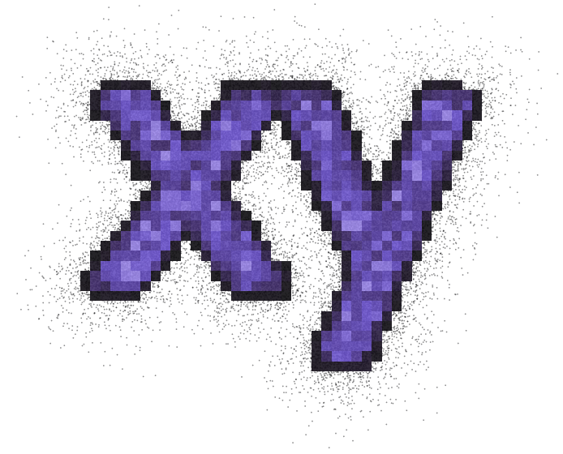
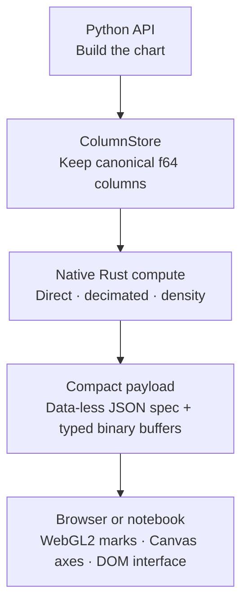

<p align="center">
  
</p>

<p align="center">
  <a href="https://github.com/reflex-dev/xy/actions/workflows/ci.yml"></a>
  <a href="https://app.codspeed.io/reflex-dev/xy?utm_source=badge"></a>
  <a href="pyproject.toml"></a>
  <a href="https://reflex.dev/docs/xy/" target="_blank" rel="noopener noreferrer"></a>
</p>

XY is an actively evolving, early-alpha Python charting library for large,
interactive datasets. Its Rust core and WebGL2 renderer keep work bounded by
what the screen can show; find guides, API reference, and examples in the
[documentation](https://reflex.dev/docs/xy/).

## Highlights

- **Built for large data.** Decimates long lines and refines dense scatter as you zoom.
- **Declarative interface.** Compose marks and guides, or use the familiar `xy.pyplot`.
- **Interactive by default.** Pan, zoom, hover, select, and inspect exact source rows.
- **One chart, many outputs.** Use notebooks or export HTML, raster, and vector formats.
- **Built for apps.** Embed responsive charts and style them with CSS or Tailwind.

## Is XY for me?

XY is a great fit for teams that want to explore large 2D datasets in Python,
share interactive notebook results, or ship self-contained charts on the web.
Build charts once, then display them in notebooks and apps or export them as
HTML, images, and vector graphics.

## Benchmarks

<p align="center">
  
</p>

The committed launch baseline uses identical seeded data, a 900×420 output,
and three isolated cold runs. See the
[launch report](benchmarks/launch_baselines/xy-0.1.0/macos-arm64-m5-pro/report.md)
and [benchmark runbook](benchmarks/README.md) for the environment,
methodology, and raw results.

## Installation

```bash
pip install xy

# or, with uv
uv add xy
```

Published wheels contain the Python package, JavaScript client, and native Rust
core. End users do not need Rust, Node, npm, or a CDN.

## Getting started

Create a small business chart:

```python
import xy

months = [1, 2, 3, 4, 5, 6]
revenue = [42, 45, 48, 51, 55, 59]
pipeline = [35, 38, 42, 40, 46, 50]

chart = xy.line_chart(
    xy.line(months, revenue, name="revenue", color="#2563eb"),
    xy.line(months, pipeline, name="pipeline", color="#16a34a"),
    xy.x_axis(label="month"),
    xy.y_axis(label="USD thousands"),
    xy.legend(),
    title="Revenue vs pipeline",
)
# chart.to_html("chart.html")
# chart.to_png("chart.png")
# chart.to_svg("chart.svg")
chart
```

The same chart can be exported without changing how it is built.

XY currently includes line, scatter, area, histogram, bar and column, heatmap,
error bar and band, box, violin, ECDF, hexbin, contour, step, stairs, stem,
triangle mesh, and faceted charts. See the
[copyable examples](spec/api/api-examples.md) for the complete surface.

### Coming from matplotlib

For common pyplot workflows, change the import and keep the plotting code:

```python
import numpy as np
import xy.pyplot as plt

x = np.linspace(0, 10, 200)
fig, ax = plt.subplots()
ax.plot(x, np.sin(x), "r--", label="signal")
ax.legend()
plt.show()
```

The shim intentionally covers common plotting workflows rather than every
matplotlib feature. See the [compatibility guide](spec/matplotlib/compat.md).

## Styling

Customize marks and chart chrome with Python, CSS, or Tailwind. See the [styling guide](docs/styling/index.md).

```python
chart = xy.line_chart(
    xy.line(x, y, color="#7c3aed", width=3),
    class_name="rounded-xl bg-white",
    class_names={"tooltip": "rounded-lg bg-zinc-900 text-white"},
)
```

## Embed XY in a Reflex app

With the `reflex-xy` adapter, any XY chart becomes a regular Reflex component.
Place it inside cards, grids, tabs, or dashboards with no JavaScript, iframe,
or separate chart service.

Register the adapter once:

```python
# rxconfig.py
import reflex as rx
import reflex_xy

config = rx.Config(
    app_name="dashboard",
    plugins=[reflex_xy.XYPlugin()],
)
```

Then add a chart anywhere in the component tree:

```python
import reflex as rx
import reflex_xy
import xy

signups = xy.line_chart(
    xy.line([1, 2, 3, 4, 5], [120, 180, 165, 240, 310]),
    title="Weekly signups",
)


def index() -> rx.Component:
    return rx.card(
        rx.heading("Growth"),
        reflex_xy.chart(signups, height="320px"),
        width="100%",
    )


app = rx.App()
app.add_page(index)
```

The chart keeps its built-in hover, pan, and zoom behavior. For charts driven
by Reflex state, events, or live streams, see the
[Reflex integration guide](https://reflex.dev/docs/xy/integrations/reflex/)
and the [runnable example app](examples/reflex/).

## How it works

Most chart stacks serialize every value as JSON and ask the browser to draw
every mark. XY instead keeps exact values in a `ColumnStore`, computes an
appropriate level of detail in Rust, and transfers typed binary buffers.
Decimated and density views are bounded by the visible result.



This is why zooming matters: a dense overview can use aggregation, while a
narrow view can return to exact points. With a live host, pan and zoom can
request a refined payload. Canonical f64 data stays in Python so hover and
selection can still return original rows.

For the full design, see the [design dossier](spec/design-dossier.md).

## What you can build today

- Declarative 2D charts with marks, axes, annotations, legends, tooltips, and
  CSS/Tailwind-friendly styling hooks.
- Interactive notebook and application views with pan, zoom, hover, and
  selection.
- Self-contained HTML and browser-free PNG, JPEG, WebP, SVG, and PDF exports
  from the same chart object.
- Large-data views that adapt from direct rendering to decimated and density
  representations as the visible range changes.

## Documentation

Start with the [XY documentation](https://reflex.dev/docs/xy/) for installation,
the chart gallery, guides, and API reference. The repository also includes
[copyable API examples](spec/api/api-examples.md),
[benchmark details](benchmarks/README.md), and the [changelog](CHANGELOG.md).
