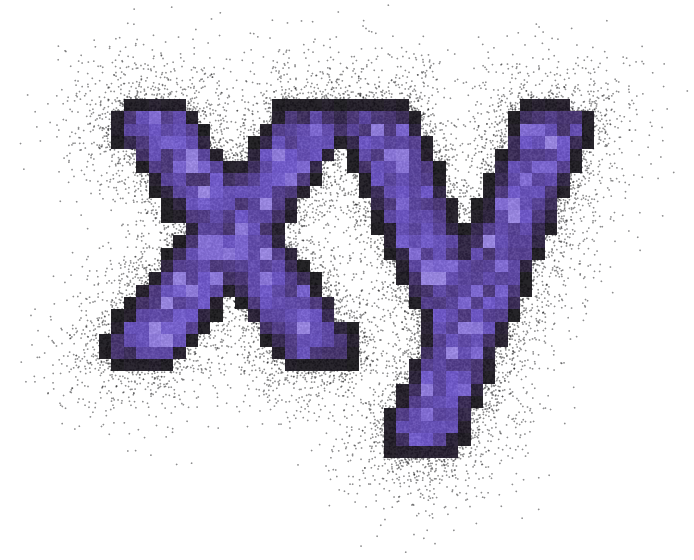
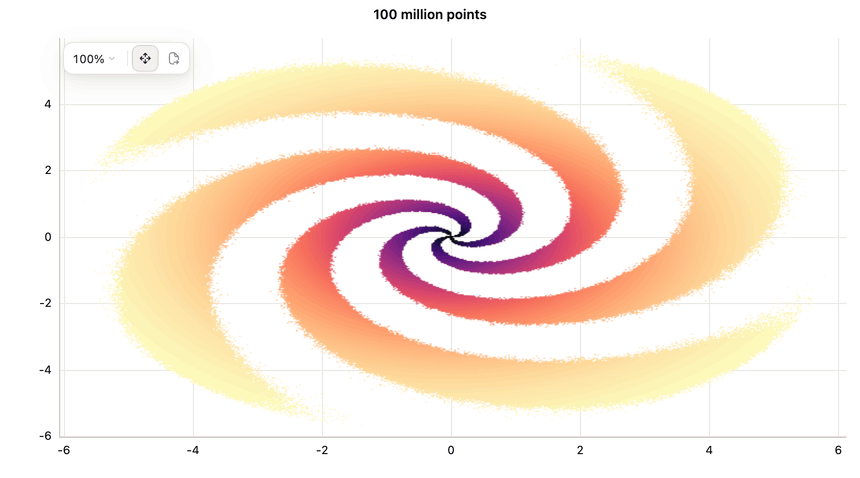
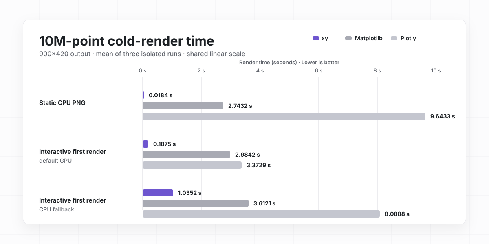
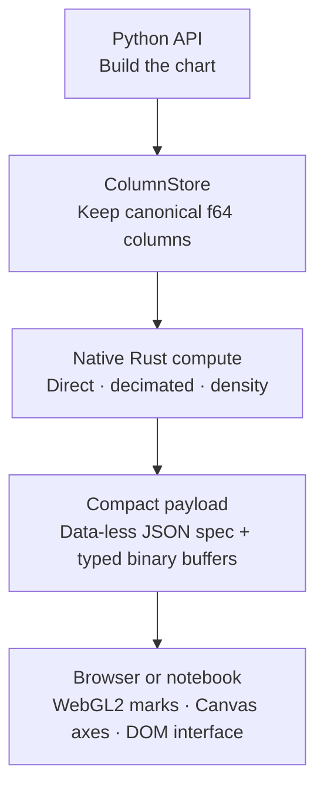
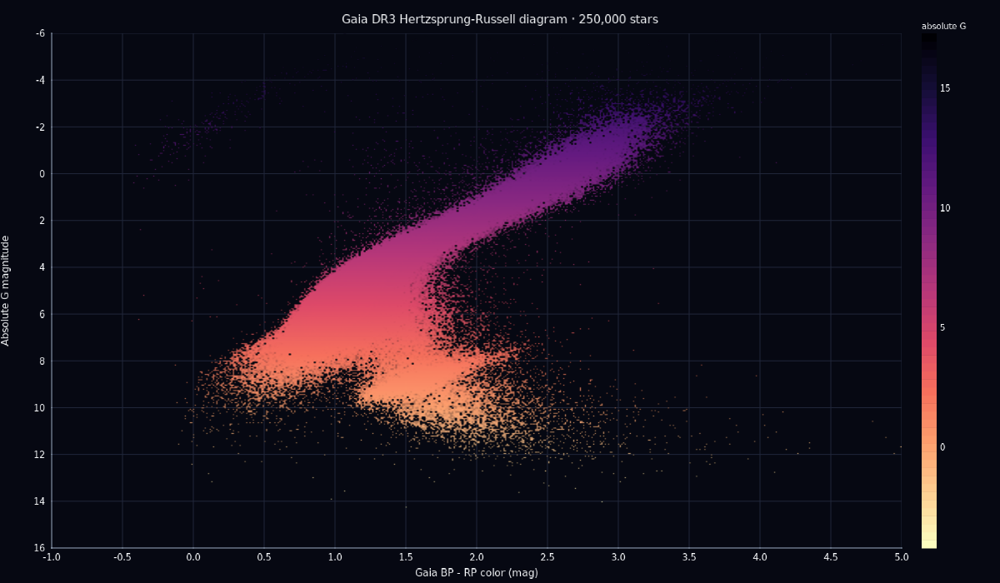
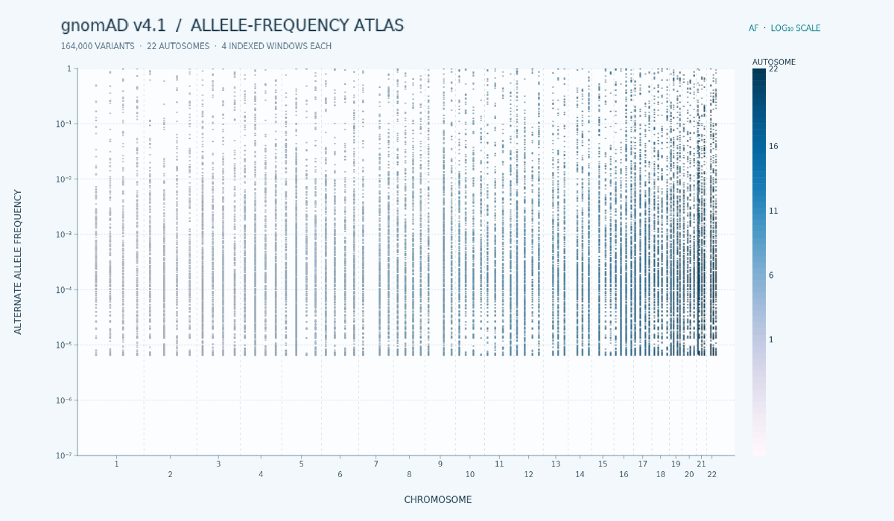
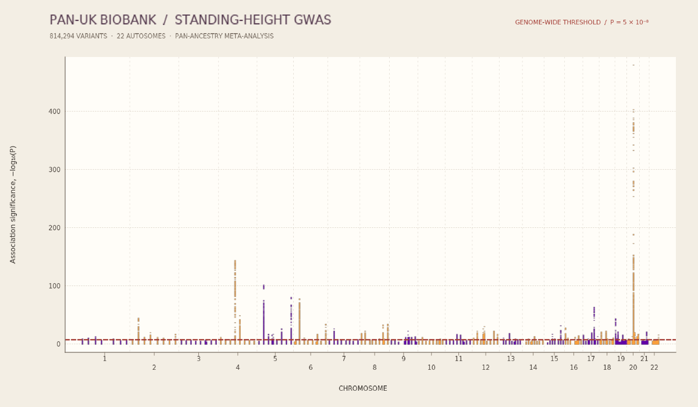
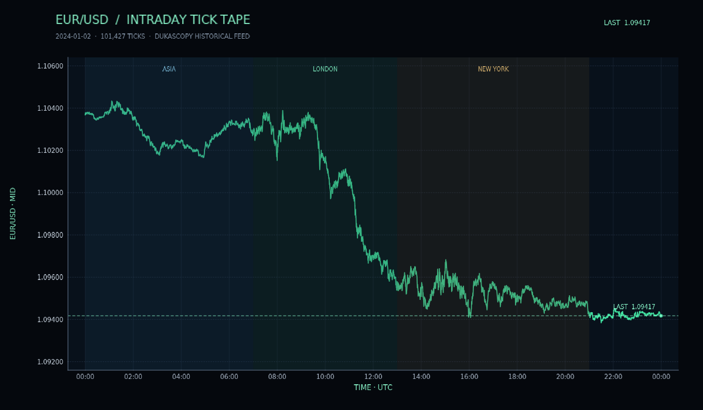
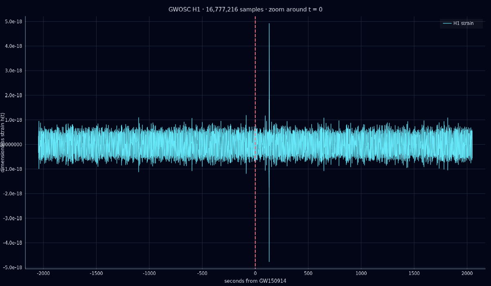
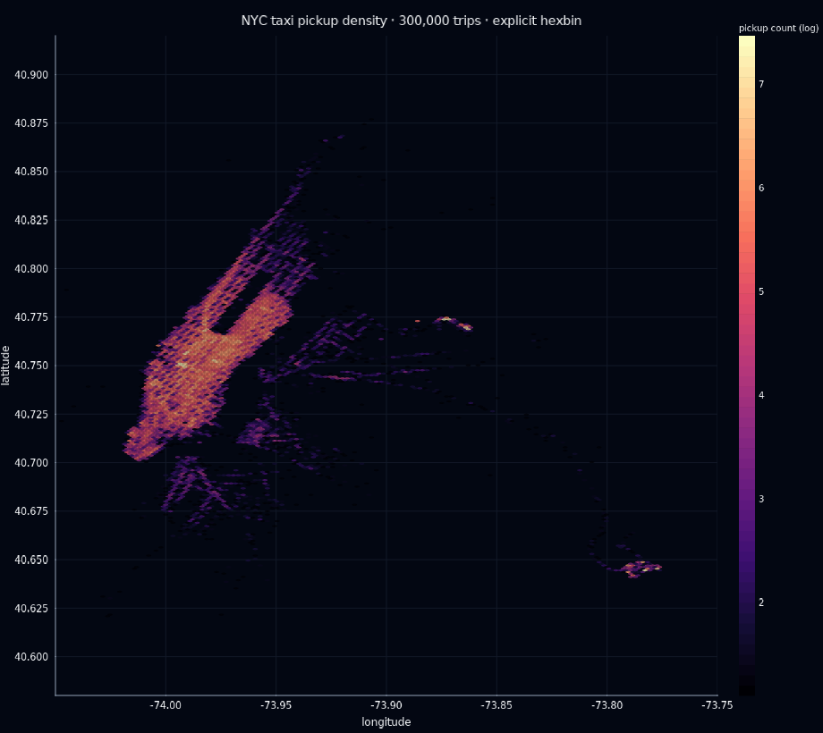

<p align="center">
  
</p>

<p align="center">
  <b><a href="https://reflex.dev/docs/xy/" target="_blank" rel="noopener noreferrer">Try it live: a million points in your browser &rarr;</a></b>
</p>

<p align="center">
  <a href="https://github.com/reflex-dev/xy/actions/workflows/ci.yml"></a>
  <a href="https://app.codspeed.io/reflex-dev/xy?utm_source=badge"></a>
  <a href="pyproject.toml"></a>
  <a href="https://reflex.dev/docs/xy/" target="_blank" rel="noopener noreferrer"></a>
</p>

XY is an actively evolving, early-alpha Python charting library for large,
interactive datasets. Its Rust core and WebGL2 renderer keep work bounded by
what the screen can show; find guides, API reference, and examples in the
[documentation](https://reflex.dev/docs/xy/).

## Highlights

- **Built for large data.** Reduces long lines and dense scatters to what the screen can show, and brings detail back as you zoom.
- **Declarative interface.** Compose marks and guides, or use the familiar `xy.pyplot`.
- **Interactive by default.** Pan, zoom, hover, select, and inspect exact source rows.
- **One chart, many outputs.** Use notebooks or export HTML, raster, and vector formats.
- **Built for apps.** Embed responsive charts and style them with CSS or Tailwind.

## Is XY for me?

XY is a great fit for teams that want to explore large 2D datasets in Python,
share interactive notebook results, or ship self-contained charts on the web.
Build charts once, then display them in notebooks and apps or export them as
HTML, images, and vector graphics.

## Installation

```bash
pip install xy

# or, with uv
uv add xy
```

## Getting started

A chart is a container plus the marks inside it. Any sequence works — plain
Python lists need no NumPy:

```python
import xy

chart = xy.line_chart(xy.line([1, 2, 3, 4, 5], [120, 180, 165, 240, 310]))
# chart.to_html("chart.html")
# chart.to_png("chart.png")
# chart.to_svg("chart.svg")
chart  # notebooks render it
```

The same API scales. Chart a hundred million points as a density surface:

<p align="center">
  <picture>
    <source media="(prefers-color-scheme: dark)" srcset="spec/assets/xy-density-100m-dark.gif">
    
  </picture>
</p>

```python
import numpy as np

import xy

rng = np.random.default_rng(7)
n = 100_000_000

r = 6.0 * rng.beta(1.2, 3.0, n)
theta = 2.9 * np.log1p(r) + rng.integers(0, 4, n) * (np.pi / 2) + rng.normal(0, 0.045 + 0.016 * r, n)

chart = xy.scatter_chart(
    xy.scatter(
        r * np.cos(theta),
        r * np.sin(theta),
        color=np.exp(-r / 2.2),
        colormap="magma_r",
        density=True,
        opacity=0.85,
        # Grow and solidify markers once a view drills through to real rows.
        size=2.5,
        zoom_size_factor=2.6,
        zoom_opacity=0.95,
    ),
    xy.theme(
        background="#ffffff", plot_background="#ffffff", grid_color="#e6e6e1",
        axis_color="#c3c2b7", text_color="#0b0b0b",
    ),
    title="100 million points",
)
chart
```

### Coming from matplotlib

For common pyplot workflows, change the import and keep the plotting code:

```python
import numpy as np
import xy.pyplot as plt

x = np.linspace(0, 10, 200)
fig, ax = plt.subplots()
ax.plot(x, np.sin(x), "r--", label="signal")
ax.legend()
plt.show()
```

The shim intentionally covers common plotting workflows rather than every
matplotlib feature. See the [compatibility guide](spec/matplotlib/compat.md).

## Benchmarks

<p align="center">
  
</p>

In the recorded 10-million-point baseline, XY produced a static PNG in 0.023 s
versus 2.8 s for Matplotlib and 9.6 s for Plotly, and reached first interactive
render 16–20× sooner.

The committed launch baseline uses identical seeded data, a 900×420 output,
and three isolated cold runs. See the
[launch report](benchmarks/launch_baselines/xy-0.1.0/macos-arm64-m5-pro/report.md)
and [benchmark runbook](benchmarks/README.md) for the environment,
methodology, and raw results.

## Styling

Customize marks and chart chrome with Python, CSS, or Tailwind. See the [styling guide](docs/styling/index.md).

What each mechanism reaches — per property, per chrome slot, per renderer, and
where it stops — is the [capability matrix](spec/api/capability-matrix.md),
generated from `python/xy/styling/capabilities.py` and checked against the
implementation.

```python
chart = xy.line_chart(
    xy.line(x, y, color="#7c3aed", width=3),
    class_name="rounded-xl bg-white",
    class_names={"tooltip": "rounded-lg bg-zinc-900 text-white"},
)
```

## Embed XY in a Reflex app

With the `reflex-xy` adapter, any XY chart becomes a regular Reflex component.
Place it inside cards, grids, tabs, or dashboards with no JavaScript, iframe,
or separate chart service.

The adapter ships as its own package, and pulls in `xy` and `reflex`:

```bash
pip install reflex-xy

# or, with uv
uv add reflex-xy
```

Register the adapter once:

```python
# rxconfig.py
import reflex as rx
import reflex_xy

config = rx.Config(
    app_name="dashboard",
    plugins=[reflex_xy.XYPlugin()],
)
```

Then add a chart anywhere in the component tree:

```python
import reflex as rx
import reflex_xy
import xy

signups = xy.line_chart(
    xy.line([1, 2, 3, 4, 5], [120, 180, 165, 240, 310]),
    title="Weekly signups",
)


def index() -> rx.Component:
    return rx.card(
        rx.heading("Growth"),
        reflex_xy.chart(signups, height="320px"),
        width="100%",
    )


app = rx.App()
app.add_page(index)
```

The chart keeps its built-in hover, pan, and zoom behavior. For charts driven
by Reflex state, events, or live streams, see the
[Reflex integration guide](https://reflex.dev/docs/xy/integrations/reflex/)
and the [runnable example app](examples/reflex/).

## How it works

Most chart stacks serialize every value as JSON and ask the browser to draw
every mark. XY instead keeps exact values in a `ColumnStore`, computes an
appropriate level of detail in Rust, and transfers typed binary buffers.
Decimated and density views are bounded by the visible result.


```mermaid
flowchart TB
    API["Python API<br/>Build the chart"]
    STORE["ColumnStore<br/>Keep canonical f64 columns"]
    CORE["Native Rust compute<br/>Direct · decimated · density"]
    PAYLOAD["Compact payload<br/>Data-less JSON spec + typed binary buffers"]
    RENDER["Browser or notebook<br/>WebGL2 marks · Canvas axes · DOM interface"]

    API --> STORE --> CORE --> PAYLOAD --> RENDER
```

This is why zooming matters: a dense overview can use aggregation, while a
narrow view can return to exact points. With a live host, pan and zoom can
request a refined payload. Canonical f64 data stays in Python so hover and
selection can still return original rows.

For the full design, see the [design dossier](spec/design-dossier.md).

## What you can build today

- Declarative 2D charts with marks, axes, annotations, legends, tooltips, and
  CSS/Tailwind-friendly styling hooks.
- Interactive notebook and application views with pan, zoom, hover, and
  selection.
- Self-contained HTML and browser-free PNG, JPEG, WebP, SVG, and PDF exports
  from the same chart object.
- Large-data views that adapt from direct rendering to decimated and density
  representations as the visible range changes.

## Examples

Each notebook fetches working rows from its linked public source; raw datasets
are not stored in this repository. See the
[example guide](examples/real_world/README.md) for source links, workload
controls, and setup. Counts describe the data behind each featured chart; the
notebooks can scale further.

|  |  |  |
| :---: | :---: | :---: |
| **Gaia DR3 · cosmic observatory**<br><sub>250,000 plotted stars</sub><br><br><br><br>[Open notebook](examples/real_world/01_gaia_hr_diagram.ipynb) | **gnomAD v4.1 · genomic atlas**<br><sub>164,000 plotted variants</sub><br><br><br><br>[Open notebook](examples/real_world/02_gnomad_allele_frequency.ipynb) | **Pan-UKBB · biobank editorial**<br><sub>814,294 plotted variants</sub><br><br><br><br>[Open notebook](examples/real_world/03_pan_ukbb_manhattan.ipynb) |
| **Dukascopy · trading terminal**<br><sub>101,427 plotted ticks</sub><br><br><br><br>[Open notebook](examples/real_world/04_dukascopy_fx_ticks.ipynb) | **LIGO · signal-lab oscilloscope**<br><sub>16,777,216 raw · 3,441 shown</sub><br><br><br><br>[Open notebook](examples/real_world/05_ligo_gw150914_strain.ipynb) | **NYC TLC · night cartography**<br><sub>300,000 pickup records</sub><br><br><br><br>[Open notebook](examples/real_world/06_nyc_taxi_density.ipynb) |

## Documentation

Start with the [XY documentation](https://reflex.dev/docs/xy/) for installation,
the chart gallery, guides, and API reference. The repository also includes
[copyable API examples](spec/api/api-examples.md),
[benchmark details](benchmarks/README.md), and the [changelog](CHANGELOG.md).

## Roadmap

XY is 2D-first: broad chart coverage on top of the binary transport and
screen-bounded rendering, before any 3D work. Queued next, no dates implied:

- **Categorical distributions** &mdash; strip, swarm, beeswarm, boxen, rug
- **Regression diagnostics** &mdash; trendline, residual, QQ, PP
- **Scatter matrix and joint plots** &mdash; SPLOM, pair grid, marginal histograms
- **Pie / donut** &mdash; in `xy.pyplot` today, promoting to `xy.pie_chart(xy.pie(...))`
- **Candlestick / OHLC and finance overlays** &mdash; SMA, VWAP, Bollinger, RSI, MACD; prototyped, awaiting a fresh landing
- **Waterfall and funnel**
- **Treemap, sunburst, and icicle**
- **Radar / polar and gauge** &mdash; needs polar axes first
- **Slope, bump, and dumbbell**

The full ranked backlog is in the [chart roadmap](spec/api/chart-roadmap.md).
Want a chart or feature that isn't listed?
[Open an issue](https://github.com/reflex-dev/xy/issues/new).
