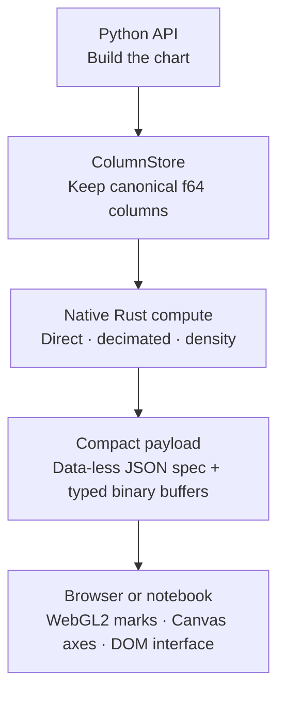

<p align="center">
  
</p>

<p align="center">
  <a href="https://github.com/reflex-dev/xy/actions/workflows/ci.yml"></a>
  <a href="https://app.codspeed.io/reflex-dev/xy?utm_source=badge"></a>
  <a href="pyproject.toml"></a>
  <a href="https://reflex.dev/docs/xy/" target="_blank" rel="noopener noreferrer"></a>
  <a href="https://mybinder.org/v2/gh/reflex-dev/xy/main?urlpath=lab/tree/examples" target="_blank" rel="noopener noreferrer"></a>
  <a href="https://github.com/reflex-dev/xy/stargazers"></a>
  <a href="https://pypi.org/project/xy/"></a>
</p>

# XY: Fast, interactive Python graphing library

XY is an open-source Python graphing and charting library built by Reflex for
interactive data visualization in notebooks, web apps, and static exports.
Its Rust compute core and WebGL2 renderer support everyday plots and large
datasets, with declarative and Matplotlib-style Python APIs.

Customize data marks with Python and style browser chart interfaces with CSS
or Tailwind.

With small charts, every point is sent to the browser. For large charts, the
Rust core computes only what the screen needs to display, based on its
resolution. Pan, zoom, hover, and selection can show full details by running the
same process for the new range, and a selection returns the original rows.

With XY we rendered the entirety of OpenStreetMap — a **10,000,000,000 point** dataset. [See the example →](https://github.com/reflex-dev/xy/tree/main/examples/osm)

> [!IMPORTANT]
> **XY is in alpha** and is receiving frequent enhancements.
> ⭐️ Star the repo to follow the progress.

[Quick start](#installation) · [Compare libraries](#xy-vs-matplotlib-plotly-and-bokeh) ·
[Benchmarks](#benchmarks) · [FAQ](#frequently-asked-questions) ·
[Documentation](https://reflex.dev/docs/xy/)

## XY vs. Matplotlib, Plotly, and Bokeh

Considering a Matplotlib, Plotly, or Bokeh alternative? XY combines large-data
rendering with CSS and Tailwind styling for chart interfaces. The table below
compares how you author and display charts; the separate benchmark table
measures a specific scatter workload.

| Capability | XY | Matplotlib | Plotly | Bokeh |
| --- | --- | --- | --- | --- |
| Python API | Declarative composition and experimental `xy.pyplot` compatibility | `pyplot` and object-oriented APIs | Plotly Express and graph objects | `bokeh.plotting` and models |
| Notebook and web display | Notebook widget, standalone HTML, and Reflex integration | Notebook backends, GUI backends, and WebAgg server | Notebook display and standalone HTML; embed figures in web apps | Notebook display, standalone HTML, and Bokeh server apps |
| Styling approach | Python properties plus CSS/Tailwind hooks for browser chart chrome | Artist properties, `rcParams`, and style sheets | Figure properties and templates | Glyph properties and themes; CSS for DOM elements |
| Reusing Matplotlib code | Supported calls through `xy.pyplot`; check compatibility coverage | Native Matplotlib behavior | Port plotting calls to Plotly's API | Port plotting calls to Bokeh's API |

Sources: [XY compatibility](spec/matplotlib/compat.md),
[Matplotlib backends](https://matplotlib.org/stable/users/explain/figure/backends.html),
[Plotly HTML export](https://plotly.com/python/interactive-html-export/),
[Bokeh embedding](https://docs.bokeh.org/en/latest/docs/user_guide/output/embed.html),
and [Bokeh DOM styling](https://docs.bokeh.org/en/latest/docs/user_guide/styling/dom.html).

**Published interactive scatter results at 10 million points:**

| Library and rendering mode | Time to correct, stable first render | Peak Python-side memory |
| --- | ---: | ---: |
| XY, density overview | 0.083 s | 0.32 GiB |
| XY, exact markers (`density=False`) | 0.206 s | 0.57 GiB |
| Matplotlib, WebAgg | 2.804 s | 0.84 GiB |
| Plotly, `scattergl` | 3.367 s | 1.86 GiB |
| Bokeh, standalone | Not measured in this comparison | Not measured in this comparison |

These are XY's own measurements on one Apple M5 Pro, one run per cell, not a
universal library ranking. Every arm receives all source rows, but XY's density
mode aggregates them into a screen-bounded overview; the exact-marker row
shows XY without aggregation. Memory excludes the browser. See
[Benchmarks](#benchmarks) for the full size ladder and reproduction methodology.

## Is XY right for me?

XY is for Python users who want one flexible charting library for everything
from everyday plots to custom application visuals and large datasets. Build a
chart once, then use it in notebooks and web apps or export it as HTML, PNG,
SVG, or PDF.

- **Large datasets:** Explore dense scatter plots and long time series with
  native aggregation or decimation, and refine the visible range with a live host.
- **Application charts:** Style titles, axes, legends, and tooltips with your
  app's CSS or Tailwind classes, alongside Python controls for data marks.
- **Matplotlib migration:** Try supported `pyplot` workflows on XY's engine by
  changing the import, then check the [compatibility guide](spec/matplotlib/compat.md).

XY is still pre-1.0. Evaluate the chart families, API coverage, export behavior,
and [alpha limitations](docs/api-reference/limitations-and-alpha-status.md)
your application needs before migrating.

## Installation

```bash
pip install xy

# or, with uv
uv add xy
```

## Getting started

A chart is a container plus the marks inside it. Any sequence works; NumPy is
optional.

```python
import xy

chart = xy.line_chart(xy.line([1, 2, 3, 4, 5], [120, 180, 165, 240, 310]))
# chart.to_html("chart.html")
# chart.to_png("chart.png")
# chart.to_svg("chart.svg")
chart  # notebooks render it
```

The same API scales to a hundred million points as a density surface:

<p align="center">
  <picture>
    <source media="(prefers-color-scheme: dark)" srcset="https://raw.githubusercontent.com/reflex-dev/xy/main/spec/assets/xy-density-100m-dark.gif">
    
  </picture>
</p>

```python
import numpy as np

import xy

rng = np.random.default_rng(7)
n = 100_000_000

r = 6.0 * rng.beta(1.2, 3.0, n)
theta = 2.9 * np.log1p(r) + rng.integers(0, 4, n) * (np.pi / 2) + rng.normal(0, 0.045 + 0.016 * r, n)

chart = xy.scatter_chart(
    xy.scatter(
        r * np.cos(theta),
        r * np.sin(theta),
        color=np.exp(-r / 2.2),
        colormap="magma_r",
        density=True,
        opacity=0.85,
        # Grow and solidify markers once a view drills through to real rows.
        size=2.5,
        zoom_size_factor=2.6,
        zoom_opacity=0.95,
    ),
    xy.theme(
        background="#ffffff", plot_background="#ffffff", grid_color="#e6e6e1",
        axis_color="#c3c2b7", text_color="#0b0b0b",
    ),
    title="100 million points",
)
chart
```

### Coming from Matplotlib

For common pyplot workflows, change the import and keep the plotting code:

```python
import numpy as np
import xy.pyplot as plt

x = np.linspace(0, 10, 200)
fig, ax = plt.subplots()
ax.plot(x, np.sin(x), "r--", label="signal")
ax.legend()
plt.show()
```

See the [compatibility guide](https://github.com/reflex-dev/xy/blob/main/spec/matplotlib/compat.md); not all charts and
functionality are supported yet.

## Customize every layer

Use Python to control the chart, from marks and axes to interactions and layout.
Browser chart chrome also exposes CSS and Tailwind hooks through `class_name`
and `class_names`, so it can share your application's design system. Data marks
use Python properties or a supported `style=` subset; arbitrary CSS and
Tailwind classes do not carry into every static export.

- **Marks:** Control color, size, opacity, symbols, gradients, strokes, curves,
  and colormaps.
- **Guides:** Customize axes, ticks, grids, annotations, legends, colorbars, and
  tooltips.
- **Interaction:** Add pan, zoom, hover, selections, crosshairs, callbacks, and
  linked charts.
- **Layout:** Create layers and facets, set responsive dimensions, and apply
  themes.

```python
chart = xy.line_chart(
    xy.line(x, y, color="#7c3aed", width=3),
    class_name="rounded-xl bg-white",
    class_names={"tooltip": "rounded-lg bg-zinc-900 text-white"},
)
```

See the [styling guide](https://github.com/reflex-dev/xy/blob/main/docs/styling/index.md)
for examples. For a detailed breakdown of what can be customized, see the
[capability matrix](https://github.com/reflex-dev/xy/blob/main/spec/api/capability-matrix.md).

## Benchmarks

Live interactive charts, 10k to 100M points. Every library gets every row and
is driven through its own input path in a real browser. The clock stops only
when the canvas is both correct (planted sentinel points verified lit) and
stable (10 byte-identical frames), so progressive renderers are charged until
their last chunk lands.

<p align="center">
  <picture>
    <source media="(prefers-color-scheme: dark)" srcset="https://raw.githubusercontent.com/reflex-dev/xy/main/spec/assets/ux-render-time-dark.png">
    
  </picture>
</p>

In this published scatter benchmark, XY's density mode records **0.071 s at
10k and 0.081 s at 100M source points**. Above 200k rows it draws a
screen-bounded density surface instead of one marker per row, and zoom drills
back to exact rows. Every
exact-marker path scales with N instead: Matplotlib crosses a second at ~3M
and reaches 13.4 s at 50M; Plotly crosses at ~2.5M and reaches 9.8 s at 25M.

The pale line is XY with `density=False`: the same engine drawing one marker
per row, no aggregation credit. In this run, it renders 100M exact markers in
1.34 s with 5.26 GiB peak Python-side memory, excluding the browser.

Time to correct, stable first render, in seconds. Density mode represents all
source rows as aggregates rather than individual markers. `✕` marks a failed
benchmark cell: Plotly did not finish constructing the figure at 50M, and
Matplotlib drew at 100M but did not resolve the zoom that followed in this run.

| Points | 10k | 100k | 500k | 1M | 2.5M | 5M | 10M | 25M | 50M | 100M |
| --- | ---: | ---: | ---: | ---: | ---: | ---: | ---: | ---: | ---: | ---: |
| *XY speedup* | *1×* | *2×* | *3×* | *4×* | *9×* | *16×* | *34×* | *89×* | *177×* | *—* |
| **XY** | **0.071** | **0.072** | **0.075** | **0.084** | **0.083** | **0.089** | **0.083** | **0.077** | **0.076** | **0.081** |
| XY (`density=False`) | 0.085 | 0.074 | 0.087 | 0.098 | 0.111 | 0.144 | 0.206 | 0.424 | 0.645 | 1.343 |
| Matplotlib (WebAgg) | 0.086 | 0.115 | 0.224 | 0.357 | 0.758 | 1.424 | 2.804 | 6.838 | 13.385 | ✕ |
| Plotly (scattergl) | 0.341 | 0.373 | 0.477 | 0.614 | 1.033 | 1.785 | 3.367 | 9.794 | ✕ | ✕ |

Peak Python-side resident memory, in GiB. Browser memory is tracked separately
and excluded here, since a headless Chrome resides ~1 GiB before drawing
anything.

| Points | 10k | 100k | 500k | 1M | 2.5M | 5M | 10M | 25M | 50M | 100M |
| --- | ---: | ---: | ---: | ---: | ---: | ---: | ---: | ---: | ---: | ---: |
| *XY advantage* | *1.8×* | *1.7×* | *1.9×* | *2.1×* | *2.1×* | *2.4×* | *2.6×* | *2.9×* | *2.8×* | *—* |
| **XY** | **0.05** | **0.05** | **0.06** | **0.07** | **0.13** | **0.19** | **0.32** | **0.70** | **1.36** | **2.58** |
| XY (`density=False`) | 0.05 | 0.05 | 0.07 | 0.10 | 0.18 | 0.31 | 0.57 | 1.35 | 2.66 | 5.26 |
| Matplotlib (WebAgg) | 0.09 | 0.09 | 0.12 | 0.15 | 0.28 | 0.46 | 0.84 | 2.06 | 3.85 | ✕ |
| Plotly (scattergl) | 0.21 | 0.18 | 0.28 | 0.36 | 0.60 | 1.05 | 1.86 | 4.70 | ✕ | ✕ |

One machine (Apple M5 Pro), one run per cell; at the small end the timings
carry roughly ±10 ms of run-to-run spread.

For the environment, methodology, per-size videos, and raw results, see the
[benchmark runbook](https://github.com/reflex-dev/xy/blob/main/benchmarks/README.md) and
[competitive benchmark specification](https://github.com/reflex-dev/xy/blob/main/spec/benchmarks/results.md).

## Frequently asked questions

### Is XY a Python graphing library or a charting library?

Both terms describe XY: an open-source Python library for interactive charts,
plots, and data visualization. XY uses a Rust compute core and a WebGL2 browser
renderer, with the same chart object usable in notebooks, web apps, and exports.

### Is XY a good Matplotlib alternative?

XY is worth evaluating when you want interactive web charts, large-data
rendering, or CSS styling while retaining familiar plotting calls. Change
`import matplotlib.pyplot as plt` to `import xy.pyplot as plt` for supported
workflows. The compatibility layer is experimental: it does not reproduce
Matplotlib's full Artist graph, transforms, or pixel output. Check the
[method-by-method compatibility matrix](spec/matplotlib/compat-matrix.md)
before migrating an existing script.

### Is XY a Plotly or Bokeh alternative for Python dashboards?

XY supports interactive charts, a native Reflex integration, and CSS/Tailwind
hooks for browser chart chrome. That makes it an option for Python dashboards
with dense data or a custom visual design. Plotly and Bokeh also support
standalone HTML and web embedding. Compare the chart types and callbacks your
app needs, and benchmark your actual workload; the published scatter comparison
above includes Plotly but does not establish a standalone Bokeh speedup.

### Is XY faster than Matplotlib or Plotly for large datasets?

In XY's published 10-million-point scatter benchmark on one Apple M5 Pro,
correct, stable first render took 0.083 s for XY's density overview, 0.206 s
for XY's exact markers, 2.804 s for Matplotlib WebAgg, and 3.367 s for Plotly
`scattergl`. These results describe that workload and machine, with one run
per cell. Density aggregation and exact-marker rendering preserve different
visual detail. See the [benchmark runbook](benchmarks/README.md) to reproduce
the measurements and evaluate your own data.

### How does XY plot millions of points while keeping exact data available?

XY retains canonical columns in a Python-side `ColumnStore`, computes a
representation in Rust, and sends typed binary buffers to the renderer.
Large scatter overviews can use density aggregation and long lines can use
decimation. With a live host, pan and zoom request a refined view, and supported
hover and selection operations can query original rows. Ingestion, canonical
memory, and initial computation still depend on source row count; a small
render payload does not mean a small source dataset in memory.

### Can I style Python charts with CSS or Tailwind?

Yes. XY exposes browser chart chrome through `class_name` and per-slot
`class_names`, including hooks for titles, legends, tooltips, and controls.
Marks use Python properties or a validated CSS-property subset through
`style=`. Native exports do not apply arbitrary browser stylesheets or Tailwind
classes. See the [styling guide](docs/styling/index.md) and
[export boundaries](docs/api-reference/limitations-and-alpha-status.md#styling-and-export-boundaries).

### Does the same chart work in notebooks, web apps, and static exports?

Yes. An XY chart can render in a notebook, mount in a Reflex app, or export to
HTML, PNG, SVG, or PDF. Standalone HTML is a snapshot: Python callbacks and
server-side refinement require a live widget or framework adapter, and an
export does not follow later data appends. See the
[Reflex integration guide](https://reflex.dev/docs/xy/integrations/reflex/).

### What chart types does XY support?

XY includes line, area, scatter, bar, histogram, box, violin, ECDF, heatmap,
hexbin, contour, uncertainty, stem, segments, Sankey, and funnel charts. Polar
families include radar, radial bar, pie and donut, and wind rose charts. Browse
the [chart gallery](https://reflex.dev/docs/xy/overview/gallery/) for examples
and family-specific capabilities.

### Is XY ready for production use?

XY is in alpha, and pre-1.0 releases can introduce breaking changes. Test the
chart families, interactions, browser support, and export paths your app uses,
and review the [limitations and alpha status](docs/api-reference/limitations-and-alpha-status.md)
before committing to a long-lived integration.

## Embed XY in a Reflex app

The Reflex integration bundled with `xy` turns any XY chart into a regular
Reflex component, with no JavaScript, iframe, or separate chart service.
Install the `reflex` extra to select a compatible framework version:

```bash
pip install "xy[reflex]"

# or, with uv
uv add "xy[reflex]"
```

The import namespace remains `reflex_xy`. Register the integration once:

```python
# rxconfig.py
import reflex as rx
import reflex_xy

config = rx.Config(
    app_name="dashboard",
    plugins=[reflex_xy.XYPlugin()],
)
```

Then add a chart anywhere in the component tree:

```python
import reflex as rx
import reflex_xy
import xy

signups = xy.line_chart(
    xy.line([1, 2, 3, 4, 5], [120, 180, 165, 240, 310]),
    title="Weekly signups",
)


def index() -> rx.Component:
    return rx.card(
        rx.heading("Growth"),
        reflex_xy.chart(signups, height="320px"),
        width="100%",
    )


app = rx.App()
app.add_page(index)
```

For state-driven charts, declare the chart in the page and supply columns from
a `@reflex_xy.data` state method — the structure (channels, colormaps, axes)
is validated when `reflex run` compiles the app, while the columns ride the
app's own websocket as binary buffers, never through Reflex state:

```python
from typing import TypedDict

import numpy as np
import reflex as rx
import reflex_xy


class CloudData(TypedDict):
    x: np.ndarray
    y: np.ndarray
    mag: np.ndarray


class Dash(rx.State):
    points: int = 200_000

    @reflex_xy.data
    def cloud(self) -> CloudData:
        rng = np.random.default_rng(7)
        x = rng.normal(size=self.points)
        y = x * 0.6 + rng.normal(scale=0.6, size=self.points)
        return {"x": x, "y": y, "mag": np.hypot(x, y)}


def dashboard() -> rx.Component:
    return reflex_xy.scatter_chart(
        data=Dash.cloud,
        x="x", y="y", color="mag", colormap="viridis",
        height="460px",
    )
```

Hover, pan, and zoom keep working. For charts driven by Reflex state, events, or
live streams, see the
[Reflex integration guide](https://reflex.dev/docs/xy/integrations/reflex/) and
the [runnable example app](https://github.com/reflex-dev/xy/tree/main/examples/reflex/).

## Examples

Each notebook fetches its rows from the linked public source; no raw datasets
are stored in this repository. Counts describe the featured chart, and the
notebooks scale further. See the
[example guide](https://github.com/reflex-dev/xy/blob/main/examples/real_world/README.md) for sources, workload controls,
and setup.

|  |  |  |
| :---: | :---: | :---: |
| **Gaia DR3 · HR diagram**<br><sub>250,000 plotted stars</sub><br><br><br><br>[Open notebook](https://github.com/reflex-dev/xy/blob/main/examples/real_world/01_gaia_hr_diagram.ipynb) | **gnomAD v4.1 · allele frequency**<br><sub>164,000 plotted variants</sub><br><br><br><br>[Open notebook](https://github.com/reflex-dev/xy/blob/main/examples/real_world/02_gnomad_allele_frequency.ipynb) | **Pan-UKBB · Manhattan plot**<br><sub>814,294 plotted variants</sub><br><br><br><br>[Open notebook](https://github.com/reflex-dev/xy/blob/main/examples/real_world/03_pan_ukbb_manhattan.ipynb) |
| **Dukascopy · EUR/USD ticks**<br><sub>101,427 plotted ticks</sub><br><br><br><br>[Open notebook](https://github.com/reflex-dev/xy/blob/main/examples/real_world/04_dukascopy_fx_ticks.ipynb) | **LIGO · GW150914 strain**<br><sub>16,777,216 raw · 3,441 shown</sub><br><br><br><br>[Open notebook](https://github.com/reflex-dev/xy/blob/main/examples/real_world/05_ligo_gw150914_strain.ipynb) | **NYC TLC · taxi pickup density**<br><sub>300,000 pickup records</sub><br><br><br><br>[Open notebook](https://github.com/reflex-dev/xy/blob/main/examples/real_world/06_nyc_taxi_density.ipynb) |

## How it works

Most chart stacks serialize every value as JSON and ask the browser to draw
every mark. XY keeps exact values in a `ColumnStore`, computes a level of detail
in Rust, and transfers typed binary buffers. Decimated and density views are
bounded by the visible result.


```mermaid
flowchart TB
    API["Python API<br/>Build the chart"]
    STORE["ColumnStore<br/>Keep canonical f64 columns"]
    CORE["Native Rust compute<br/>Direct · decimated · density"]
    PAYLOAD["Compact payload<br/>Data-less JSON spec + typed binary buffers"]
    RENDER["Browser or notebook<br/>WebGL2 marks · Canvas axes · DOM interface"]

    API --> STORE --> CORE --> PAYLOAD --> RENDER
```

So a dense overview can aggregate while a narrow view returns exact points. With
a live host, pan and zoom request a refined payload. Canonical f64 data stays in
Python, so hover and selection still return original rows.

For the full design, see the [design dossier](https://github.com/reflex-dev/xy/blob/main/spec/design-dossier.md).

## Roadmap

Broad 2D coverage first, then geographic, 3D, and volume visualization. Queued
next, no dates implied:

- **Categorical distributions:** strip, swarm, beeswarm, boxen, rug
- **Regression diagnostics:** trendline, residual, QQ, PP
- **Scatter matrix and joint plots:** SPLOM, pair grid, marginal histograms
- **Pie / donut:** `xy.pie_chart(labels, values, hole=...)` ships over
  unequal-width core polar bars, with Matplotlib-shaped helpers in `xy.pyplot`;
  nested donuts and variable-radius composition remain
- **Candlestick / OHLC and finance overlays:** SMA, VWAP, Bollinger, RSI, MACD; prototyped, awaiting a fresh landing
- **Waterfall**
- **Treemap, sunburst, and icicle**
- **Gauge / indicator:** build on the shipped polar axes and composable radial marks
- **Slope, bump, and dumbbell**
- **3D and volume:** scatter, surfaces, meshes, isosurfaces, and volumetric views

The full ranked backlog is in the [chart roadmap](https://github.com/reflex-dev/xy/blob/main/spec/api/chart-roadmap.md).
Want a chart or feature that isn't listed?
[Open an issue](https://github.com/reflex-dev/xy/issues/new).
