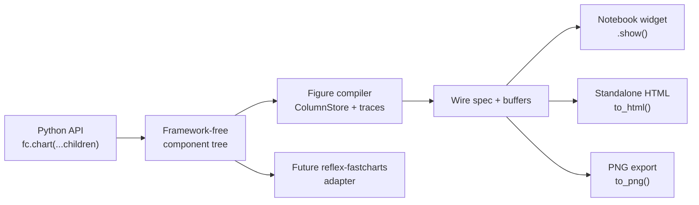

# Reflex-Shaped API Without A Reflex Dependency

**Status:** design proposal.

Goal: make FastCharts feel like a Reflex component tree: declarative,
children-first, styleable with normal CSS/Tailwind, and easy to wrap in Reflex
later. The core package must still have **no Reflex dependency** and must keep
the notebook/static export ergonomics users already expect: `.show()`,
`widget()`, `to_html(...)`, and `to_png(...)`.

This proposal complements `chart-grammar.md`: that doc defines marks, panels,
and overlays; this one defines the public API shape and styling contract.

## 1. Summary

FastCharts should expose a small framework-agnostic component model:

```python
import fastcharts as fc

chart = fc.chart(
    fc.scatter(
        x="feature_a",
        y="feature_b",
        color="segment",
        data=df,
        opacity=0.7,
    ),
    fc.line(x=fit_x, y=fit_y, color="var(--brand-accent)", width=2),
    fc.x_axis(label="feature A"),
    fc.y_axis(label="feature B"),
    fc.legend(),
    title="Customer clusters",
    width="100%",
    height=420,
    class_name="rounded border bg-white text-slate-950 dark:bg-zinc-950 dark:text-zinc-50",
    class_names={
        "legend": "text-xs rounded bg-white/80 shadow-sm dark:bg-zinc-900/80",
        "tooltip": "rounded-md bg-zinc-950 px-2 py-1 text-xs text-white shadow-lg",
        "modebar": "rounded border bg-white/80 backdrop-blur",
    },
    style={
        "--chart-grid": "rgba(148, 163, 184, 0.25)",
        "--chart-axis": "rgba(100, 116, 139, 0.85)",
        "--chart-text": "currentColor",
    },
)

chart.show()                 # notebook / IPython display
html = chart.to_html()       # standalone HTML
chart.to_html("chart.html")  # shareable file
chart._repr_html_()          # standalone HTML repr fallback
chart.to_png("chart.png")    # optional Chromium screenshot
```

The tree is not a Reflex tree. It is a pure FastCharts Python object graph that
can be rendered by notebooks, static HTML export, and future adapters:



## 2. Design Principles

- **No framework dependency in `fastcharts`.** The package may be easy to wrap
  in Reflex, Dash, Streamlit, or plain web apps, but it imports none of them.
- **Adapters use the thinnest possible dependency.** A future Reflex adapter
  should avoid depending on the full Reflex package unless that is the only
  supported public integration point. Prefer no hard Reflex dependency, or a
  core/component-only Reflex package if Reflex exposes one. Treat full Reflex as
  an optional app dependency, not something chart users inherit by installing
  FastCharts.
- **Full Reflex is not the default adapter dependency.** The target order is:
  no hard Reflex dependency first; then a supported Reflex core/component
  package if Reflex publishes one; then full `reflex` only as an explicit,
  documented fallback such as a demo/app extra.
- **Declarative by default.** Component construction records intent. Rendering
  happens when the user calls `.show()`, `widget()`, `to_html(...)`,
  `to_png(...)`, or when an adapter mounts it.
- **One chart vocabulary.** `Figure().scatter(...)` and
  `fc.chart(fc.scatter(...))` use the same mark names, channel names, defaults,
  and validation rules.
- **CSS styles chrome, spec styles marks.** DOM chrome like title, tooltip,
  legend, modebar, and wrapper can be styled with classes and CSS variables.
  WebGL marks are pixels, so their color/opacity/width still come from mark
  props that may resolve CSS color tokens.
- **Data never lives in framework state.** Component props describe bindings and
  styling. Large canonical arrays stay in FastCharts column storage and ship as
  binary buffers.
- **Notebook and static export stay first-class.** The declarative API is not
  only for web apps. It must render in Jupyter and export to standalone HTML.

## 3. Public API Shape

### 3.1 Component Nodes

Every public node is a plain Python object with `props` and `children`.

```python
fc.chart(
    fc.scatter(...),
    fc.line(...),
    fc.x_axis(...),
    fc.y_axis(...),
    fc.legend(...),
    title="...",
)
```

Target node types:

| Node | Purpose | Status |
|---|---|---|
| `chart(...)` | Single-panel container | Exists; existing `*_chart` wrappers remain |
| `figure(...)` | Multi-panel container | Later |
| `panel(...)` | Subplot/pane container | Later |
| `scatter(...)`, `line(...)`, etc. | Mark nodes | Exists for core marks |
| `x_axis(...)`, `y_axis(...)` | Scale chrome | Exists with scale, domain, side, label-position, format, and style hooks |
| `legend(...)` | Legend chrome | Exists |
| `tooltip(...)` | Tooltip chrome/customization | Exists |
| `modebar(...)` | Zoom/pan/reset controls | Exists |
| `theme(...)` | CSS variable defaults | Exists |

The implementation can stay dataclass-like. It does not need React-style
lifecycle in Python; lifecycle belongs to render targets.

### 3.2 Props

Props should follow Reflex-style Python naming:

- `snake_case`, not camelCase.
- `class_name`, not `className`.
- `data` plus string column references, similar to Recharts `dataKey` but more
  Pythonic: `x="date"`, `y="revenue"`, `color="segment"`.
- Event props start with `on_`: `on_hover`, `on_select`, later
  `on_view_change`.

```python
fc.scatter(
    x="date",
    y="latency_ms",
    color="region",
    size="requests",
    data=df,
    name="requests",
    class_name="fc-mark-latency",
    color_scale="viridis",
)
```

Important distinction: `class_name` on a mark is metadata for generated DOM
readouts and adapters. It cannot directly style already-rastered WebGL pixels.
Mark colors can still use CSS-resolved values:

```python
fc.line(x="t", y="p95", data=df, color="var(--chart-critical)", width=2)
```

### 3.3 Readout Methods

Every renderable component should expose the same readouts as `Figure`:

```python
chart.figure()       # compile to Figure
chart.widget()       # anywidget object
chart.show()         # display widget in notebook
chart.to_html()      # standalone string
chart.to_html(path)  # write standalone file
chart.html()         # alias for to_html()
chart._repr_html_()  # notebook/static HTML repr fallback
chart.to_png(path)   # screenshot standalone HTML
chart.memory_report()
```

`html()` is an alias only. `_repr_html_()` delegates to the standalone HTML
export path for notebook/export tools that inspect HTML representations instead
of anywidget display hooks. `to_html()` remains the canonical method because it
already exists and clearly communicates export behavior. `Chart.to_html(path)`
delegates to the same standalone export path as `Figure.to_html(path)`,
including same-directory atomic file replacement for path writes.

## 4. Styling Contract

FastCharts should support styling through three layers, in this order:

1. **CSS variables** for theme tokens used by canvas and DOM chrome.
2. **Class hooks** for DOM chrome and wrapper styling.
3. **Mark props** for visual encodings that become pixels.

### 4.1 CSS Variables

The current `--chart-*` variables should remain supported. New names can alias
to the old ones later, but do not break existing docs or examples.

Recommended token surface:

| Token | Applies to |
|---|---|
| `--chart-bg` | Plot/background clear color |
| `--chart-grid` | Grid lines |
| `--chart-axis` | Axis lines and ticks |
| `--chart-text` | Axis labels, title, legend text |
| `--chart-tooltip-bg` | Tooltip background |
| `--chart-tooltip-text` | Tooltip text |
| `--chart-legend-bg` | Legend panel |
| `--chart-selection` | Box select fill/stroke |
| `--chart-accent` | Default accent color for marks/modebar |

Example:

```python
fc.chart(
    fc.line(x="date", y="revenue", data=df, color="var(--chart-accent)"),
    class_name="text-slate-900 dark:text-slate-50",
    style={
        "--chart-bg": "transparent",
        "--chart-grid": "rgba(148, 163, 184, 0.20)",
        "--chart-axis": "rgba(100, 116, 139, 0.80)",
        "--chart-accent": "rgb(37, 99, 235)",
    },
)
```

### 4.2 Class Hooks

The chart should accept:

```python
class_name: str | None
class_names: dict[str, str]
```

`class_name` applies to the root chart wrapper. `class_names` targets stable
DOM chrome slots:

| Slot | Element |
|---|---|
| `root` | Outermost `.fastcharts` wrapper |
| `title` | Title chrome |
| `chrome` | Canvas-backed axis/grid/annotation layer |
| `canvas` | Plot canvas |
| `labels` | Axis/tick label layer |
| `legend` | Legend container |
| `legend_item` | Legend row |
| `legend_swatch` | Legend color swatch |
| `tooltip` | Tooltip container |
| `modebar` | Modebar container |
| `modebar_button` | Modebar button |
| `selection` | Selection rectangle |
| `crosshair_x` | Vertical crosshair line |
| `crosshair_y` | Horizontal crosshair line |
| `badge` | Reduction/density badge container |
| `badge_item` | Reduction/density badge row |
| `tick_label` | Axis tick label |
| `axis_title` | Axis title label |

Each rendered slot also receives `data-fc-slot="<slot>"`, so plain CSS,
attribute selectors, and Tailwind arbitrary variants can target the same stable
surface even when the caller does not add a class. The client ships one
zero-specificity `:where([data-fc-slot="…"])` default stylesheet, so a
`class_names` utility class (or an inline `chrome_styles` value) always wins
over the built-in look without needing `!important`. In the standalone
`to_html(...)` export — which has no host page to inherit Tailwind from — pass
`custom_css="…"` to inject the stylesheet that defines those utility classes.
The canonical slot tuple is exported as `fastcharts.CHART_DOM_SLOTS` so adapters
and tests do not have to copy this table by hand. That root export resolves
through the lightweight DOM contract module, so framework adapters can inspect
the styling surface without importing NumPy, the chart engine, or widget stack.
`class_names` keys are validated against that tuple; unknown keys fail fast
instead of being silently ignored. The same validation is applied by the fluent
`Figure` export path, so mutating `fig.class_names` or `fig.chrome_styles`
cannot bypass the public DOM-slot contract.

Tailwind example:

```python
fc.chart(
    fc.histogram(values="latency", data=df, bins=200),
    title="Latency distribution",
    class_name="h-[360px] w-full rounded-md border border-zinc-200 bg-white text-zinc-950 dark:border-zinc-800 dark:bg-zinc-950 dark:text-zinc-50",
    class_names={
        "legend": "rounded bg-white/80 text-xs shadow-sm dark:bg-zinc-900/80",
        "tooltip": "rounded-md bg-zinc-950 px-2 py-1 text-xs text-white shadow-xl",
        "modebar_button": "hover:bg-zinc-100 dark:hover:bg-zinc-800",
    },
)
```

### 4.3 Inline Styles

Support `style: dict[str, str | int | float]` on containers and chrome nodes.
This should serialize to safe DOM style assignment, not raw HTML.

Rules:

- Allow CSS custom properties.
- Avoid accepting raw CSS text strings.
- Avoid style props on WebGL-only mark internals unless they map to existing
  mark props.
- Preserve CSP compatibility for standalone export.

### 4.4 Tailwind Caveat

Tailwind can style the chart wrapper and DOM chrome. It cannot directly style
individual WebGL points/bars/lines after they are rasterized. For marks, use
props that resolve CSS colors:

```python
fc.scatter(x="x", y="y", data=df, color="var(--chart-accent)")
```

This keeps Tailwind useful without pretending CSS can reach GPU buffers.

## 5. Tooltip Customization

Tooltips need a first-class declarative surface because they are where Reflex
users expect customization.

Target API:

```python
fc.chart(
    fc.scatter(x="x", y="y", color="segment", data=df),
    fc.tooltip(
        fields=["x", "y", "segment"],
        title="{segment}",
        format={
            "x": ".2f",
            "y": ".2f",
        },
        class_name="rounded bg-zinc-950 text-white shadow-lg",
    ),
)
```

Design rules:

- Tooltip content is data, not raw HTML.
- `fields`, `title`, and `format` compile to a safe client readout spec.
- Text is inserted with `textContent` or text nodes.
- Framework adapters can map tooltip payloads to framework-side custom
  components. Core `fastcharts` stores those components as opaque Python
  objects and does not import Reflex.

Implemented adapter hook:

```python
chart = fc.chart(
    fc.scatter(x="x", y="y", color="segment", data=df),
    fc.legend(rx.vstack(...), show=False),
    fc.tooltip(rx.box(...), show=False, fields=["x", "y", "segment"]),
)

chart.chrome_components()
# {"legend": <rx.vstack ...>, "tooltip": <rx.box ...>}
```

The render objects are not serialized into standalone HTML. `show=False`
suppresses the built-in DOM chrome when an adapter is replacing it; leaving
`show=True` keeps the normal safe built-in fallback.

Potential future advanced API:

```python
fc.tooltip(render="compact_metric")  # named client-side template
```

Avoid accepting arbitrary JS callbacks in standalone HTML. Notebook callbacks
can stay on `on_hover`, where Python is present.

## 6. Event Model

Events should be semantic, small, and transport-independent.

```python
def hover(row: dict): ...
def selected(selection: dict): ...
def view_changed(view: dict): ...

fc.chart(
    fc.scatter(x="x", y="y", data=df),
    on_hover=hover,
    on_select=selected,
    on_view_change=view_changed,
)
```

Event payloads:

| Event | Payload |
|---|---|
| `on_hover` | One row/readout dict |
| `on_select` | Trace ids, row indices/counts, optional aggregate summary |
| `on_view_change` | x/y ranges, pixel shape, sequence id |

Render target behavior:

- Notebook widget: callbacks can call Python.
- Standalone HTML: no Python callback and no serialized callable/framework
  object. Event props compile only to interaction flags such as
  `{"hover": true, "select": true}`. Optionally dispatch DOM `CustomEvent`s for
  host pages.
- Future Reflex adapter: map payloads to Reflex event handlers.

## 7. Render Targets

The component tree compiles once and can target multiple renderers.

| Target | Method | Notes |
|---|---|---|
| Notebook widget | `show()` / `widget()` | Python callbacks available |
| Notebook/static HTML repr | `_repr_html_()` | Self-contained fallback that reuses standalone export |
| Standalone HTML | `to_html()` / optional `html()` alias | Self-contained, no Python callbacks |
| Static PNG | `to_png()` | Screenshots same standalone render |
| Future Reflex | external adapter package | Uses the smallest supported Reflex surface; core does not import Reflex |
| Future server app | generic payload/message routes | Same wire protocol |

This keeps the API framework-shaped without making FastCharts a framework
package.

## 8. What The Future Reflex Adapter Looks Like

FastCharts core:

```python
chart = fc.chart(
    fc.scatter(x="x", y="y", data=df),
    class_name="h-full w-full",
)
```

Future app code using an adapter:

```python
import reflex as rx
import reflex_fastcharts as rfc

class State(rx.State):
    chart_token: str = ""

    def load(self):
        chart = fc.chart(fc.scatter(x="x", y="y", data=df))
        self.chart_token = rfc.register(chart)

def index():
    return rfc.chart(
        token=State.chart_token,
        class_name="h-[480px] w-full",
        on_hover=State.hovered,
    )
```

The adapter consumes the same component tree or compiled figure. The user app
may import full Reflex because it is a Reflex app. The adapter package itself
should still use the minimum possible Reflex dependency surface:

- Best: no hard Reflex dependency; expose registration/data-plane helpers and a
  small component declaration that plugs into Reflex when Reflex is already
  installed.
- Good: depend only on a supported Reflex core/component package if Reflex
  provides one.
- Last resort: depend on full `reflex`, and document why the public API requires
  it.

In every case, `fastcharts` remains pure and Reflex-free.

Dependency rule:

```text
pip install fastcharts                 # never installs Reflex
pip install reflex-fastcharts          # should not install full Reflex by default
pip install reflex-fastcharts[reflex]  # only if full Reflex is truly required
```

The adapter can assume it is running inside a Reflex app when the user imports
it from app code. That lets the adapter use duck typing, registration helpers,
or a small component declaration without making every charting install inherit
the full Reflex application stack.

## 9. Concrete Code Examples

These examples are written as target API sketches. They show the intended shape
of the API before implementation details are locked.

### 9.1 Notebook-First Chart That Also Exports

This is the core promise: the declarative API feels component-shaped, but it
still works like today's notebook-friendly FastCharts objects.

```python
import numpy as np
import pandas as pd
import fastcharts as fc

rng = np.random.default_rng(7)
df = pd.DataFrame(
    {
        "x": rng.normal(size=50_000),
        "y": rng.normal(size=50_000),
        "segment": rng.choice(["enterprise", "growth", "self serve"], size=50_000),
    }
)

chart = fc.chart(
    fc.scatter(
        x="x",
        y="y",
        color="segment",
        data=df,
        opacity=0.55,
        name="accounts",
    ),
    fc.x_axis(label="activation score"),
    fc.y_axis(label="retention score"),
    fc.legend(),
    title="Account clusters",
    width="100%",
    height=420,
)

chart.show()                       # notebook / IPython
chart.to_html("clusters.html")     # standalone shareable file
chart.to_png("clusters.png")       # optional local Chromium screenshot
```

The same object compiles to a `Figure`, so existing internals and future
adapters share the same payload path:

```python
fig = chart.figure()
report = chart.memory_report()
```

### 9.2 Tailwind-Styled Operations Chart

This example shows the styling contract: Tailwind classes style the wrapper and
DOM chrome, while marks use props and CSS variables that the renderer resolves.

```python
import fastcharts as fc

chart = fc.chart(
    fc.histogram(
        values="latency_ms",
        data=requests,
        bins=240,
        density=True,
        color="var(--chart-accent)",
        name="latency",
    ),
    fc.rule(y=0.95, color="var(--chart-critical)", dash=True),
    fc.tooltip(
        fields=["latency_ms", "count"],
        title="Latency",
        format={"latency_ms": ".1f", "count": ",.0f"},
        class_name="rounded-md bg-zinc-950 px-2 py-1 text-xs text-white shadow-xl",
    ),
    title="API latency distribution",
    width="100%",
    height=360,
    class_name=(
        "h-[360px] w-full rounded-md border border-zinc-200 bg-white "
        "text-zinc-950 dark:border-zinc-800 dark:bg-zinc-950 dark:text-zinc-50"
    ),
    class_names={
        "legend": "rounded bg-white/80 text-xs shadow-sm dark:bg-zinc-900/80",
        "modebar": "rounded border bg-white/80 backdrop-blur dark:bg-zinc-900/80",
        "modebar_button": "hover:bg-zinc-100 dark:hover:bg-zinc-800",
    },
    style={
        "--chart-bg": "transparent",
        "--chart-grid": "rgba(148, 163, 184, 0.20)",
        "--chart-axis": "rgba(100, 116, 139, 0.80)",
        "--chart-accent": "rgb(37, 99, 235)",
        "--chart-critical": "rgb(239, 68, 68)",
    },
)
```

Tailwind controls layout and chrome. The histogram pixels still come from the
compiled mark spec, which is what keeps large-data rendering fast and
framework-independent.

### 9.3 Future Reflex App With A Thin Adapter

The future adapter should consume FastCharts objects; FastCharts itself does not
import Reflex. This example imports Reflex because it is user application code,
not because the core charting package depends on Reflex.

```python
import reflex as rx
import fastcharts as fc
import reflex_fastcharts as rfc


class Dashboard(rx.State):
    chart_token: str = ""
    hovered: dict = {}

    def load(self):
        chart = fc.chart(
            fc.scatter(x="x", y="y", color="segment", data=load_big_frame()),
            title="Live customer map",
            class_name="h-[520px] w-full",
        )
        self.chart_token = rfc.register(chart)

    def on_hover(self, row: dict):
        self.hovered = row


def page():
    return rfc.chart(
        token=Dashboard.chart_token,
        on_hover=Dashboard.on_hover,
        class_name="h-[520px] w-full",
    )
```

The adapter owns the registry and event forwarding. It should avoid owning a
full Reflex dependency unless absolutely necessary. Core FastCharts owns the
declarative chart object, binary payload, and renderer.

## 10. Compatibility Contract

Must keep:

- `Figure` fluent API.
- Existing `scatter_chart`, `line_chart`, etc. wrappers.
- `Chart.figure()`.
- `Chart.widget()`.
- `Chart.show()`.
- `Chart.to_html(...)`.
- `Chart.to_png(...)`.
- Static HTML exports with no Python/Reflex runtime.
- No Reflex import in `fastcharts`.

Now part of the core alpha contract:

- Neutral `fc.chart(...)`.
- `fc.tooltip(...)`, `fc.modebar(...)`, `fc.theme(...)`.
- `class_name`, `class_names`, and `style` props.

Can add:

- DOM `CustomEvent`s for standalone host integration.
- A separate adapter package with optional/minimal Reflex integration.

Should avoid:

- Raw HTML tooltip strings.
- Raw JS callbacks in Python specs.
- Per-mark imperative draw functions.
- Storing large arrays in framework state.
- Making Tailwind classes pretend to style WebGL pixels.
- Pulling full Reflex into any install path unless an adapter cannot work
  against no Reflex dependency or a smaller supported API.

## 11. Implementation Plan

### Phase 1: Styling Props On Existing Components

- Add `class_name`, `class_names`, and `style` to `Chart`.
- Add class hooks to DOM chrome in `ChartView`.
- Preserve current inline styles as defaults, but let classes and CSS variables
  override where safe.
- Implemented: `CHART_DOM_SLOTS` exports the fixed slot list, client tests
  verify every slot is applied, and user text still uses text nodes.

### Phase 2: Neutral Container And Tooltip Node

- Add `fc.chart(...)` as a kind-neutral alias.
- Add `fc.tooltip(...)` node compiling to safe tooltip readout spec.
- Keep existing `*_chart(...)` helpers as ergonomic aliases.

### Phase 3: CSS Variable Expansion

- Document and test the full CSS variable table.
- Cache CSS color resolution outside hot render paths.
- Add examples for vanilla CSS and Tailwind.

### Phase 4: Events And Standalone Host Hooks

- Add `on_view_change`.
- For standalone HTML, dispatch optional DOM `CustomEvent`s:
  `fastcharts:hover`, `fastcharts:select`, `fastcharts:view`.
- Keep Python callbacks notebook-only.

### Phase 5: External Reflex Adapter

- Build an external adapter package.
- Start with zero hard Reflex dependency if practical; otherwise use only a
  supported Reflex core/component package.
- Add a full-Reflex extra only if the adapter genuinely needs app-level Reflex
  APIs; do not make full Reflex the default adapter install.
- Use registry tokens for large figures.
- Use binary payload/message routes for data plane.
- Map semantic events to Reflex handlers.

## 12. Acceptance Criteria

- A user can build a line-on-scatter overlay declaratively.
- The same chart can call `.show()` in a notebook and `to_html()` for static
  export.
- The chart root and chrome can be styled with Tailwind classes.
- Mark colors can be driven by CSS variables.
- `pip install fastcharts` does not install Reflex.
- Installing the adapter does not pull full Reflex unless that dependency is
  proven necessary and isolated behind an extra or clearly documented package.
- Security tests still prove text is never inserted via HTML parser sinks.
- Large data remains binary/screen-bounded; no chart data enters framework
  state by default.
