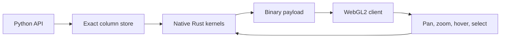

# xy

Interactive Python charts whose cost follows the screen, not the dataset.

xy is an experimental charting engine for very large interactive line,
scatter, density, area, histogram, bar, and heatmap charts. It combines a
native Rust compute core, binary columnar transport, WebGL2 rendering, and
level-of-detail tiers so notebooks and standalone HTML exports stay
interactive well past the point where JSON/SVG-heavy chart stacks run out of
room.

> **Early alpha:** the core 2D surface is in place, but APIs may still change
> before 1.0.

## Install

Published wheels include the native Rust core and JavaScript client. You do
not need Rust, Node, or a CDN at runtime.

```bash
pip install xy
```

Python 3.11 or newer is required.

## Build your first chart

```python
import numpy as np
import xy as fc

x = np.linspace(0, 20, 1_000_000)
y = np.sin(x) + np.random.default_rng(7).normal(0, 0.08, x.size)

chart = fc.line_chart(x=x, y=y)
chart
```

xy keeps exact source values in Python, sends typed binary buffers instead of
JSON number soup, and draws a screen-bounded representation in WebGL. Zooming
refines the visible region without making initial rendering proportional to
the full dataset.

## Why xy

| Large-chart problem | xy approach |
|---|---|
| JSON payloads grow with every point | Binary typed buffers ship geometry and channels |
| SVG creates one DOM node per mark | WebGL2 draws instanced marks and line segments |
| GPU floats lose timestamp precision | Exact f64 values stay in Python; GPU values are recentered |
| Rendering 10M points is visually wasteful | Density tiers and M4 decimation follow screen resolution |
| Performance claims get fuzzy | Benchmarks report timing, memory, payload, and backend |

## Choose an API

Use the declarative xy API for composition, channels, interaction, and native
chart features. Start with the [API examples](/api-examples/) and the
[styling guide](/styling/).

If you already have Matplotlib plotting code, change the import and use the
supported 2D compatibility surface:

```python
import xy.pyplot as plt

fig, ax = plt.subplots()
ax.plot([1, 2, 3], [2, 5, 3], "o-", label="series")
ax.legend()
fig
```

See [Matplotlib compatibility](/matplotlib-compat/) for supported methods and
intentional boundaries.

## How it works



The [design dossier](/design-dossier/) explains the system end to end. For
measured performance, fairness rules, and reproducible commands, read the
[benchmarks](/benchmark/).

## Next steps

- Copy a complete example from [API examples](/api-examples/).
- Learn the chrome, token, and mark styling model in [Styling](/styling/).
- Bring over existing plotting code with [xy.pyplot](/matplotlib-compat/).
- Read [Production readiness](/production-readiness/) before adopting an
  early-alpha feature in a critical system.
