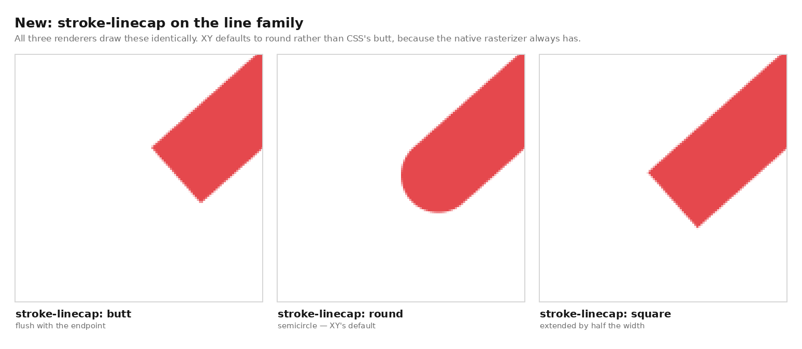

# Styling XY

Each public chrome slot names a stable, CSS-addressable DOM surface. You can
restyle those surfaces with plain CSS, attribute selectors, Tailwind, or
per-slot inline styles. Built-in visual defaults stay in a low-priority layer,
so normal utilities override those defaults without `!important`; canvas
pixels, structural geometry, live state, and explicit inline `styles` have
separate ownership described below.

This engineering guide explains the implementation contract. The public,
task-oriented references are [Styling](../../docs/styling/index.md),
[Component Variations](../../docs/styling/component-variations.md), and
[Mark Styles](../../docs/styling/mark-styles.md). For the API shapes see
[reflex-shaped-api.md](../design/reflex-shaped-api.md); for the render internals
see [renderer-architecture.md](../design/renderer-architecture.md).

## The five ways to style

| Mechanism | Scope | Where |
| --- | --- | --- |
| `class_names={slot: "..."}` | Add classes to a chrome slot (great for Tailwind) | `xy.chart(...)` |
| `styles={slot: {...}}` | Inline CSS on a chrome slot | `xy.chart(...)` |
| `style={...}` | Cross-renderer CSS appearance subset for a rendered mark | `xy.line(...)`, `xy.scatter(...)`, … |
| `class_name=` / `style=` | One annotation label; geometry still uses typed props | `.vline(...)`, `.text(...)`, … |
| `custom_css="..."` | A raw author stylesheet in the exported document | `to_html(fig, custom_css=...)` |

```python
import xy

chart = xy.chart(
    xy.scatter(
        x=xs,
        y=ys,
        style={"fill": "var(--accent)", "stroke": "currentColor", "stroke-width": "1px"},
    ),
    class_names={
        "tooltip": "rounded-lg bg-slate-900/90 text-white shadow-xl",
        "legend": "text-xs font-medium",
        "modebar_button": "hover:bg-slate-200",
    },
    styles={"title": {"font_size": 18, "letter_spacing": "0.02em"}},
)
```

`styles` values follow the same numeric-length convention as common React/Python
style APIs: a bare number on a length property becomes `px` (`{"font_size": 18}`
→ `font-size:18px`), custom properties (`--x`) and unitless properties pass
through untouched.

In Reflex, Tailwind utilities require `rx.plugins.TailwindV4Plugin()`. Configure
that plugin with `{"darkMode": "selector"}` when `dark:` utilities should track
Reflex's `.dark` color-mode switch; the plugin default instead follows the OS
media query. Complete literal classes emitted into Reflex's generated JSX work
with the plugin's normal scan paths; the original Python or Markdown path does
not need to be added. Fixed Chart/Figure sources expose their class inventory
automatically; token/Var sources pass their complete build-time inventory
through `reflex_xy.chart(..., tailwind_classes=...)`. See the public
[Chrome Slots](../../docs/styling/chrome-slots.md) guide for the
standalone-export and dynamic-class boundaries.

The inventory preserves advanced Tailwind candidates verbatim, including
quoted arbitrary values, escaped underscores, and Unicode content. It is an
ordered string inventory: mappings and unordered sets raise. A live figure
must inventory every complete class it can emit. A payload whose
constructor-owned chrome changes (including `dom`, title, legend, colorbar,
badge, modebar, or axis-band topology) rebuilds that chrome so old runtime
classes or nodes do not linger; every named-axis range and durable geometric
selection is restored silently.

Before the live-chart inventory existed, the class names reached the DOM but
their utilities were absent from the compiled stylesheet:


The same production build with `tailwind_classes=` emits the requested
utilities for the chart root, title, tooltip, and controls:


## Rendered marks: standard CSS vocabulary

WebGL and native-raster marks are not DOM elements, so XY compiles a deliberate
CSS subset instead of pretending every browser property can work. Property
names are canonical CSS kebab-case; snake_case aliases remain accepted for
Python compatibility. Unsupported properties raise before the figure mutates.

```python
xy.line(
    x=x,
    y=y,
    style={
        "stroke": "var(--accent)",
        "stroke-width": "2px",
        "stroke-opacity": 0.85,
        "stroke-dasharray": "6px 3px",
    },
)

xy.bar(
    x=category,
    y=value,
    style={
        "fill": "linear-gradient(to top, #2563eb, #93c5fd)",
        "stroke": "#1e3a8a",
        "stroke-width": "1px",
        "border-radius": "4px",
    },
)
```

| Mark family | Supported CSS properties |
| --- | --- |
| line, step, stairs, ECDF | `stroke`, `stroke-width`, `stroke-opacity`, `stroke-dasharray`, `stroke-linecap`, `opacity` |
| area, error band | `fill`, `fill-opacity`, `stroke`, `stroke-width`, `stroke-opacity`, `opacity`; area also supports `stroke-dasharray` |
| scatter | `fill`, `fill-opacity`, `stroke`, `stroke-width`, `stroke-opacity`, `marker-shape`, `opacity` |
| histogram, bar, column | `fill`, `fill-opacity`, `stroke`, `stroke-width`, `stroke-opacity`, `border-radius`, `opacity` |
| segments, error bars, contour, stem | `stroke`, `stroke-width`, `stroke-opacity`, `opacity` |
| box | `fill`, `fill-opacity`, `stroke`, `stroke-width`, `stroke-opacity`, `opacity` |
| violin | `fill`, `fill-opacity`, `opacity` |
| triangle mesh | `fill`, `fill-opacity`, `stroke`, `stroke-width`, `stroke-opacity`, `opacity` |
| heatmap, hexbin | `fill-opacity`, `opacity` |

Legacy appearance arguments such as `color=`, `width=`, and `opacity=` remain
supported; a CSS `style` declaration is the final override when both are set.
Within `style`, use the standard paint property for the geometry: `stroke` for
line-like marks and `fill` for filled marks. `color` is not a paint alias there;
this avoids ambiguous combinations such as `color` plus `stroke` and keeps the
same declarations meaningful in SVG, WebGL, and native PNG output.

### Compound box-plot parts

`box` compiles into a rectangle body, segment whiskers, a segment median, and
scatter outliers. The public mark exposes the renderer-backed parts directly:

| Mapping | Compiles as | Accepted vocabulary |
| --- | --- | --- |
| `style` | box-body rectangle | fill, fill/stroke opacity, stroke paint/width, overall opacity |
| `whisker_style` | segments | stroke paint/width/opacity, overall opacity |
| `median_style` | segments | stroke paint/width/opacity, overall opacity |
| `outlier_style` | scatter | fill/stroke paint/width/opacity, marker shape, overall opacity |

Each mapping is validated against its actual primitive. A fill on a whisker or
a marker shape on the body raises before the figure mutates. The default path
emits the same trace styles as before these mappings existed.

A mark's `class_name` is adapter-only trace metadata. It does not create a DOM
node and is not interpreted as a paint selector by the shipped browser,
Reflex, SVG, or native renderers.

### Polyline stroke geometry

`stroke-linecap` (`butt` | `round` | `square`) carries its standard SVG
semantics: it shapes the two ends of an open polyline and each dash end. It is
accepted **only** by the line family, because it describes stroked open-path
geometry; every other mark rejects it at build time rather than accepting a
declaration no renderer would draw.




XY's default is `round`, deliberately not the CSS initial value `butt`. Before
this vocabulary existed the three renderers silently disagreed — the native
rasterizer capped round from its clamped segment distance field
(`src/raster.rs`), the WebGL client capped butt with a half-pixel bleed, and
the SVG writer hardcoded `round` on line paths while the area outline inherited
SVG's `butt`. Round is now the contract in all three, because the native
rasterizer is the reference for static export.

`styles.DEFAULT_LINE_CAP` names that default and `marks._stroke_geometry` omits
a key that equals it, so a spec that never asks for another cap stays
byte-identical to one built before the change.

Joins are always round and are not selectable. That was already the geometry
the native rasterizer produced, so nothing changed there; what did change is
that the SVG writer now *names* the join on every stroked path instead of
letting the format's `miter` default through — `_pdf` reads these attributes
straight back out of that markup, so an unnamed join meant SVG and PDF
disagreeing with the rasterizer at no benefit.

### Marker shape

`marker-shape` selects one of the 19 renderer-backed scatter symbols and is the
CSS spelling of the existing `symbol=` argument — both resolve to the same
`symbol` trace-style value, so the two spellings produce identical specs. It is
an **XY vocabulary name, not a standard CSS property**: CSS has no shape keyword
for a non-DOM point mark, and the alternative (a `-xy-` vendor prefix) would
force an unusable `_xy_marker_shape` Python alias. The distinction is recorded
per property rather than encoded in the name.

### Reflex integration boundary

Reflex owns reactive `Var` values, conditions, application state, event
handlers, layouts, and themes. XY does not duplicate those facilities. The
integration resolves them into concrete `style`, `styles`, `class_name`, and
`class_names` values and updates the renderer. CSS variables are the preferred
bridge for design tokens and theme changes.

### Axis paint and geometry

`xy.x_axis(style={...})` and `xy.y_axis(style={...})` accept a strict,
cross-renderer axis vocabulary. Unknown keys and invalid values raise when the
axis component is created, before the chart or an export is rendered. Keys may
use Python snake_case or CSS kebab-case; pixel geometry accepts a finite number
or a CSS `px` value such as `"3px"`.

`minor_style={...}` accepts the same vocabulary for the independent minor-tick
and minor-grid tier. `minor_tick_values=[...]` supplies its positions without
labels; major `tick_values`/`tick_labels` remain unchanged. On log axes,
`nonpositive="clip"` maps non-positive mark coordinates below the visible
range, while `"mask"` makes those endpoints non-renderable in the browser,
SVG, and native raster paths.

| Axis style key | Value |
| --- | --- |
| `grid_color`, `axis_color`, `tick_color`, `tick_label_color`, `label_color` | CSS color |
| `grid_width`, `axis_width`, `tick_width` | Non-negative pixel length |
| `grid_dash` | `"solid"`, `"dashed"`, `"dotted"`, or `"dashdot"` |
| `grid_opacity` | Number from `0` to `1` |
| `tick_length` | Non-negative pixel length |
| `tick_padding` | Signed pixel length (negative allowed) — extra distance between an axis tick and its tick label, on top of the tick's outward length. Defaults to `0`. Honored by static SVG/PNG exports. |
| `tick_size` / `tick_label_size`, `label_size` | Positive pixel font size |
| `label_font_weight`, `label_font_family`, `label_font_style` | Axis-label font overrides, passed through to the browser, SVG, and native PNG paths. `label_font_weight` defaults to `400` — see [Chrome text weight](#chrome-text-weight). |
| `tick_direction` | `"in"`, `"out"`, or `"inout"` |
| `tick_label_anchor` | `"start"`, `"center"`, or `"end"` (mpl `ha` aliases `"left"`/`"right"`/`"middle"` normalize) — which label edge pins to the tick; rotated labels pivot about the pinned edge. Also a first-class `x_axis`/`y_axis` option. X defaults to `"center"`; y defaults to the tick-side edge (`"end"` left of the plot, `"start"` right of it). Honored by static SVG/PNG exports. |

`tick_label_strategy="preserve"` is the explicit-locator policy: every tick
label is drawn even when its box overlaps another. It is used by
`xy.pyplot` for Matplotlib categorical conversion, `FixedLocator`, and
`set_*ticks`; ordinary composition axes remain on `"auto"` and retain
collision-aware rotate/stagger/thinning behavior.

When `side` is omitted, the browser resolves primary x/y chrome to
bottom/left and named extra y axes to the right. The same fallback applies to
tick marks and tick labels, including a live spec update that clears `side`.

```python
xy.x_axis(
    label="time",
    style={
        "grid-color": "rgb(148 163 184 / 25%)",
        "grid-width": "1px",
        "grid-dash": "dashed",
        "grid-opacity": 0.7,
        "axis-color": "var(--axis)",
        "tick-length": "6px",
        "tick-direction": "out",
        "tick-color": "currentColor",
        "tick-label-color": "currentColor",
        "label-size": "13px",
    },
)
```

Tick-label placement has two regimes, and which one applies is decided by
whether the axis authored any tick geometry — `tick_length` or
`tick_padding`:

- **Authored.** The label's anchor sits `tick_padding` past the outward end of
  the tick mark, plus the room the glyph box itself needs on that side. This is
  matplotlib's rule, and it is how the pyplot shim reproduces mpl spacing: it
  always supplies `{x,y}tick.major.size` and `{x,y}tick.major.pad` from
  `rcParams` (`_rc_axis_style`), so pyplot charts are always in this regime.
- **Unauthored.** The chart keeps a fixed per-side gap. Core's default
  `tick_length` is `0` and there is no default `tick_padding`, so deriving the
  gap from tick geometry would silently pull the labels of every chart that
  styles no ticks toward the spine. The per-side gaps are a layout contract:
  charts that author no tick styling render identically before and after
  `tick_padding` existed, in the browser client, SVG export, and native
  raster alike. `_axis_tick_label_offset` in `python/xy/_svg.py` (shared with
  `_raster.py`) and `tickLabelOffset` in `js/src/50_chartview.ts` are the two
  implementations, and each renderer passes its own historical per-side value.

Grid visibility is **per axis**. Every renderer — WebGL canvas, SVG, and native
PNG — paints an axis's grid lines from that axis's own `grid_color` and
`grid_width`, so `grid_color: "transparent"` hides exactly that axis's grid and
leaves the other axis untouched. Enabling one axis's grid never turns the
opposite axis's grid off; x and y are independent switches, and the matplotlib
shim's `Axes.grid(axis="x")`/`Axes.grid(axis="y")` and `Axis.grid()` resolve
onto the same rule.
Major and minor grids apply this rule independently through `style` and
`minor_style`; a transparent minor grid does not hide minor tick marks.

#### Axis visibility switches

Hiding axis chrome is the single most common styling edit and it is pure
subtraction, so it is a switch, not seven transparent colors. `x_axis` and
`y_axis` take `show`, `line`, `ticks`, `grid`, and `text`; each compiles to the
style properties below, which means they need no renderer support and compose
with everything that already reads `style`.

| Switch | Compiles to |
| --- | --- |
| `line=False` | `axis_width: 0`, `axis_color: "#00000000"` |
| `ticks=False` | `tick_length: 0`, `tick_width: 0` (geometry, never `tick_color`: every renderer resolves the tick-*label* color as `tick_label_color` falling back to `tick_color`, so blanking the paint would erase the labels too) |
| `grid=False` | `grid_opacity: 0` |
| `text=False` | `tick_label_color: "#00000000"`, `label_color: "#00000000"` |
| `show=False` | all four |

`show` is the default for the other four, and each overrides it in **both**
directions: `y_axis(show=False, grid=True)` is a grid with no other chrome.
An explicit `style=` property always outranks a switch, so a switch is a
default and never a lock. `text` (axis text visibility) is deliberately not
named `labels`, which would read as a sibling of `tick_labels` (the label
*strings*). Unset switches emit no style at all, so specs that do not use them
stay byte-identical.

```python
xy.x_axis(show=False)                       # no axis chrome drawn
xy.y_axis(show=False, grid=True)            # horizontal guides only
xy.x_axis(line=False, ticks=False, style={"grid_color": "#1e293b"})
```

The switches control what is *painted*, not the layout: the plot rect is
unchanged, because the gutters are reserved by `padding`. An edge-to-edge
sparkline is `show=False` **plus** `padding=0`.

### Plot rectangle and chrome reservations

`xy.chart(..., padding=[top, right, bottom, left])` sets the gutters around the
plot rectangle in pixels. When omitted, the renderers pick label-aware defaults
that leave room for ordinary tick and axis labels; those defaults are
implementation-owned and may evolve with the text measurement and layout
engines. `padding=[0, 0, 0, 0]` plus hidden axes gives an edge-to-edge
sparkline.

Some chrome is reserved **outside** `padding` rather than inside it, so
supplying padding does not have to anticipate it:

| Reservation | Where it is allocated |
| --- | --- |
| Chart title band | above the plot |
| A top-side x axis | above the plot |
| Right-side y axis gutter (secondary/named `y`) | to the right of the plot |
| Vertical colorbar and its label | to the right of the plot |
| Horizontal colorbar and its label | below the plot |

`xy._svg.layout()` is the single resolver for this in the Python exporters, and
the browser client's `ChartView._layout()` mirrors it exactly — the two must
stay in step, because a caller that pins a plot rectangle (as `xy.pyplot` does
to honor Matplotlib's `figure.subplot.*` frame) computes its padding by
subtracting these reservations.

#### Measured multiline chrome and the rotated y-axis title

Every newline-delimited title or tick/category label is measured as a block.
Line splitting normalizes CRLF/CR to LF and preserves empty lines; width is the
widest DejaVu advance and height is `line_count × 1.2 × font_size`. SVG keeps
single-line strings as direct text nodes and emits one `<tspan>` per line only
for multiline blocks; native PNG emits one glyph command per line, and the
browser uses `white-space: pre-line` with the same line height. Rotated extents
use the whole block:

The pyplot shim retains authored font sizes in Matplotlib points and resolves
them to output pixels at the owning figure's current DPI before any of those
measurements or renderer handoffs. This includes figure suptitles and a
temporary `savefig(dpi=...)` override; 14 pt is therefore 19.44 px at 100 dpi,
not 14 CSS pixels.

```text
rotated width  = |cos θ| × block width + |sin θ| × block height
rotated height = |sin θ| × block width + |cos θ| × block height
```

The ordinary one-line tick gutters remain unchanged. An outside x-axis title
raises that floor only when its baseline, ascent/descent, and edge guard do not
fit; each extra title/tick line then raises only the corresponding gutter by its
line step. Tight/constrained pyplot layouts are marked dirty by later chrome
mutations and resolve from these final per-panel measurements; a subplot
boundary reserves the outward gutters of both neighbors rather than a single
global title constant.

The **left** gutter is additionally floored at what the left y axis's own text
measures, rather than trusting the flat `46/62 px`:

```text
left ≥ 10 px inset + the full multiline title box
     + 0.4 em title-to-tick gap
     + tick_padding (+ the outward part of tick_length)
     + the widest tick label's advance
```

with the title terms dropped when the axis has no title (or places it
`inside_*`), and the tick terms dropped when its tick labels are hidden. The
full title box includes its ascent, descent, and every additional line step.
Widths come from the advance table in `python/xy/_fontmetrics.py`, generated by
`scripts/gen_font.py` from the same DejaVu Sans face `src/font.rs` bakes for the
Rust rasterizer — the reservation is measured in the metrics of the font that
will draw the ink, which is also Matplotlib's default face. Browser layout adds
a 2 px Canvas-to-DOM measurement guard only for an outside y title; the guard
prevents edge clamping from consuming the authored gap and does not apply to
`inside_*` titles. A rotated tick label
(`tick_label_angle`) contributes `advance·cos θ + line box·sin θ`.

This is a floor, never an override: `padding` and the `46/62` default both stand
whenever they already fit, so a chart whose text fits the default is laid out
byte-identically. It rises above them only when the alternative is ink drawn off
the canvas or on top of the tick labels, which a static export cannot recover
from the way the DOM can (the browser ellipsizes an overlong categorical tick
label; an SVG has no such fallback).

The **outside** y-axis title is a quarter-turned line box centered on a fixed
inset — `10 px` from the canvas edge on the left, `plot-right + 40 px` on the
right — matching ChartView's `left:` values. Static exporters emit a *baseline*
rather than a CSS box, so they shift it by half the ascent/descent asymmetry
(`(ascent − descent) / 2`, away from the plot) to land the same ink; this is the
y-axis counterpart of the `font_size × 0.82` correction the x-axis title makes.
A title whose line box is taller than twice the inset is clamped to keep 1 px of
leading ink on the canvas. Titles at an angle other than ±90° keep the raw inset.
`label_offset` moves the title within the reserved gutter and is included in the
reservation.

The **top and bottom x-axis gutters** are likewise floored at the outside axis
title's measured outer glyph edge and at the projected tick-label cross-axis
extent when the caller explicitly authors an angle or rotate/stagger strategy.
The title floor uses the same `font_size × 0.82` baseline conversion as the
emitters and includes `label_offset`, ascent/descent, multiline steps, and the
4 px edge guard. The SVG/native paths use the baked DejaVu advance table; the
browser uses `measureText` with the active tick size. The tick reservation is
evaluated after collision strategy, and `"preserve"` pays for every authored
location. Core `"auto"` retains its long-standing fixed-band collision fallback.
An outside title or explicitly rotated labels therefore cannot be clipped
merely because a 32/42 px legacy band was chosen before their geometry was
known.

Two asymmetries are deliberate, not oversights:

- **Right-side y axes keep the flat `42/54 px`.** Their title is pinned
  plot-relative (`plot-right + 40`) rather than to a canvas inset, so widening
  only the static exporters' right gutter would move their title away from the
  browser's. Unusually wide right-side tick labels can therefore still meet
  their axis title, in every renderer alike.
- **Only a spec-authored `padding` reaches the browser.** `layout()` is a Python
  function; a chart rendered live with `padding=None` gets ChartView's own
  `46/62` default, not the measured floor. The pyplot shim closes that gap on the
  path where it matters — `_mplfig._to_notebook_html` pins a padding to match
  Matplotlib's inline `bbox_inches="tight"` canvas, so it asks `layout()` for the
  measured gutter first and ships that number, widening the canvas by the
  shortfall so the plot box keeps Matplotlib's `0.775` width fraction. Browser,
  SVG, and PNG then share one reservation by construction rather than by two
  implementations agreeing.

### Series palette and custom colormaps

The two color decisions that used to be unreachable from a host's design tokens
are `theme(palette=...)` and `colormap=`.

`xy.theme(palette=[...])` sets the chart's **categorical cycle**: the colors
unnamed series take in order, and the colors a categorical `color=` channel
assigns to its categories. It must land before any mark applies — a trace bakes
its color at build — and rides the spec as `palette`, the indexed fallback the
SVG and native renderers use for a trace with no style color. (The browser
client never reads the chart-level key; it works from each channel's own
resolved `palette`.) Entries obey the **same rule as colormap stops**, for the
same reason: a palette is an indexed lookup consumed by four things with no DOM
between them (the density plane, the SVG writer, the native rasterizer, and the
client's own worker re-bin), so `var()`/`oklch()`/`color-mix()` are refused with
that reason.
The failure they would cause is worse than for a single mark — several such
entries resolve to one fallback, collapsing distinct categories into one
indistinguishable color. A single `color=`/`stroke`/`fill` is unaffected: one
mark, one paint, existing fallback behavior. A palette shorter than the
series/category count repeats, with a warning.

Entries are **normalized to hex on the wire**, not merely validated. The
browser client's only cascade-free decode is `hexColor`; a `tomato` entry
shipped verbatim would fall through to a `getComputedStyle` probe, which
returns `""` while the chart root is still detached (notebook webviews attach
asynchronously) — black, and permanently so, because a cached palette LUT is
rebuilt only on GL context loss. Resolving once in Python means all four
consumers read the same bytes with no cascade involved.

`channels.palette_rows_rgba8` is the one place a palette is turned into LUT
rows — shared by the density plane and both static exporters, so they cannot
drift. It substitutes the built-in palette **at the same index** (never one
shared fallback) and warns; with the validator above, that path is unreachable
from the public API and exists for hand-authored specs.

`colormap=` accepts, in addition to the twenty built-in names:

| Form | Example |
| --- | --- |
| A sequence of CSS colors | `["#0b1220", "#2563eb", "#22d3ee", "#fde68a"]` |
| `(position, color)` pairs | `[(0.0, "#000"), (0.25, "#fff"), (1.0, "#000")]` |
| A CSS gradient | `"linear-gradient(#0b1220, #2563eb 30%, #fde68a)"` |

The gradient form shares `mark_fill`'s CSS stop-position grammar and therefore
its 2–8 stop bound; the sequence forms take up to 256. A direction keyword
(`to top`) is refused rather than ignored — a colormap maps values to colors and
has no spatial axis, so reverse the stop order instead.

Every form normalizes to **evenly spaced 8-bit RGB stops** — the shape the
built-in tables already use — so the WebGL client, the SVG writer, and the
native rasterizer share one LUT interpolation path. Uniform input ships its own
stops; positioned input resamples at the LUT's 256 texels, which makes the round
trip exact rather than approximate. Resolution is idempotent, so a mark that
validates its own `colormap=` can pass the canonical form straight on.

Unlike a palette entry, a colormap stop must resolve to fixed channels in
Python (hex, `rgb()`, `hsl()`, named colors). `var()`, `oklch()`, and
`color-mix()` raise **with that reason**: they resolve only in a browser, and a
colormap that painted one ramp on screen and a fallback in `to_png()` would be
exactly the silent divergence §28 forbids. `_r` reversal stays a built-in-name
affordance; reverse a custom ramp by reversing the sequence.

### Axis ticks and label formatting

Tick placement is computed in f64 on the CPU (§16), never through f32, and is
selected per scale kind with a target of 6 ticks. Every generator caps its
output at 200 ticks.

| Scale kind | Rule |
| --- | --- |
| linear | Step is the nice step for `(hi - lo) / target` — the smallest of `1, 2, 2.5, 5, 10` times the decade magnitude that covers the rough step. Ticks start at the first multiple of the step at or above `lo`. |
| log | Decade ticks from `floor(log10(lo))` to `ceil(log10(hi))`; multipliers `1, 2, 5` when the decade span is small, `1` alone otherwise. Only powers of ten are labeled, thinned so roughly `target` labels remain. Non-positive bounds yield no ticks. |
| symlog | The linear rule applied in symlog-coordinate space, mapped back to data units (tick values are round in transform space, not in data space); `0` is appended when the range spans it. Charts wanting decade-style labels pin them via `tick_values`/`tick_labels`. |
| category | Every `ceil(visible / target)`-th category index in view. |
| time | The smallest step in a fixed ladder from 1 ms through 14 days that covers the rough step. Above 14 days per tick, calendar ticks land on UTC month boundaries with a month step from `1, 2, 3, 6, 12, 24, 60, 120`. |

`xy.x_axis(format=...)` and `xy.y_axis(format=...)` take a format string whose
grammar depends on the axis kind. Both are deliberately small subsets, not full
d3-format or strftime, and neither raises on a spec it does not understand —
but they fail differently, and only the numeric grammar falls back.

- **Numeric axes** accept `.Nf` (fixed decimals), `,.Nf` (fixed decimals with
  locale group separators, via the runtime's default locale), and either form
  with a trailing `%`, which multiplies the value by 100 and appends the sign —
  for example `.2f`, `,.0f`, `.1%`. The trailing `f` is optional. A literal
  **prefix and/or suffix** may surround the core when the core names `f` or
  `%` explicitly — `"$,.0f"` → `$14,741`, `"$,.0fK"` → `$14,741K` — copied
  through verbatim (the sign stays with the number: `$-14,741`); affixes may
  not contain `,`, `.`, or `%`, and the bare `.N` core accepts none, so the
  historical grammar parses identically. Any other string **falls back**:
  `fmtNumberSpec` returns `null` and `fmtAxis` takes its `|| fmtLinear(...)`
  branch (`js/src/30_ticks.ts`), so the axis silently reverts to the automatic
  formatter. On a log axis, a value in `(0, 1)` that the spec would render as
  `"0"` takes `fmtLog` instead, which labels the decade from its own magnitude
  (`0.001`), because both the spec and the linear fallback collapse sub-unit
  decades to a bare `"0"`. The same grammar formats tooltip fields
  (`xy.tooltip(format=...)`, `js/src/52_tooltip.ts`). The static exporters
  consult `format` too: `_fmt_number_spec` / `_fmt_time_spec` / `_fmt_log` in
  `python/xy/_svg.py` are ports of the same three functions, deliberately
  restricted to the same grammar so an axis cannot read `$1,000,000` in the
  browser and `1.0e6` in the exported PNG. Formatted labels are wider than
  automatic ones, so `layout()` measures them and widens the left gutter when
  they need it (`_left_tick_label_room`); a chart whose labels already fit keeps
  its previous geometry byte for byte.
- **Time axes** accept a strftime subset of exactly `%Y %m %d %H %M %S %b %B`.
  All fields are **UTC**; `%b`/`%B` are English month names. A time spec
  **never** falls back: `fmtTimeSpec` (`js/src/30_ticks.ts:180-200`)
  substitutes the tokens it knows and copies every other character through
  verbatim, so it always returns a string and the `|| fmtTime(...)` branch at
  `:204` is unreachable. An unrecognized `%` token such as `%y` therefore
  renders literally as `%y`. The automatic time formatter is reached only when
  `format` is absent or not a string.
- **Category axes** ignore `format=` and render the category label.

### Colorbar placement and ticks

The built-in colorbar's geometry rides the first-paint spec's `colorbar` object
(`spec["colorbar"]`, written by `python/xy/_payload.py` from
`Figure.colorbar_options`) and is honored identically by the browser client
(`js/src/50_chartview.ts`), SVG (`python/xy/_svg.py`), and native PNG
(`python/xy/_raster.py`).

| Colorbar option | Value | Default |
| --- | --- | --- |
| `orientation` | `"vertical"` (right of the plot) or `"horizontal"` (below it) | `"vertical"` |
| `shrink` | Fraction of the plot's length the bar spans along its long axis, in `(0, 1]` | `1` — full plot length |
| `anchor` | `[x, y]` placement of a shrunken bar within the leftover room | `[0.5, 0.5]` — centered |
| `minor_ticks` | Draw unlabeled minor ticks between the major ticks | absent — off |

- **`shrink`** scales only the long axis: a horizontal bar's width becomes
  `plot.w * shrink`, a vertical bar's height `plot.h * shrink`. Bar thickness
  and the chrome room the layout reserves are unchanged, so shrinking a colorbar
  never reflows the plot. The browser client additionally clamps the value into
  `[0.01, 1]` (absent, zero, or non-finite reads as `1`) and floors a vertical
  bar at 24 px; the static renderers use the authored value as given, because
  the authoring surface below validates it.
- **`anchor`** is a fraction of the *leftover* room, not of the plot, and only
  the component along the bar's long axis is read: a vertical bar uses
  `anchor[1]`, a horizontal bar `anchor[0]`. `anchor[0]` runs left → right
  (`0` flush left, `1` flush right). `anchor[1]` runs **bottom → top** (`0`
  flush with the plot's bottom edge, `1` with its top) — Matplotlib's bottom-up
  axes-fraction convention, not the renderers' top-down pixel space. At
  `shrink = 1` there is no leftover room, so `anchor` has no effect. The
  cross-axis position stays layout-owned: a vertical bar always clears
  right-side y-axis chrome, a horizontal one always sits below the bottom axis.
- **`minor_ticks`** splits each interval between consecutive *rendered* major
  ticks into fifths and draws four unlabeled 3 px ticks per interval on the
  bar's tick side (right of a vertical bar, below a horizontal one). The
  subdivision follows whichever major positions the colorbar actually drew —
  explicit `ticks` included — and needs at least two of them, so a colorbar
  showing a single major tick draws no minor ticks. Minor ticks carry
  `data-xy-colorbar-minor="true"` in both the DOM and the SVG and deliberately
  carry **no slot**: they are not `class_names`/`styles` targets and inherit the
  surrounding text color (`currentColor` in the browser).

`plt.colorbar()` / `fig.colorbar()` is the only authoring surface for `shrink`,
`anchor`, and `minor_ticks` today; the declarative `xy.colorbar()` component
still exposes `title`, `orientation`, and `ticks` only. The shim also accepts
Matplotlib's `location=` as a synonym for the side — `"right"` selects
`orientation: "vertical"`, `"bottom"` selects `"horizontal"` — and `location`
never reaches the spec as a field of its own. Invalid values raise instead of
being silently reinterpreted: `location="left"`/`"top"` is a
`NotImplementedError` (unsupported placement), a `location`/`orientation` pair
naming different sides is a `ValueError`, and so are a `shrink` outside
`(0, 1]` and an `anchor` that is not a finite `(x, y)` pair.
`Colorbar.minorticks_on()` / `minorticks_off()` toggle `minor_ticks` on the live
handle. `shrink` and `anchor` are omitted from the spec entirely when they hold
their defaults, so the wire shape of a default colorbar is unchanged.

An **inferred** colorbar domain — the one the shim derives when no explicit
`domain` was authored — is computed over **unmasked, finite** samples only:
`np.ma`-masked entries are compressed out before the min/max, so a masked
image's colorbar spans the values it actually paints rather than the fill values
hidden underneath the mask. When masking (or non-finiteness) leaves no sample at
all, the domain falls through to the existing autoscale path and resolves from
the compiled figure's color domain at render time instead of a `0..1`
placeholder.

### Legend placement — `loc` and `anchor`

`xy.legend(loc=...)` places the legend against the plot rectangle by name
(`"upper right"`, `"lower left"`, `"center"`, …). The box is inset 6 px from the
named edge and kept inside the plot rectangle — static export clamps it there
explicitly — so `loc` alone can never paint a legend outside the axes.

For an **unanchored Cartesian** legend, `loc="best"` requests automatic
placement. Payload build measures the static legend footprint, scores the nine
standard in-plot locations against the emitted mark geometry, and records a
concrete `loc` as the static decision and safe first-paint fallback. The payload
also records `auto_loc: "best"`, allowing the live browser to refine that choice
from the pixels it actually rendered on its first settled draw, after a
responsive resize, or after a settled view change. A concrete named `loc` is
exact and never moves automatically.

`xy.legend(anchor=...)` replaces that bounded, name-only placement with explicit
geometry, mirroring Matplotlib's `bbox_to_anchor`; the `pyplot` shim maps
`legend(bbox_to_anchor=...)` — a sequence, or any object exposing `.bounds` —
onto this same option. It accepts a sequence of **2 or 4 finite numbers**.
Anything else — a wrong length, a string, a non-finite value — raises
`ValueError` when the component is created, before the chart or an export
renders. The values reach the wire as `spec["legend"]["anchor"]`.

Coordinates are **normalized plot-rectangle fractions with y pointing up**, the
Matplotlib axes-fraction convention: `x = 0` is the plot's left edge and `x = 1`
its right edge, `y = 0` the **bottom** edge and `y = 1` the **top**. Values
outside `0…1` are legal and are the point of the option — they are how a legend
is placed beside or above the axes.

| Form | Meaning |
| --- | --- |
| `(x, y)` | A single anchor point. |
| `(x, y, w, h)` | An anchor *box* whose lower-left corner is `(x, y)`, spanning `w` × `h`. |

`loc` keeps a job under `anchor`: it selects **which point of the legend box** is
pinned to the anchor, and for the 4-value form which point of the anchor box
supplies it. Horizontally `"left"` → 0, `"right"` → 1, otherwise 0.5;
vertically `"lower"` → 0, `"upper"` → 1, otherwise 0.5. So
`legend(loc="lower left", anchor=(0, 1))` pins the legend's lower-left corner to
the plot's upper-left corner, seating the legend entirely above the axes.

An anchored legend is **not** clamped into the plot rectangle: the 6 px inset and
the containment clamp are both skipped and the coordinates are honored literally.
Reserving room for a legend placed outside the axes is therefore the caller's
job. The composition API performs no automatic padding reservation — only the
`pyplot` shim widens its own chart padding when `bbox_to_anchor` pushes the
legend past an edge.

An `anchor` is authored geometry and always bypasses live best-location
scoring. Polar legends likewise keep their polar gutter placement; automatic
re-scoring is a Cartesian in-plot behavior only. Supplying either one therefore
omits `auto_loc`, even if Python had to settle a `"best"` spelling to a concrete
location for the initial render.

In the browser the legend is a DOM overlay above the marks canvas, positioned
through the private `--xy-legend-left` / `--xy-legend-top` custom properties and
a matching `translate()`, with `--xy-legend-right` / `--xy-legend-bottom` set to
`auto` under `anchor`. Static SVG and PNG export compute the same geometry; see
*Static export* below for the clipping consequence, which is a contract change,
not just a new placement.

## Slot reference

Every element below is rendered with `data-xy-slot="<slot>"`, so
`class_names[slot]`, `styles[slot]`, and a plain `[data-xy-slot="<slot>"]`
selector all target the same node. Slot names are validated — an unknown slot
raises before it reaches the client.

| Slot | Element |
| --- | --- |
| `root` | Outer chart container |
| `title` | Chart title |
| `chrome` | Canvas-painted plot chrome |
| `canvas` | WebGL2 plot canvas |
| `labels` | Axis/annotation label layer |
| `annotation_layer` | Whole canvas-painted annotation bitmap |
| `legend` | Legend container |
| `legend_title` | Legend title |
| `legend_item` | One legend row |
| `legend_swatch` | Legend color swatch |
| `legend_label` | Legend text label |
| `colorbar` | Colorbar container |
| `colorbar_bar` | Colorbar gradient/bands |
| `colorbar_tick` | Colorbar tick label |
| `colorbar_title` | Colorbar label (rotated beside a vertical bar) |
| `colorbar_extension` | One under/over-range extension |
| `colorbar_line` | One contour boundary on a line-only colorbar |
| `colorbar_minor_tick` | One unlabeled minor colorbar tick |
| `tooltip` | Hover tooltip container |
| `tooltip_title` | Formatted tooltip title |
| `tooltip_row` | One tooltip field row |
| `tooltip_label` | One tooltip field label |
| `tooltip_value` | One formatted tooltip value |
| `modebar` | Mode/tool bar container |
| `modebar_drag_handle` | Draggable grip that reveals and moves the modebar |
| `modebar_control_group` | Main top-level control group |
| `modebar_separator` | Top-level toolbar separator |
| `modebar_button` | One mode/tool button (`.xy-active` when engaged) |
| `modebar_icon` | Icon wrapper inside a top-level modebar button |
| `modebar_zoom_value` | Current zoom percentage |
| `modebar_indicator` | Zoom-limit or menu-open indicator |
| `modebar_selection_icon` | Active selection-mode icon |
| `modebar_menu` | Zoom, selection, or export popover |
| `modebar_menu_separator` | Separator inside a modebar popover |
| `modebar_menu_icon` | Icon inside a popover command |
| `modebar_menu_label` | Text inside a popover command |
| `modebar_history_controls` | Back/forward view-history group |
| `selection` | Active box/range rectangle plus lasso path and editable handles |
| `crosshair_x` | Vertical crosshair line |
| `crosshair_y` | Horizontal crosshair line |
| `badge` | Reduction/density badge container |
| `badge_item` | One reduction/density badge |
| `tick_label` | Axis tick label |
| `axis_title` | Axis title label |
| `annotation_label` | Text/label/callout annotation (DOM overlay) |
| `axis_band` | Invisible axis-only pan/zoom gesture band |
| `axis_line` | One Cartesian axis baseline |
| `tick_mark` | One Cartesian major or minor tick mark |

### Tailwind capability taxonomy

The slot contract has five surface classes:

| Surface | Included hooks | Ownership and cascade |
| --- | --- | --- |
| Visually overridable DOM | Root/title; legend, colorbar, tooltip, badge, and label slots; the visual face of selection, crosshair, and modebar slots | Background, color, border, font, padding, shadow, and cursor defaults are layered and yield to normal utilities. `styles[slot]` is explicit inline author intent and wins over a normal utility. |
| Structural-owned DOM | Layer geometry; legend/colorbar/modebar anchoring; tooltip, selection, crosshair, and popover placement | Position, dimensions, display, z-index, pointer events, and transforms required for layout/interaction are written inline. Utilities are not guaranteed to beat them and should not do so accidentally. |
| Whole bitmap | `canvas` (WebGL marks), `chrome` (canvas-painted plot chrome), and `annotation_layer` (canvas-painted annotation geometry) | CSS affects each canvas element as one bitmap. It cannot select individual marks, grid lines, or annotation shapes; those use the typed renderer vocabulary and `--chart-*` paint tokens. |
| Repeated or ephemeral DOM | Legend rows/swatches/labels, colorbar ticks, tooltip rows/fields, modebar buttons, badge items, tick labels, annotation labels, selection/crosshair overlays | `class_names[slot]` and `styles[slot]` apply to every node created for that slot. Node count, presence, and identity may change after a payload, hover, interaction, or responsive relayout. |
| State-owned / conditional inline | Legend hover/toggle, tooltip/selection/crosshair visibility and geometry, modebar active/open/fit state | The controller writes the live property or exposes a state class/attribute. Replacing an inline state property requires `!important` and transfers responsibility for that behavior to the author. |

The modebar exposes a public slot for every visible layer: its draggable grip,
control group, separators, buttons and icons, zoom value, state indicators,
active selection icon, popovers, popover separators/icons/labels, and history
group. `modebar_button` covers both top-level controls and menu-item buttons;
the more specific inner slots let a utility style their contents independently.
Leave toolbar/menu placement, fit visibility, opacity, and pointer events to
the interaction controller.

Conditional inline state is also deliberate. Legend hover/toggle writes row
`opacity` and `filter` while exposing `data-xy-legend-off`; tooltip,
selection, and crosshair visibility/geometry are live; modebar state exposes
`.xy-active`, `aria-pressed`, and `aria-expanded`. Normal utilities continue to
style durable appearance, but replacing a state-owned inline property requires
`!important` and transfers responsibility for that behavior to the author.

The selection slot spans two element types: box/range selections are HTML
rectangles, while a completed lasso is an SVG path plus editable circle
handles. Background/border utilities style the former; SVG fill/stroke
utilities style the latter. The client pins the lasso path to
`pointer-events:none` and its handles to `pointer-events:all`, so sharing an
existing box-oriented `pointer-events-none` class cannot disable handle edits.

The `legend_swatch` slot is the chip wrapper for every legend handle. Bar/solid
chips use its background and box dimensions, and retain the source mark's
stroke paint/width so an unfilled bar still has a visible outlined handle.
Scatter and line SVG descendants inherit fill, stroke, stroke-width, and dash
paint from that wrapper. The renderer supplies those values through private
base-layer variables rather than presentation attributes, so normal Tailwind
SVG paint utilities on the slot override them.

Responsive CSS on DOM chrome reevaluates normally. Canvas paint is different:
the renderer samples `--chart-bg`, `--chart-grid`, `--chart-axis`, and the
canvas use of `--chart-text`. It refreshes those samples on OS scheme changes
and ancestor `class`, `data-theme`, or `style` mutations, but a breakpoint-only
media-query change is not itself a refresh signal. Responsive canvas-token
changes therefore need a corresponding watched mutation or figure rebuild;
CSS-only tokens consumed by DOM chrome do not.

```css
/* plain CSS — no build step, no classes on the Python side */
.xy [data-xy-slot="tooltip"] { border-radius: 10px; }
.xy [data-xy-slot="annotation_label"] { font-style: italic; }
.xy [data-xy-slot="canvas"] { cursor: cell; }
```

```html
<!-- Tailwind arbitrary variant, targeting the same attribute -->
<div class="[&_[data-xy-slot=legend]]:bg-transparent"> … </div>
```

### Legend geometry

Legend metrics are **font-relative**, never fixed pixels. Every length below is
a multiple of the legend font size — 11 px unless a `font-size` in `px` is set
on the `legend` slot (pyplot: `legend(fontsize=)`) — so a legend keeps its
proportions instead of cramping as its type grows. The factors are Matplotlib's
`legend` defaults, which is why a pyplot legend measures like a Matplotlib one
without a shim-only code path.

| Metric | Factor | At 11 px | Notes |
| --- | --- | --- | --- |
| Border pad, per side | `0.4` | 4.4 px | mpl `borderpad`; an `em` `padding` on the slot overrides it |
| Handle length | `2` | 22 px | mpl `handlelength` — the line sample, marker cell, or patch width |
| Handle-to-label pad | `0.8` | 8.8 px | mpl `handletextpad` |
| Column spacing | `2` | 22 px | mpl `columnspacing`, between `ncols` columns |
| Row spacing | `0.5` | 5.5 px | mpl `labelspacing`; an `em` `rowGap` on the slot overrides it |
| Label row height | `1.03` | 11.33 px | one row advances `1.03 + labelspacing` = 16.83 px |
| Glyph advance | `0.564` | 6.2 px | conservative width estimate for column sizing and ellipsis |

This governs **every static legend**, not only pyplot's: the SVG exporter and
the native rasterizer share one `_legend_layout` (`python/xy/_svg.py`), so a
composed `scatter_chart`/`line_chart` legend and a pyplot one are laid out by
the same code with the same defaults. The browser carries the three spacing
factors as CSS (`padding` in `em`, `column-gap: 2em`, `row-gap: .5em`) and
leaves handle and label metrics to the cascade, because a DOM legend measures
itself and can scroll where a static file cannot.

Columns size to their own labels rather than inheriting the widest label in the
legend, and each retains at least a handle plus four glyphs; a plot too narrow
for the requested `ncols` loses columns first and only then ellipsizes labels.
A **legend title participates in both measurements**: it widens the box when
its glyph advance plus both border pads exceeds the entry columns, and it is
ellipsized against that same full inner width, so a title that fits is never
shortened. It also consumes one extra `1.03 + labelspacing` row of height,
which can push the last entry out of a short plot; a plot with room for no
entry at all renders neither frame nor title.

### Default colorbar label orientation

The `colorbar_title` slot carries the colorbar's label (`title=` on the
composition API, `Colorbar.set_label(...)` under `xy.pyplot`). By default its
orientation follows the bar, matching Matplotlib:

| Orientation | Placement | Rotation |
| --- | --- | --- |
| vertical | centered beside the bar, outboard of the tick labels | 90° counter-clockwise (reads bottom-to-top) |
| horizontal | centered below the bar, under the tick labels | upright |

All three renderers agree on this default vertical label: the browser client
uses `writing-mode: vertical-rl` plus a half turn, the SVG exporter uses
`rotate(-90 …)`, and the native PNG exporter uses the rasterizer's quarter-turn
glyph path (`_TEXT_ROT_CCW`). The two static exporters use the same baseline
(`bar_x + bar_width + 38`), and `layout()` reserves enough right-margin room
for the label's cross-axis glyph extent.

Quarter turns are exact in every renderer, including native PNG; only
*arbitrary* text angles degrade there (glyphs stay upright). The pyplot shim
does not yet model Matplotlib's `Colorbar.set_label(loc=..., labelpad=...,
rotation=..., **text_properties)` customizations; those keyword arguments are
currently accepted and ignored.

### Chrome text weight

**Every chrome text element defaults to `font-weight: 400`** — chart title, axis
titles, tick labels, legend entries, legend titles, colorbar titles, and text/
label/callout annotations alike. This is Matplotlib's default and it is
deliberate: `axes.titleweight`, `axes.labelweight`, and `font.weight` are all
`normal` in Matplotlib 3.11, and its legend titles and colorbar labels are
normal too, so a chart exported from `xy.pyplot` carries the same text weight as
the same script run under Matplotlib.

The default is a **cross-renderer contract**, not a per-renderer choice. All
three renderers must agree:

| Renderer | Where the default lives |
| --- | --- |
| Browser render client | `font-weight:400` on the low-priority text slot rules in `js/src/20_theme.ts`; `js/src/50_chartview.ts` keeps constructor defaults out of inline styles so Tailwind and author CSS can override them, while an explicit axis/slot weight remains inline |
| SVG export | `python/xy/_svg.py` — the `font-weight` attribute on the title, axis-title, and legend-title `<text>` elements |
| Native PNG export | `python/xy/_raster.py` — `_native_font_emphasis` maps a weight `>= 600` onto the baked atlas's bold face, so 400 emits a plain, unemphasized text record |

A renderer that drifts heavier is a bug; `tests/test_text_weight_defaults.py`
asserts the emitted weight per element in the SVG output and in the native
raster command stream, and holds source-level guards on the TypeScript base
defaults and the absence of renderer-owned inline defaults (the client bundles
are a generated, git-ignored artifact, so a bundle-reading test could not run
from a fresh checkout).

Heavier text is always opt-in, never a default:

```python
xy.chart(..., styles={"title": {"font_weight": 600}})        # per-slot
xy.x_axis(label="time", style={"label_font_weight": "bold"})  # per-axis
```

Under the pyplot shim, Matplotlib's own knobs work too —
`rcParams["axes.titleweight"]`, `rcParams["axes.labelweight"]`, and the explicit
`ax.set_title(..., fontweight=)` / `ax.set_xlabel(..., fontweight=)` arguments.
Because `normal` is already every renderer's default, the shim only puts a
weight on the wire when it differs from `normal`.

The native PNG exporter's font atlas is bounded and carries one regular and one
bold face, so it approximates: any weight `>= 600` (or a name in
`bold`/`semibold`/`demibold`/`heavy`/`black`) renders with the bold face, and
everything lighter renders regular. Intermediate weights are therefore not
distinguishable in native PNG output, while the browser and SVG paths pass the
requested weight through verbatim.

### Legend placement

The pyplot shim accepts Matplotlib's ten anchored names — `upper right`,
`upper left`, `lower left`, `lower right`, `right`, `center left`,
`center right`, `lower center`, `upper center`, `center` — plus `"best"`.
Validation stays in pyplot: core `xy.legend()` has its own existing vocabulary,
including the documented `"top left"` spelling, and a Matplotlib compatibility
change must not narrow that API.

`"best"` is resolved to an anchored name during figure build, before the wire.
The scorer follows Matplotlib's `Legend._find_best_position`:

- candidates are scored in Matplotlib's location-code order (1..10, with code 5
  `right` folded onto its identical code-7 anchor), the first empty one wins,
  and ties go to the earlier candidate — this order *is* the tie-break contract;
- each candidate is the **measured** legend box from `_legend_layout` above, as
  a fraction of the plot box, not an estimate from row count and label length;
- the box is anchored inside the plot box inset by `borderaxespad` on all four
  sides, as Matplotlib's `offsetbox._get_anchored_bbox` pads its container;
- badness is a raw count of line/path vertices strictly inside the box plus one
  per intersecting path, collection offsets, and overlapping bar rectangles,
  scored against the **displayed** view (an autoranged view is padded by the
  engine, so the corner a mark reaches on screen is not the corner it reaches
  in data space);
- candidate fractions use the plot rectangle returned by the shared exporter
  layout after the figure is built. They are not inferred from a second copy of
  default margins.

Known departures from Matplotlib's badness, in descending impact:

- **Frame dependency.** A measured box can only match Matplotlib as a fraction
  when the displayed axes frame also matches. The frame-geometry work tracked
  separately from legend scoring is therefore a required compatibility
  dependency, not a reason to score against an imaginary rectangle.
- **Text extents.** Matplotlib 3.11 counts rendered `Text` bounding-box
  overlaps. The shim does not yet include text boxes in badness.
- **Non-bar patch detail.** Polygon vertices and crossings are included, and
  bars use rectangle overlaps, but marker extents are omitted just as they are
  in Matplotlib 3.11.
- **Decimation** (§28). Occupancy is scored from at most 4096 strided vertices
  per series, weighted back up to the true length so relative badness survives.
  A lone excursion into an otherwise empty box can be missed on a series far
  longer than that; Matplotlib counts every vertex and warns that `loc="best"`
  is slow for exactly this reason.

## Cascade: visual defaults yield; structure and state do not

The client injects one stylesheet of *visual* defaults (background, color,
padding, border, font, box-shadow, cursor). It lives in the low-priority `base`
cascade layer, and every selector uses
[`:where(...)`](https://developer.mozilla.org/en-US/docs/Web/CSS/:where) for
**zero specificity**. Tailwind's later utility layer, unlayered author CSS, and
inline `styles[slot]` therefore beat the defaults without `!important`.

That statement is scoped to visual defaults. Rendered elements also carry
structural and conditional inline styles for position, size, visibility,
z-index, pointer routing, and live interaction state. Those declarations are
the renderer's layout/state authority; a normal utility does not override
them. Themeable appearance remains open unless the author explicitly pins the
same property through `styles[slot]`.

> Annotation label color and the plot cursor follow the same rule: the default
> is a `:where()` stylesheet entry keyed on a slot/attribute, so `cursor-cell` or
> `text-rose-500` on the slot wins. (A per-annotation `style={"color": ...}` still
> pins that one label inline, as an explicit intent.)

## Theme tokens

All default colors flow through `--chart-*` custom properties, so container
theming cascades into the chart (including dark mode) without touching a slot.
Set them on `.xy` or any ancestor:

```css
.xy {
  --chart-bg: transparent;
  --chart-text: #e5e7eb;
  --chart-grid: rgba(255, 255, 255, 0.12);
  --chart-axis: rgba(255, 255, 255, 0.5);
  --chart-tooltip-bg: #0b1220;
  --chart-tooltip-text: #f8fafc;
}
```

| Token | Themes | Default |
| --- | --- | --- |
| `--chart-bg` | Plot-rect background only (`theme(plot_background=)`, mpl `axes.facecolor`) | transparent |
| `--chart-text` | Title, tick/axis titles, legend, annotation labels, modebar glyphs | inherited text (canvas labels: `currentColor` @ 85%) |
| `--chart-grid` | Grid lines (canvas) | `currentColor` @ 14% |
| `--chart-axis` | Axis lines (canvas) | `currentColor` @ 55% |
| `--chart-tooltip-bg` / `--chart-tooltip-text` | Tooltip | `rgba(20,24,33,.92)` / `#fff` |
| `--chart-legend-bg` | Legend background | `rgba(128,128,128,.08)` |
| `--chart-badge-bg` / `--chart-badge-text` | Reduction badges | `rgba(255,255,255,.82)` / `#0f172a` (light; see below) |
| `--chart-tick-label-max-width` | Maximum browser width of categorical y-axis tick labels | available space between the transformed label and chart edge |
| `--chart-modebar-bg` / `--chart-modebar-active` | Modebar / active button | `#fff` / `#edf1f6` light; `#1b1d20` / `#121417` dark |
| `--chart-modebar-focus` | Modebar keyboard focus ring | falls back to `--chart-focus`, then `#1b212a` light; `#e2e5e9` dark |
| `--chart-selection` / `--chart-selection-fill` | Box/lasso/x-range/y-range select | modebar grey: `rgba(92,101,115,.6)` / `…,.12)` (light; see below) |
| `--chart-zoom-selection` / `--chart-zoom-selection-fill` | Box-zoom drag rectangle | same modebar grey as selection (see below) |
| `--chart-crosshair` | Crosshair lines | `rgba(15,23,42,.42)` |
| `--chart-annotation-text` | Annotation label color | falls back to `--chart-text` |
| `--chart-cursor` / `--chart-cursor-pan` | Plot cursor (box-zoom / pan) | `crosshair` / `grab` |
| `--chart-focus` | Keyboard focus ring on the plot canvas, and on modebar buttons when `--chart-modebar-focus` is unset | `#aa99ec` |

The modebar, badge, and selection-band defaults are **scheme-aware**: a `.dark`
class on the chart root or any ancestor flips the internal fallbacks — the
modebar active fill to `#121417` and focus ring to `#e2e5e9`, badges to
`rgba(30,35,44,.88)` bg / `#f8fafc` text, selection/zoom bands to the dark
modebar grey `rgba(173,180,191,.6)` stroke / `…,.12)` fill (light scheme:
`rgba(92,101,115,.6)` / `…,.12)`, the modebar's text greys). Box, lasso, and
x/y-range selections **persist** after the drag — like the lasso, they stay
drawn (re-projected through pan/zoom) until the selection is cleared. The
x-range band drops its top/bottom border and the y-range band its left/right
border, so each range brush reads as the pair of edges bounding its axis. The
public `--chart-modebar-*`, `--chart-badge-*`, `--chart-selection` /
`--chart-selection-fill`, and `--chart-zoom-selection` /
`--chart-zoom-selection-fill` tokens override both schemes (the CSS resolves
each public token ahead of the internal `--xy-selection*` fallback); the
modebar's border and shadow and the badge's
shadow have no public token and are internal `--xy-modebar-*` /
`--xy-badge-shadow` defaults only. `--chart-focus` is likewise not carried into
client-side PNG/SVG export, which snapshots the other `--chart-*` tokens.

The **figure background** (matplotlib's `figure.facecolor` — the whole card
including margins, title, and tick labels) is not a token: `theme(background=)`
sets the root element's CSS `background` directly, and the plot rect shows it
unless `plot_background` (`--chart-bg`) paints the rect separately. Static SVG
and PNG exports reproduce both fills (solid colors; gradients stay
browser-only), so a dark card exports dark.

The compact toolbar appears at the plot's top-left while the chart is hovered
or one of its controls has keyboard focus. Its background, padding, gaps, and
separators are draggable after a 5px movement threshold; controls and popovers
are not drag targets. A 26×28px external drag affordance appears on hover,
focus, or during a drag and flips between the toolbar's left and right sides
to avoid clipping the chart edge. Pan starts active and toggles off to release
drag and wheel gestures back to the containing page. Zoom and
selection modes are grouped into menus; completed lasso selections expose up
to 16 adaptively simplified handles that can be dragged to refine the selected
range or double-clicked to remove a vertex down to a three-vertex minimum;
double-clicking the chart while any selection mode is active clears the active
selection. The export menu defaults to PNG, SVG, and the chart's resident data as
CSV. `xy.export_config(formats=[...])` governs which of `png`, `jpeg`, `webp`,
`svg`, and `csv` appear and in what order; `pdf` and `html` are Python-side
formats and are skipped in the client menu. An explicit empty list hides the
download trigger while the toolbar surface remains draggable.
Client PNG and SVG export snapshot the chart's computed `--chart-*` tokens,
text color, and font styles so themes inherited from a host application are
preserved in the downloaded image.

## Standalone HTML

`to_html(fig, custom_css=...)` inlines the same client and your stylesheet into a
self-contained document, so exported charts style identically to the widget:

```python
from xy import to_html

to_html(fig, "chart.html", custom_css="""
  .xy { --chart-text: #1f2937; font-family: 'Inter', system-ui; }
  .xy [data-xy-slot="tooltip"] { backdrop-filter: blur(4px); }
""")
```

`custom_css` is injected as an author `<style>` and is rejected if it tries to
break out of the tag (`</style>`, comment sequences).

## Styling the marks

The marks themselves — bars, areas, lines, points — are painted on the WebGL2
canvas, so CSS *selectors* can't reach them. Instead, the mark props speak CSS:
every color accepts any CSS color the browser can resolve (`var(--accent)`,
`oklch(...)`, named colors, alpha hex), re-resolved live on theme change, and
fills accept real CSS `linear-gradient(...)` syntax. The border trio mirrors
CSS naming (`corner_radius`, `stroke`, `stroke_width`).

```python
# The classic dashboard look: smooth curve + gradient fade to the baseline
fig.area(x, y, color="#3b82f6", curve="smooth",
         fill="linear-gradient(currentColor, transparent)")

# Rounded, bordered, gradient bars
fig.bar(x, y,
    corner_radius=6,                                   # like CSS border-radius (px)
    stroke="var(--chart-axis)", stroke_width=1.5,      # like CSS border
    fill="linear-gradient(to top, #2563eb, #93c5fd)")  # per-bar gradient
```

### Gradient fills — `fill=` on `area`, `bar`, `column`, `histogram`

`fill` takes a CSS `linear-gradient(...)`: optional direction (`to top`,
`to bottom` — the default, `to left`/`to right` in plot space), then 2–8 color
stops with optional `%` positions (CSS rules: endpoints default to 0%/100%,
unpositioned stops spread evenly). Two special colors:

- `currentColor` — the mark's own resolved color (palette default, `var()`,
  anything), so one string works across every trace.
- `transparent` — stops interpolate in premultiplied alpha, so fades to
  transparent keep their hue (no gray fringe).

Gradients run in **mark space** by default: along each mark's value axis, `to
bottom` starting at the tip/line and ending at the base — an area fades from
its curve down to the baseline; every bar fades along its own height. For one
gradient across the whole plot box instead, opt into **plot space**:

```python
fill={"gradient": "linear-gradient(to right, var(--a), var(--b))", "space": "plot"}
```

### Borders & radius — `bar`, `column`, `histogram`

`corner_radius` (px, clamped to half the mark size — a radius of half-width
gives pill bars), `stroke` (any CSS color; defaults to the mark color when only
a width is given), `stroke_width` (px; a stroke color alone implies 1px).
Rendered as an antialiased SDF in the fragment shader — zero cost when unset,
and hover/tooltips still hit the full rectangular footprint.

`corner_radius` also takes a `(tip, base)` pair in mark space — the classic
rounded-top bar is `corner_radius=(6, 0)`: round the value end, keep the base
square on the axis. Like gradients, the pair is orientation-aware (a
horizontal bar rounds its right end) and correct for negative bars (the tip
is below the baseline).

### Opacity

Every mark takes standard CSS `opacity` (0–1) for the whole mark. Standard SVG
CSS `fill-opacity` and `stroke-opacity` independently multiply the fill and
stroke channels. Effective alpha is therefore paint alpha × channel opacity ×
whole-mark opacity. These compose with everything
— a solid color, a gradient fill (each stop is scaled, so a fade-to-transparent
stays proportional), and the antialiased corner/stroke coverage. `area` also has
`line_opacity` for its outline. For finer control, any color is a full CSS color
**including alpha** — `rgba(37,99,235,.5)`, `#2563eb80`, `oklch(... / 40%)` — and
because the channels are separate, a translucent fill with a solid border is
`style={"fill-opacity": 0.3, "stroke-opacity": 1}`.

Whole-mark opacity applies to an area's outline as well as its fill. Therefore
the default area `opacity=0.35` produces a `0.35`-alpha outline. For a faint
fill with an opaque outline, keep whole-mark opacity at `1` and set
`style={"fill-opacity": 0.35, "stroke-opacity": 1}`.

### Vectorized instance styles

Instanced 2-D primitives accept scalar or per-item styles without splitting a
collection into one trace per mark:

| Mark | Direct paint | Numeric/glyph channels |
| --- | --- | --- |
| scatter | `color`, `stroke`: `(N, 3)` RGB or `(N, 4)` RGBA | `opacity`, `size`, `stroke_width`, `symbol` |
| bar, column, histogram, rectangles | `color`, `stroke`: `(N, 3|4)` | `opacity`, `stroke_width`, `corner_radius` (`N` or `N × 2`) |
| independent segments | `color`: `(N, 3|4)` | `opacity`, `width` |
| triangle mesh | `color`, `stroke`: `(N, 3|4)` | `opacity`, `stroke_width` |

Multi-series bars accept `(S, N, 3|4)` paint and `(S, N)` numeric channels.
A one-series `(N, …)` value never broadcasts into a differently shaped series;
shape mismatches fail before the figure is mutated. Direct RGBA is packed as
four normalized bytes per item. Scalar constants remain spec-only, while
semantic one-dimensional numeric/categorical color channels keep using a
scalar plus a lookup table and may produce a colorbar.

An outline that follows its item fill ships as the buffer-free `match_fill`
paint mode; it does not duplicate direct RGBA bytes.

Alpha composition is ordered and shared by WebGL, PNG, and SVG:

1. the paint contributes intrinsic alpha;
2. a Matplotlib artist-alpha override replaces that intrinsic alpha (`None`
   restores it);
3. core `opacity`, component `fill_opacity`/`stroke_opacity`, and selection
   opacity multiply the result.

A scalar `style={...}` declaration is intentionally scalar-only and overrides
the corresponding typed scalar/vector argument. Dense scatter aggregation can
discard exact instance styles above the direct-render ceiling; its warning
lists every dropped channel.

Streaming append accepts matching `color`, `size`, `stroke`, `opacity`,
`alpha`, `stroke_width`, and `symbol` tails for an existing per-item scatter
channel. All tail shapes are validated before geometry or style storage is
mutated, so a rejected append cannot leave channel lengths out of sync.

### Scatter markers — `symbol`, `stroke`, `stroke_width`

`scatter` markers take any of the 19 renderer-backed symbols listed in the
public [Mark styles](../../docs/styling/mark-styles.md#mark-specific-appearance) guide,
plus a `stroke` color and `stroke_width` (px) for a border, e.g.
`scatter(x, y, symbol="triangle", stroke="#fff", stroke_width=2)`. Each is an
antialiased SDF in the point shader, so shapes stay crisp at any size and the
border is a true ring (a stroke width with no color borders in the mark color).
Symbols compose with the color/size channels.

The Matplotlib shim additionally compiles its authored marker grammar into a
private bounded style representation: regular polygon/star/asterisk tuples and
finite custom vertex contours become normalized paths, while a mathtext form
that resolves to one glyph in the embedded font becomes a glyph marker. This
is a compatibility path, not an expansion of the public `symbol=` vocabulary;
unsupported or oversized authored forms raise instead of falling back to a
circle. Browser, SVG, native PNG, and legend renderers consume the same
representation.

Glyph geometry follows Matplotlib's marker paths, size convention included.
`diamond` is the `square` glyph rotated 45°, so its half-diagonal is √2× the
glyph radius — the rotated square keeps `square`'s side length at the same
`size` rather than shrinking to fit the unrotated footprint, and `thin_diamond`
is that same diamond squashed to 0.6 width. `triangle_left` and
`triangle_right` rotate the shared triangle path so the apex points along the
named direction and the wide base sits opposite it. Each backend reaches that
geometry by its own route and lands on the same size convention: the WebGL
client scales the point sprite by √2 and leaves the unit-space SDF untouched,
the native rasterizer scales both the SDF threshold and the bounding-box extent
it paints into, and SVG emits the widened outline directly — so one `size`
value is one on-screen glyph across WebGL, PNG, and SVG. Charts that already
used these four symbols render at a corrected size or orientation for an
unchanged `size`; the set of available symbols does not change.

Interaction state belongs to the host framework. In Reflex, use Reflex state,
event handlers, conditions, and ordinary CSS classes/styles; XY only emits the
events and renders the resulting props. The component API deliberately does not
define a parallel hover/selected/unselected styling language.

### Smooth curves — `curve="smooth"` on `line`, `area`

Monotone cubic (Fritsch–Carlson) through the points: follows the data, never
overshoots (safe on decimated tiers), re-applied on every zoom-refined window.
Hover and tooltips keep reporting the real data points, not interpolated ones.
Densification caps at ~32k vertices — past that the polyline is sub-pixel
dense and smoothing is invisible by construction.

### Common typed appearance combinations

This table compares the most feature-rich typed appearance props. The public
[Mark Styles](../../docs/styling/mark-styles.md) matrix is exhaustive across every
rendered mark family and its accepted `style=` properties.

| Mark | Color/opacity | Gradient fill | Corner radius | Stroke | Curve | Dash | Size/width |
| --- | --- | --- | --- | --- | --- | --- | --- |
| `bar` / `column` | ✅ (+ per-series `colors`) | ✅ mark/plot space | ✅ all or `(tip, base)` | ✅ | — | — | ✅ `width` |
| `histogram` | ✅ | ✅ | ✅ all or `(tip, base)` | ✅ | — | — | bin-driven |
| `area` | ✅ (+ `line_width`/`line_opacity`) | ✅ | — | line is the stroke | ✅ | ✅ outline | ✅ |
| `line` | ✅ | — (stroke gradients: roadmap) | — | is a stroke | ✅ | ✅ | ✅ `width` |
| `ribbon` | per-end colours are **channels** (`color`/`color_target`), not style — `style.fill` gradients are rejected so the flow gradient cannot be half-overridden | — | — | ✅ outline, falls back to the band colour | ✅ bump cubic | — | ✅ `stroke_width` |
| `funnel` | per-stage colours are a **channel** (categorical over the stage names, or `colors=`/`color=`), not style — `style.fill` is rejected for the same reason as `ribbon` | — | — | ✅ outline, falls back to each segment's own fill (1px implied when only `stroke` is set) | straight edges in transformed space | — | ✅ `stroke_width` |
| `scatter` | ✅ + color/size channels | — | 17 `symbol` glyphs | ✅ `stroke`/`stroke_width` | — | — | ✅ + size channel |
| `heatmap` | colormap + `domain` | colormap is the gradient | — | — | — | — | cell-driven |

On the roadmap, in likely order: per-mark drop
shadows, gradient angles beyond the four axis directions, and stroke gradients.

### Dashes — `dash` on `line`, `area`

`dash` takes a preset — `"dashed"`, `"dotted"`, `"dashdot"` (or `"solid"`) — or
an explicit `[on, off, …]` px sequence (the SVG/CSS convention). The pattern is
measured in **screen-space arc length**, computed per frame, so dashes stay a
constant on-screen size through zoom and run continuously across every segment
of a curve — not reset per data point. `area` dashes its outline.

## Validation — loud errors, never a silently wrong chart

Every color, gradient stop, and `style`/`styles` declaration is validated at
chart-build time by the native core's CSS grammar (`src/css.rs`, over
`kernels.css_check`) — the same parser the built-in PNG rasterizer paints
with, so what validates is exactly what renders:

- **Closed grammars parse strictly.** A bad hex digit (`#3b82zz`), an unknown
  color name (`bluu`), a non-length (`font_size: "big"`), or an unknown unit
  (`12parsecs`) raises `ValueError` at the chart call, naming the argument
  and the reason.
- **Browser-resolved forms pass through.** `var(--accent)`, `oklch(…)`,
  `color-mix(…)`, and `calc(…)` are shape-checked (known function, balanced)
  and left for the client's probe element to resolve.
- **Unknown DOM properties are allowed** — your CSS is authority — but every
  value must be declaration-safe: `;`, `{`, `}`, `</`, control characters,
  and unbalanced quotes/parentheses are rejected on every styling surface.
- **Canvas/WebGL mark properties use a strict CSS subset.** Unsupported mark
  declarations raise instead of silently disappearing in one renderer.
- **A string `color=` is a constant iff it parses as a CSS color**; any other
  string is a `data=` column name. The full named-color table counts, so
  `color="rebeccapurple"` is a color, and a color-shaped typo reports its
  CSS reason instead of a misleading column-lookup error.

## What CSS cannot restyle

Annotation **shapes** (markers, arrows, filled zones) are canvas-painted; style
them through the annotation's own `color` / `stroke_color` / `stroke_width` /
`opacity` arguments. Only annotation **labels** are DOM (`annotation_label`)
and thus fully CSS-styleable.

### Annotation label boxes

A text/label/callout annotation may carry a boxed background through four
style keys. The render client applies them as ordinary CSS on the label
element (`border_radius` → `border-radius`, numbers gaining `px`); the SVG and
native-PNG exporters reimplement the same four keys so an export matches the
live label.

| Key | Browser | SVG export | Native PNG export |
| --- | --- | --- | --- |
| `background` | CSS `background` | `<rect fill>` | `FILL` polygon |
| `border` | CSS `border` (`"1px solid <color>"`) | `<rect stroke>` + `stroke-width` | `STROKE` polyline |
| `padding` | CSS `padding` | grows the rect | grows the polygon |
| `border_radius` | CSS `border-radius` | `<rect rx>` | polygon corners arc-flattened, 4 segments per quarter turn |

Each renderer clamps `border_radius` to half the shorter box side, as CSS
does, so an oversized radius degrades to a stadium rather than an inverted
polygon. The exporters size the box from a dependency-free, glyph-shaped
sans-serif width estimate, so a box tracks its text approximately, not exactly.

Vertical alignment is measured from the text block, not the padded patch.
Unspecified alignment and `vertical_align="baseline"` follow Matplotlib's
default: the supplied coordinate is the **final line's baseline**, so a
multiline label grows upward and the box padding extends around it. This is the
placement used by low, axes-relative statistics boxes such as Anscombe's
quartet. The browser compensates for computed padding and border widths; SVG
and native PNG derive their box from the same final-line baseline.

**Label color** resolves as `label_color` → `color` → the renderer's own
default, and the three defaults are *not* the same value: the browser uses
`--chart-annotation-text` (falling back to `--chart-text`), the SVG exporter
`#667085`, and the native rasterizer `rgba(32,32,32,.85)` (which composites to
`rgb(65,65,65)` on white). A caller that needs one colour across all three must
say so; `xy.pyplot` does, pinning `label_color` from
`rcParams["text.color"]` on every text/annotate label.

### Per-slot styles in a file

`styles={slot: {...}}` is a browser surface first — the browser has a cascade
and a file does not — but the slots that name chrome a static file *contains*
carry a defined subset of their declarations into SVG, PNG and PDF:

| | |
| --- | --- |
| Slots | `title`, `axis_title`, `tick_label`, `legend`, `legend_title`, `legend_label`, `colorbar`, `colorbar_title`, `colorbar_tick` (`_svg.STATIC_STYLED_SLOTS`) |
| Vector — SVG, PDF | `font-size`, `font-weight`, `font-style`, `font-family`, `letter-spacing`, `opacity`, and the text paint — `fill`, or `color` (`_svg.SLOT_TEXT_PROPS`) |
| Raster — PNG, JPEG, WebP | `font-size` and the text paint only (`_svg.SLOT_RASTER_PROPS`) |

The raster writer's glyph primitive takes a size and one RGBA paint and nothing
else, so `font-weight`, `font-style`, `font-family`, `letter-spacing` and
`opacity` are **vector-only**. They are not approximated: the atlas is a single
baked face, and a silently substituted weight would be exactly the kind of
invisible decision §28 forbids.

```python
xy.chart(
    xy.line(x=months, y=revenue),
    title="Quarterly performance",
    styles={
        "title": {"font_size": 22, "fill": "#7c3aed", "font_weight": 800},
        "tick_label": {"font_size": 13, "fill": "#0891b2"},
        "legend": {"background": "#fef3c7", "border_radius": "10px"},
    },
)
```


Everything else stays browser-only: the remaining slots are live chrome
(`tooltip*`, `modebar*`, `crosshair_*`, `selection`, `badge*`) with nothing in a
file to paint, and `class_names` cannot apply anywhere without a stylesheet to
select from. Where two surfaces name the same chrome the narrower selector
wins — an axis's own `label_color` over `styles={"axis_title": ...}`.

The legend's three spellings — `styles={"legend": ...}`,
`xy.legend(style=...)`, and the `--chart-legend-bg` theme token — merge into one
declaration block before either native writer reads it, so what agrees in the
browser agrees in a PNG. An explicit `background` paints opaque;
`--xy-legend-frame-alpha` stays the knob for the default grey frame.

Full contract and enforcement: [export.md](export.md) § 9 and
`tests/test_export_style_survival.py`.

### Legend placement

`xy.legend(loc=...)` takes Matplotlib's vocabulary — `"upper right"`,
`"lower left"`, `"center"`, `"upper center"`, and so on — plus `"best"`.
Spellings that are unambiguous are normalized rather than refused: case and
whitespace are free, `-`/`_` work as separators, either word order is accepted,
`"right"`/`"left"` alone mean the centered edges, and **`top`/`bottom` are
accepted for `upper`/`lower`** — the CSS and Plotly spelling, and the one XY's
own docs use.

Everything else is **refused**. The writers resolve a location by substring, so
an unrecognized string never failed; it landed somewhere. `"northeast"` and
`"best"` came out dead center, on top of the data, and `"top left"` came out
*center*-left — which is what the facets-and-layers docs page was rendering.

For an unanchored Cartesian legend, `loc="best"` means **automatic**. The
compatible `loc=None` default remains fixed at upper right. Python first records
a concrete static decision and first-paint fallback, then adds the separate
`auto_loc="best"` intent for the live renderer. Concrete named locations,
anchored legends, and polar legends omit that intent and are never moved by the
browser.

The initial Python pass (`xy._legendfit`) scores the **measured** box returned by
the same `_legend_layout` used for static export, including its title, columns,
font-relative row metrics, and 6 px plot inset. It reads the geometry already
emitted for rendering, projects it through the displayed axis scale and
direction, and accounts for the shape that can actually overlap the box:

- lines contribute emitted vertices and segment crossings, including a visible
  crossing whose endpoints lie outside the candidate;
- areas contribute the covered area of their emitted top-and-baseline polygon,
  so a thin sliver scores below a nearly full box;
- scatter contributes marker extents rather than point centers alone;
- density scatter contributes occupied cells from its bounded grid;
- bar, column, and histogram marks contribute their full emitted rectangles;
  and
- rules, bands, arrows, text, labels, callouts, and other annotations contribute
  their visible anchors, spans, paths, or estimated boxes.

The production pass never performs a second scan of canonical mark rows. Direct
scatter and rectangular marks use at most **4096** deterministically selected
emitted entries; density uses its at-most **512 × 384** grid; and large
line/area paths use their view-width-bounded M4 output, preserving extrema that
an unrelated stride could miss. Direct line/area paths are already capped by
the direct-tier threshold. Geometry is evaluated in display space (`linear`,
`log`, or `symlog`) and clipped against the visible plot, while off-view line
endpoints remain available to detect a segment crossing. A private raw-geometry
fallback, used only when no emitted columns are available, caps paths at 1024
entries. With no visible usable geometry the initial location is
`"upper right"`.

The nine candidates, in deterministic preference and tie-break order, are
`"upper right"`, `"upper left"`, `"lower left"`, `"lower right"`,
`"center right"`, `"center left"`, `"lower center"`, `"upper center"`, and
`"center"`. The initial Python/static decision and the browser's first settled
live decision choose the exact minimum score; only an exact tie reaches this
canonical order. The order is therefore part of the placement contract: an
empty or symmetric plot always chooses the same box.

After layout, the browser measures the real DOM legend footprint and scores a
fixed **96 × 72** occupancy raster made from the rendered marks and annotation
overlay, plus visible annotation-label boxes and any fixed legend boxes. This
is bounded by rendered pixels rather than canonical row count, so direct,
decimated, and density tiers have the same fixed placement cost. A responsive
resize remeasures and re-scores the box. Pan/zoom and programmatic view changes
keep the last answer throughout update and transition frames, then re-score
once the view has settled; a moving legend never chases the data during a
gesture. Legend toggles and settled data/LOD replacements likewise dirty one
bounded re-score. Once the browser has a settled live winner, these re-scores
are hysteretic: the current location stays unless the best challenger lowers
the normalized occupied fraction by at least **0.05** (5 percentage points).
An empty challenger always beats an occupied current box, even when the
improvement is smaller than that threshold. This prevents near-uniform rasters
from making the legend hop after each settle while preserving clear-corner
wins; exact-minimum and canonical-tie selection still govern the first live
decision.

Static export keeps the initial concrete choice when its dimensions are
unchanged (including pyplot's more detailed compatibility scorer). When an
export overrides width or height, SVG and raster remeasure the box and re-score
the same emitted columns against the final layout before painting.

## Static export

`fig.to_image(format="png", *, width=, height=, scale=2.0, background=,
engine=xy.Engine.auto, quality=, optimize=, custom_css=)` returns image bytes,
and `fig.write_image(path, *, format=None, ...)` writes them (format inferred
from the path suffix when omitted). Both are mirrored on `Chart` and
`FacetChart`. The five formats are `png`, `jpeg` (alias `jpg`), `webp`, `svg`,
and `pdf`; `to_svg` and `to_png` remain as the two-format shorthands described
below.

| Format | Nature | Notes |
| --- | --- | --- |
| `png` | Raster | `optimize=True` trades latency for indexed-palette compression |
| `jpeg` | Raster, lossy | `quality` 1–100 (default 90); rejects `background="transparent"` |
| `webp` | Raster | Native encoder is lossless; `quality` applies to Chromium's lossy WebP |
| `svg` | Vector | Native-only — `engine=chromium` is not available |
| `pdf` | Vector | Text, axes, and marks stay vector; density and heatmap layers embed as bounded rasters (hybrid-vector policy) |

`scale` is the device-pixel ratio for raster output and is ignored by the vector
formats. `background` accepts `"auto"` (per-format default), a CSS color, or
`"transparent"`.

`engine=xy.Engine.auto` — the default for `to_image`/`write_image` — resolves
deterministically: the browser-free native path for every format, and Chromium
only when `custom_css` requires a real CSS engine. `xy.Engine.default` pins the
native path and `xy.Engine.chromium` pins the browser.

`fig.to_svg(path?, width=, height=)` renders the same decimated payload the
browser client consumes into a standalone, resolution-independent SVG — pure
Python, no browser, no extra dependencies. Because decimation runs first, the
file is **screen-bounded**: a 10M-point line exports in ~4 ms as a ~58 KB SVG.
Density/heatmap tiers embed as compact rasters.

`fig.to_png(path?, width=, height=, scale=)` defaults to
`engine=xy.Engine.default`: the
built-in **Rust rasterizer** paints that same decimated payload — no browser and
millisecond export. Pass `optimize=True` to trade latency for indexed-palette
PNG compression and smaller files. Text uses a baked bitmap font (the core has no FreeType),
so small labels are slightly less refined than a browser's.

**Native text coverage.** The atlas is a generated grayscale DejaVu Sans sheet
(`src/font.rs`, regenerated by `scripts/gen_font.py`) baked at a 16 px base
cell and blitted and scaled at runtime, so glyph coverage is a fixed set: ASCII
32–126 plus 329 enumerated extras — the Latin-1 Supplement and Latin Extended-A
letters (U+00C0–U+017F, covering Western, Central, and Northern European
orthographies, though **not** Vietnamese or Romanian's `ș`/`ț`, which live in
later Latin blocks), non-ASCII currency symbols, Greek, common math operators,
arrows, super/subscripts, and typographic quotes and dashes. `format="€,.0f"` and a `Zürich` tick label
therefore survive `to_png()` intact.

A codepoint outside that set — CJK, Cyrillic, Arabic, emoji — renders as
U+FFFD, the replacement box, and reserves that glyph's advance. It used to be
**silently skipped**, with no box and no advance, so `Zürich` exported as
`Zrich` and a CJK label exported as blank space while the same figure's SVG was
correct; §28 asks that a decision the engine makes on the user's behalf be
visible, and a box is the visible form of "this renderer cannot draw that".
Zero-width and control characters are still dropped — they have nothing to
show — and whitespace maps to a space rather than a box, because locale-aware
number formatting emits NBSP and narrow NBSP as group separators. Use `engine=xy.Engine.chromium` for full Unicode text.

The atlas bounds the native **raster** formats (PNG, JPEG, WebP) only. The
other two native formats carry their own text contracts: SVG emits real
`<text>` elements in a `system-ui` stack and so resolves against the viewer's
fonts, while PDF sets text with the base-14 Helvetica family in WinAnsiEncoding
and replaces any character outside WinAnsi with `?` — a deterministic,
locale-independent substitution.

For browser CSS, font, and WebGL fidelity, `engine=xy.Engine.chromium`
screenshots the standalone HTML with an installed Chrome, Chromium, Edge, or
`chrome-headless-shell`. Set `XY_BROWSER` to an executable path to override
automatic discovery. Pass `custom_css="..."` to inject an author stylesheet
into the captured standalone document. Since native export has no browser
cascade, it rejects `custom_css`. Legacy string engine values remain deprecated
aliases.

Both static engines carry the full mark styling surface — gradients, dashes,
symbols, rounded/stroked bars, smooth curves — with the same two documented
approximations: an area's mark-space gradient uses the area's bounding box (no
per-column gradient), and nested browser-only color expressions remain
browser-dependent in SVG and use the native rasterizer's static fallback in
PNG. Complete paint references such as `var(--accent)` resolve against custom
properties in the chart's own `style`, including nested token aliases and
`var()` fallbacks. SVG renders smooth curves as exact cubic Béziers; the native
raster flattens them to a fine polyline.

**Legend clipping, and the `anchor` exemption.** The browser hands an oversized
legend a scrollbar. A static file cannot scroll, so SVG and PNG export instead
ellipsize the labels and clip the legend to the plot rectangle. A legend with
`anchor` set (see *Legend placement* above) is **exempt** from that clip. This is
a deliberate narrowing of an older guarantee: static export used to promise that
a legend never painted outside the plot rectangle, and an anchored legend gives
that promise up so it can sit beside or above the axes. Nothing else bounds it —
an anchored legend that overruns the canvas is cut off by the image edge, so
reserve padding for it.

The exemption is scoped **per legend** in both static backends: each legend box
keeps or drops the clip on its own `anchor`, so an anchored extra legend does not
un-clip the main one (or a non-anchored sibling extra). SVG gives each legend
group its own `clip-path`; the native rasterizer's clip is a stateful command, so
it switches the clip rectangle around each legend and only emits a command on a
transition — an all-anchored or all-bounded figure produces the same command
stream it always did. The browser needs no equivalent rule: every legend box is
its own scroll container sized by `--xy-legend-max-width`/`-height`, so the
constraint is already per element there.

**The frame is sized to measured glyph advances.** A static legend column is as
wide as its widest label actually sets, not as wide as its character count
suggests. The advances are the bundled DejaVu Sans ones the native rasterizer
already blits, mirrored Python-side into `python/xy/_fontmetrics.py` and
generated beside `src/font.rs` by `scripts/gen_font.py`, so the two cannot
drift. A flat per-character average cannot bound a proportional face — `m` is
over three times the width of `l`, so `"gamma"` sets 42.6 px at the 11 px legend
font against a 31.0 px estimate — and sizing a frame from the estimate drew the
border *inside* its own labels. Labels and the title are both ellipsized against
the same measured budget, so whatever survives truncation also fits. This is
what the browser does natively: each legend column is `max-content`. A codepoint
the atlas lacks reserves the nominal average advance rather than the
rasterizer's zero, because SVG resolves it against the viewer's fonts and does
paint it; over-reserving only widens the frame, which can never spill a label.

Border pad aside, the guarantee is one-directional: the frame contains its
entries. It is a bound, not a matplotlib-identical measurement — the faces
differ, so expect small numeric differences against matplotlib's own
`borderpad` inset, not a different sign.

**The frame is a closed rectangle.** All four sides paint, matching
matplotlib's legend frame (a `FancyBboxPatch`). SVG emits a `<rect>` and the
browser a CSS `border`, both inherently four-sided; the native rasterizer
strokes the four corner points as a *closed* polyline, since stroking them open
paints top/right/bottom and silently drops the left edge. Fill and stroke both
carry `framealpha`, and `frameon=False` drops the box entirely.
