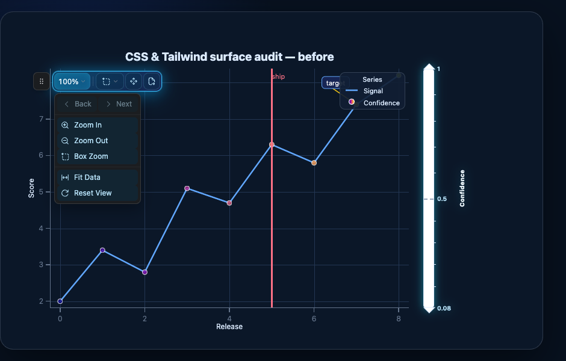
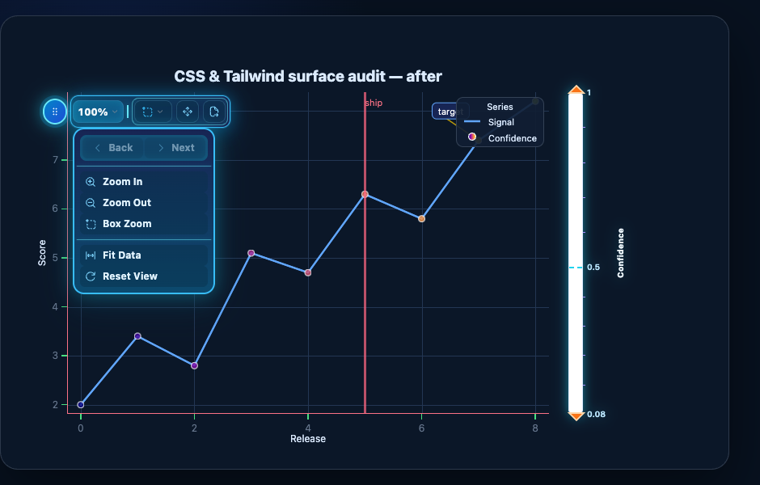

# CSS and Tailwind component-surface audit — 2026-07-30

This audit follows every user-visible chart surface from the public Python
composition API to the browser DOM, canvas/WebGL renderer, static writers, and
Reflex Tailwind source inventory. It answers two separate questions:

1. can an author reach the part with CSS-shaped styling; and
2. can a normal CSS or Tailwind class beat XY's browser default without
   `!important`?

The distinction matters. DOM chrome can participate directly in the cascade.
Marks, grid lines, polar frames, and annotation geometry are pixels in a
canvas, so making them one DOM node per primitive would discard XY's large-data
rendering model. Those parts use typed, CSS-shaped mark/axis/annotation styles
and CSS theme tokens instead.

## Findings and disposition

| Priority | Finding | Disposition |
| --- | --- | --- |
| P0 | The modebar drag affordance was a private span. `class_names` and `styles` could style the toolbar or every button, but not the draggable part the user directly identified. | **Fixed.** `modebar_drag_handle` is a stable public slot. |
| P0 | Modebar groups, separators, icons, zoom value, indicators, menus, menu separators, menu icons/labels, and history controls exposed private `data-xy-modebar-*` attributes only. Tailwind required a root arbitrary selector and could not use the validated `class_names` mapping. | **Fixed.** Twelve granular modebar subpart slots now cover the complete visible toolbar tree while `modebar_button` keeps its existing top-level/menu-button contract. |
| P1 | Cartesian axis spines and tick marks were anonymous divs whose inline `background` defeated ordinary utility classes. | **Fixed.** `axis_line` and `tick_mark` slots use private paint/geometry variables consumed by low-priority base rules. Major/minor kind, axis ID, and side remain available as data attributes. |
| P1 | Axis gesture bands had only a private attribute and an inline cursor. | **Fixed.** `axis_band` exposes the interaction surface; its cursor is now a defeatable base-layer default while hit geometry remains controller-owned. |
| P1 | Colorbar extension triangles, contour lines, and minor ticks were private descendants. Line and minor-tick borders were inline, so normal utilities could not recolor them. | **Fixed.** `colorbar_extension`, `colorbar_line`, and `colorbar_minor_tick` are public slots; renderer paint feeds private variables and the base layer. |
| P1 | The canvas above marks that carries annotation rules, bands, arrows, callouts, and markers had no whole-layer hook. | **Fixed.** `annotation_layer` styles that canvas as one bitmap. Per-annotation geometry still uses the cross-renderer annotation API. |
| P2 | Canvas/WebGL primitives cannot be selected individually by CSS or Tailwind. | **Deliberate boundary.** Marks use the validated 11-property CSS subset plus typed geometry/channel props; axes and annotations use their validated paint/geometry vocabularies; theme tokens bridge cascade colors into canvas. |
| P2 | Facet wrapper layout is not a child chart DOM slot. | **Deliberate ownership boundary.** Every panel receives the complete chart contract. The wrapper exposes stable `.xy-facet-grid`, `.xy-facet-panel`, and `.xy-facet-title` selectors; Reflex callers can place Tailwind arbitrary variants on the outer `class_name`, and standalone files use `custom_css`. |

The public browser contract grows from 29 to 48 validated slots. Unknown names
still fail while the chart is built, and the capability registry is generated
from the same tuple, so documentation and implementation cannot drift.

## Component-by-component result

| Requested area | Independently reachable parts | CSS/Tailwind route | Non-DOM route and boundary |
| --- | --- | --- | --- |
| Overview | Root, chart title, chrome canvas, mark canvas, annotation canvas, label layer | `root`, `title`, `chrome`, `canvas`, `annotation_layer`, `labels`; chart `class_name`, `class_names`, `style`, `styles` | Plot background, grid, axis, and text canvas paint also consume `--chart-*` tokens. Layout-owned position/size stays inline. |
| Marks | Fill, stroke, fill/stroke opacity, stroke width/dash/cap where the renderer supports them, rectangle radius/wedge gap, scatter shape, and mark-specific typed channels/geometry | Root CSS variables may supply any constant CSS color expression; Tailwind can set those variables | Individual marks are WebGL pixels, not DOM. `mark(style={...})` compiles the supported CSS subset identically for WebGL, SVG, and native raster. Unsupported declarations raise. |
| Axes | Gesture band, Cartesian spine, major/minor tick marks, tick labels, axis titles | `axis_band`, `axis_line`, `tick_mark`, `tick_label`, `axis_title`; `data-xy-axis`, `data-xy-axis-side`, and `data-xy-tick-kind` refine selectors | Grid lines, polar rings/spokes/frame, and static export use validated axis `style` (`grid_*`, `axis_*`, `tick_*`, label paint/type). |
| Legends | Container, title, row, swatch, label | `legend`, `legend_title`, `legend_item`, `legend_swatch`, `legend_label`; state attributes expose off/hover semantics | Scatter/line SVG handles inherit fill/stroke/width/dash from the swatch slot. Placement and live toggle opacity/filter remain controller state. |
| Tooltips | Container, title, row, field label, field value | `tooltip`, `tooltip_title`, `tooltip_row`, `tooltip_label`, `tooltip_value`; component-local class/style reaches the container | Tooltip position/visibility is live state. A framework-owned replacement is styled by that framework. |
| Colorbars | Container, ramp/bands, extension triangles, contour lines, tick labels, minor tick marks, title | `colorbar`, `colorbar_bar`, `colorbar_extension`, `colorbar_line`, `colorbar_tick`, `colorbar_minor_tick`, `colorbar_title` | Domain, colormap, levels, orientation, ticks, extension, and contour-line values remain semantic colorbar configuration and static-writer input. |
| Modebars & controls | Toolbar, drag handle, control group, separator, button, top-level icon, zoom value, chevron, active selection icon, menu, menu separator, menu icon, menu label, history group | `modebar`, `modebar_drag_handle`, `modebar_control_group`, `modebar_separator`, `modebar_button`, `modebar_icon`, `modebar_zoom_value`, `modebar_indicator`, `modebar_selection_icon`, `modebar_menu`, `modebar_menu_separator`, `modebar_menu_icon`, `modebar_menu_label`, `modebar_history_controls` | Placement, open/closed display, fit visibility, dragging, focus routing, and disabled/active state remain interaction-owned; state is exposed through classes/ARIA/data attributes. |
| Annotations | Whole shape canvas and each DOM label/callout | `annotation_layer`, `annotation_label`, plus per-annotation `class_name` and label CSS style | Rule/band/arrow/marker geometry uses annotation color, width, opacity, stroke, symbol, and offsets so browser, SVG, and native PNG agree. |
| Triangle mesh | Constant/per-vertex/per-face fill, opacity, border paint/width/opacity, colormap/domain, colorbar | CSS color expressions and `triangle_mesh(style=...)`; the derived colorbar uses its seven DOM slots | Mesh faces and edges are GPU/native/vector primitives, never one DOM triangle per face. |
| Facets and layers | Every child panel's complete 48-slot contract; facet grid, panel, and title wrappers; each layered mark's own typed style | Panel `class_names`/`styles`; `.xy-facet-*` wrapper selectors; Reflex outer Tailwind arbitrary variants; standalone `custom_css` | Layer order is declaration order. Marks share one WebGL canvas for performance and are styled individually through their mark specs. |
| Other | Selection rectangles/lasso/handles, x/y crosshairs, reduction badge container/items | `selection`, `crosshair_x`, `crosshair_y`, `badge`, `badge_item`; lasso part attributes refine SVG selectors | Selection/crosshair geometry and visibility are live state. Screen-reader summary/live nodes are intentionally visually hidden and are not styling surfaces. |

## Cascade contract

Normal utilities own durable appearance: paint, background, border, radius,
typography, spacing, shadow, filter, opacity, and cursor. Explicit
`styles={slot: ...}` remains inline author intent and outranks an ordinary
utility.

XY retains structural and state authority where changing it can break layout
or interaction: absolute coordinates, plot-sized dimensions, z-index, live
display, popover transforms, pointer routing, modebar fit/drag state, tooltip
placement, selection geometry, and legend toggle/hover opacity. Those elements
expose slot and state attributes, but overriding a controller-written property
means the author accepts responsibility for the behavior.

## Matched browser evidence

Both captures use the same chart spec, utility stylesheet, and class strings.
The before page substitutes the pre-change standalone bundle, so the new class
keys are present but have no DOM surface to land on.

Before: the grip, menu internals, colorbar parts, axis lines, and tick marks
retain their built-in appearance:



After: the identical classes independently style the pink drag handle, blue
menu shell, history group, icons/labels, orange colorbar extensions, cyan
contour marker, red axis spines, and green tick marks:



Regenerate the pair from a configured checkout:

```bash
node js/build.mjs
uv run python scripts/css_tailwind_slot_evidence.py before before.html before.png \
  --bundle path/to/pre-change/standalone.js
uv run python scripts/css_tailwind_slot_evidence.py after after.html after.png
```

## Regression coverage

- `CHART_DOM_SLOTS` is the one validated key set for `class_names` and
  `styles`.
- The capability registry must cover that tuple exactly, and its two generated
  Markdown matrices must be current.
- A source contract requires every declared slot to be applied by the client.
- A real Chromium probe creates all 19 newly exposed surfaces, verifies each
  utility class reaches its node, and checks computed paint/cursor/type styles.
- The probe also verifies axis, colorbar-line, colorbar-minor-tick, and
  axis-band visual defaults are no longer inline, which is the condition that
  lets ordinary Tailwind utilities win.
- The JavaScript build/typecheck and the existing legend, tooltip, selection,
  export-survival, and Reflex Tailwind suites continue to guard the older
  surfaces.
