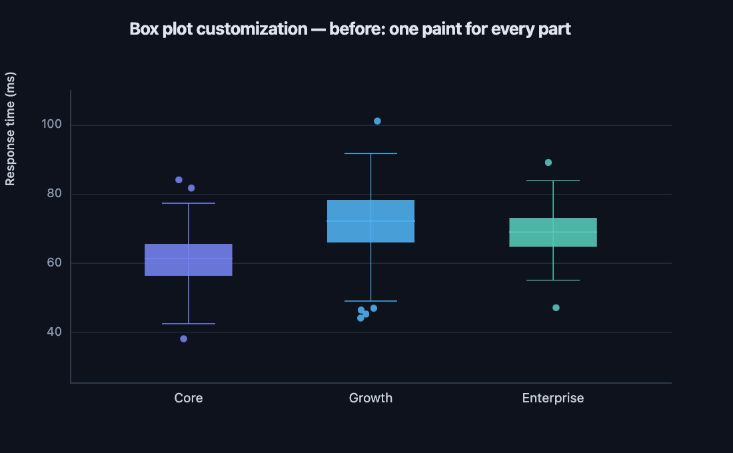
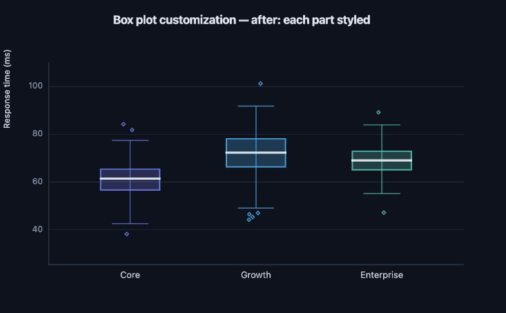

# Customizability audit — 2026-07-26

This audit traces the public composition API through style compilation, wire
specs, browser chrome, WebGL, SVG/PDF, native raster output, the Reflex adapter,
and the generated capability registry. It focuses on whether users can reach a
visible part, whether invalid declarations fail early, and whether a valid
choice survives every renderer that claims to support it.

## Summary

XY has a strong customization foundation:

- mark and axis styles use closed, validated cross-renderer vocabularies;
- every browser chrome element has a stable DOM slot for CSS and Tailwind;
- chart tokens, categorical palettes, custom colormaps, annotations, tooltips,
  legends, and interaction chrome are first-class;
- the capability matrix is generated from the implementation and checked in
  tests; and
- export boundaries are explicit rather than silently promising a browser
  cascade to native writers.

The weakest user-facing area was not the base styling system but compound
marks. A box plot was implemented from independently rendered body, whisker,
median, and outlier traces, yet exposed one color and one opacity. The
implementation already had the necessary cross-renderer primitives; the
public API did not make them reachable.

## Findings and disposition

| Priority | Finding | Disposition |
| --- | --- | --- |
| P0 | Box body fill/border, whiskers, median, and outliers could not be styled independently. | **Fixed.** `style`, `whisker_style`, `median_style`, and `outlier_style` compile through the existing rectangle, segment, and scatter vocabularies. |
| P0 | `box` accepted fill styling but not the rectangle renderer's existing stroke support. | **Fixed.** `stroke`, `stroke-width`, and `stroke-opacity` are now registered for the box body in WebGL, SVG, and native raster. |
| P1 | Wide polyline joins still differ: WebGL shows overlapping segment quads while SVG and native raster draw round joins. | Open. Requires real client join geometry before `stroke-linejoin` can be accepted honestly. Tracked in the capability matrix. |
| P1 | Violin outlines are unavailable. Stroking each existing density band would create internal seams, not one distribution outline. | Open. Add a dedicated envelope trace before exposing stroke styling. |
| P1 | Browser slot CSS does not flow through the native cascade; only chart tokens, mark/axis styles, and a narrow legend channel survive. | Deliberate boundary, but native title/colorbar typography remains a useful typed-style follow-up. |
| P2 | Mark plugins compose built-in marks but cannot add a GPU primitive; custom shaders and renderers are planned only. | Open architectural extension point. Do not expose until picking and static-export fallbacks have a contract. |
| P2 | There is no selected/unselected/hovered mark-style vocabulary. | Deliberate for now: host state can rebuild ordinary style props, while DOM interaction chrome remains slot-styleable. Revisit if stateful GPU paint can stay renderer-neutral. |

## Implemented contract

```python
xy.box(
    values,
    group=cohorts,
    style={
        "fill": "#dbeafe",
        "fill-opacity": 0.4,
        "stroke": "#2563eb",
        "stroke-width": 2,
    },
    whisker_style={
        "stroke": "#64748b",
        "stroke-width": 1.5,
        "stroke-opacity": 0.75,
    },
    median_style={"stroke": "#0f172a", "stroke-width": 3},
    outlier_style={
        "fill": "#ffffff",
        "stroke": "#dc2626",
        "stroke-width": 2,
        "marker-shape": "diamond",
    },
)
```

Part mappings are strict. For example, `whisker_style={"fill": ...}` and
`style={"marker-shape": ...}` raise with the part name before the figure
mutates. Unstyled box plots retain their previous trace-style defaults.

## Visual evidence

Before, each body, border, whisker, median, and outlier inherited one series
paint:



After, every rendered part is independently reachable while using the same
underlying renderer paths:



## Verification

The focused regression suite checks:

- exact trace styles for all four parts;
- public component-to-figure routing;
- part-specific validation failures;
- native SVG survival;
- generated capability-matrix synchronization; and
- unchanged behavior of the broader API-parity suite.

Regenerate the matched standalone evidence from a configured checkout:

```bash
.venv/bin/python scripts/box_customizability_evidence.py before before.html
.venv/bin/python scripts/box_customizability_evidence.py after after.html
```
