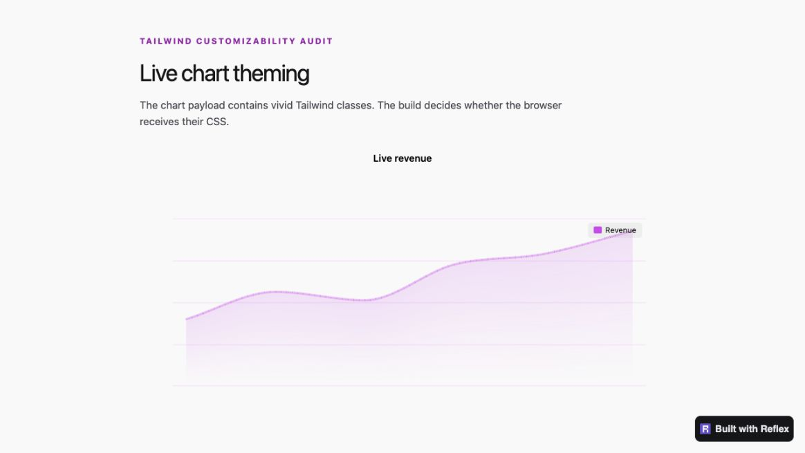
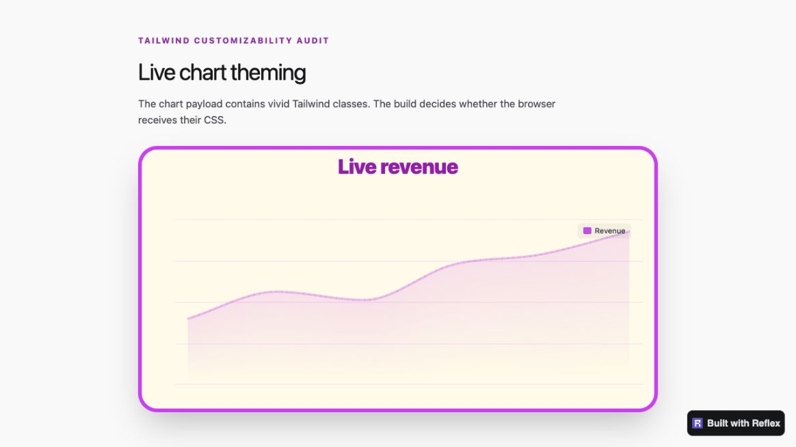
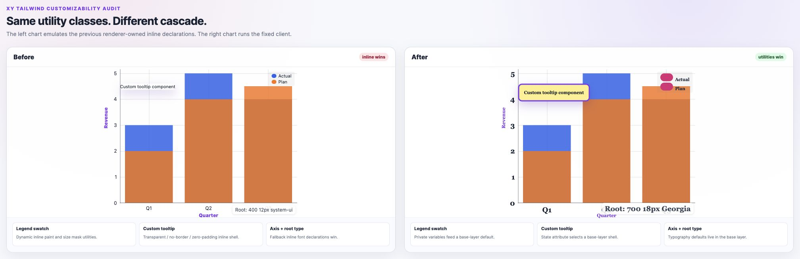

# Tailwind customizability audit — 2026-07-26

This audit follows Tailwind classes from Reflex source discovery through the
generated application, XY's live payload boundary, browser cascade, repeated
chrome nodes, interaction state, and canvas rendering. It uses Tailwind v4 and
a production Reflex build rather than a development-only stylesheet.

## Summary

XY already had a strong browser styling foundation: 29 validated public slots,
zero-specificity visual defaults in Tailwind's low-priority `base` layer, typed
inline styles for explicit author intent, and CSS variables for canvas theme
paint. The audit found gaps at three different boundaries:

1. live token/`Var` charts could attach classes at runtime without exposing
   those complete candidates to Tailwind's build-time source scan;
2. some browser defaults were inline and therefore defeated ordinary
   utilities, while live payload class changes could leave old DOM chrome
   mounted; and
3. the `selection` slot reached box/range bands but not the completed lasso's
   SVG nodes.

Those gaps are fixed and covered by source, browser, adapter, and production
build regressions.

## Findings and disposition

| Priority | Finding | Disposition |
| --- | --- | --- |
| P0 | Runtime figure tokens are opaque to Tailwind's source scanner, so live classes reached the DOM without generated utility rules. | **Fixed.** `reflex_xy.chart(..., tailwind_classes=...)` supplies a compile-only inventory for token/`Var` charts, merges with static discovery, and covers every facet panel. |
| P0 | Normal prop serialization JSON-escaped quotes, backslashes, and non-ASCII content into different source candidates. | **Fixed.** The normalized inventory is emitted verbatim in a scan-only JavaScript comment expression and is discarded before DOM props are spread. |
| P0 | Re-publishing a live payload reused persistent constructor chrome, so changed `dom`, title, legend, colorbar, badge, modebar, or axis-band inputs could stay stale. | **Fixed.** A projected chrome signature selects a full rebuild without penalizing data-only publishes; every named-axis range and durable box/range/lasso geometry is restored silently before one mask refresh. |
| P1 | The chart root's inline `font` shorthand defeated Tailwind typography utilities. | **Fixed.** The default is now a zero-specificity base-layer rule; explicit chart styles remain inline. |
| P1 | Legend-swatch paint/geometry, custom-tooltip reset chrome, and axis-title fallback weight competed with normal utilities inline. | **Fixed.** Renderer values now feed private variables or base-layer state rules; explicit slot/axis styles retain inline precedence. |
| P1 | `selection` classes did not reach completed lasso SVG paths and handles. | **Fixed.** The slot is applied to both while structural pointer behavior remains pinned for gesture safety. |
| P1 | Static source discovery included per-mark and shape-only annotation `class_name` metadata even though their WebGL/canvas geometry has no DOM node. | **Fixed.** Automatic inventory contains only class strings that can reach browser DOM. |
| P1 | Tailwind's default dark variant follows OS color scheme, while Reflex's manual mode uses `.dark`. | **Documented and configured.** Examples use `TailwindV4Plugin(config={"darkMode": "selector"})`; applications that want OS behavior can omit it. |
| P2 | Canvas/WebGL pixels cannot be selected with CSS, and CSS-only breakpoint changes do not notify the renderer to resample canvas paint tokens. | **Deliberate browser boundary.** Use mark/axis/annotation props for individual pixels; pair responsive canvas-token changes with a watched theme mutation or figure rebuild. DOM chrome remains immediately responsive. |

## Production utility matrix

The evidence app exercises complete literal candidates across these Tailwind
v4 categories:

- responsive and range variants: `md:`, `max-[700px]:`, container `@min-*`;
- color mode and state: `dark:`, `hover:`, `focus:`, `active:`, `has-*`,
  `not-*`, and `supports-*`;
- arbitrary values, arbitrary properties, CSS-variable shorthand, and
  important modifiers;
- quoted/Unicode pseudo-element content and escaped underscores inside
  arbitrary descendant selectors;
- root and per-slot typography, spacing, border, radius, shadow, background,
  fill, stroke, cursor, and transition utilities;
- static charts, live tokens, state-driven class swaps, and facet panels.

Every possible state-driven class must be present as a complete string in
`tailwind_classes`; constructing class names from fragments remains outside
Tailwind's text-scan contract.

## Cascade ownership

Normal utilities own durable visual appearance on DOM slots. XY still owns
structural geometry and conditional interaction state: positioning, live
display, z-index, transforms, pointer routing, legend hover/toggle
opacity/filter, and modebar open/active state. An explicit `styles={...}` value
is inline author intent and outranks a normal utility.

`canvas` and `chrome` are whole bitmap surfaces. A class can style each element
as one box, but it cannot address individual WebGL marks or canvas-painted grid,
axis, and annotation geometry.

A live constructor-chrome replacement restores durable viewport and geometric
selection state. Transient view-local state—the active drag tool, undo/redo
history, legend toggles, and a manually moved modebar—belongs to the replaced
view and resets. Preserving selected transient state could be a future
enhancement, but it is not part of the current durable-state document.

## Visual evidence

Before, the live chart carried its requested classes in DOM but the production
Tailwind build had no matching rules:

After, the same live chart has the generated radius, border, background,
typography, controls, and shadows:

The second comparison holds the utility classes constant. Its left side
emulates the former renderer-owned inline declarations; the fixed client on the
right lets utilities control the root/axis typography, legend-swatch
paint/size, and custom-tooltip shell:

## Verification

The regression matrix covers:

- verbatim source candidates for static, live, and facet charts;
- rejection of unordered inventories and omission of canvas-mark metadata;
- projected live browser-chrome rebuild selection and its wrapper source
  contract, plus real-browser all-axis viewport reconstruction, silent
  box/range/lasso hydration, and tagged mask-reply event suppression;
- real Chromium computed styles for root typography, legend swatches,
  including solid, scatter, and line paint; custom tooltips, axis titles, and
  lasso path/handles;
- preservation of explicit style precedence and lasso handle dragging;
- Tailwind selector-mode configuration in the documentation app; and
- the JavaScript build/typecheck, Python suites, Ruff, and repository
  pre-commit gates.
